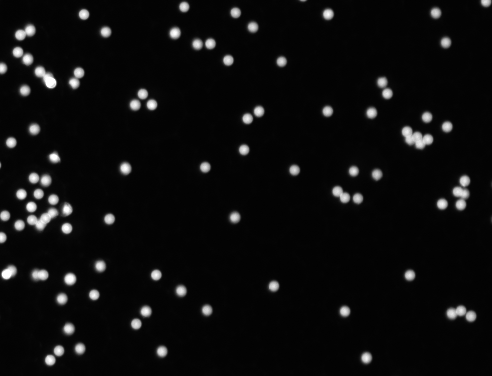
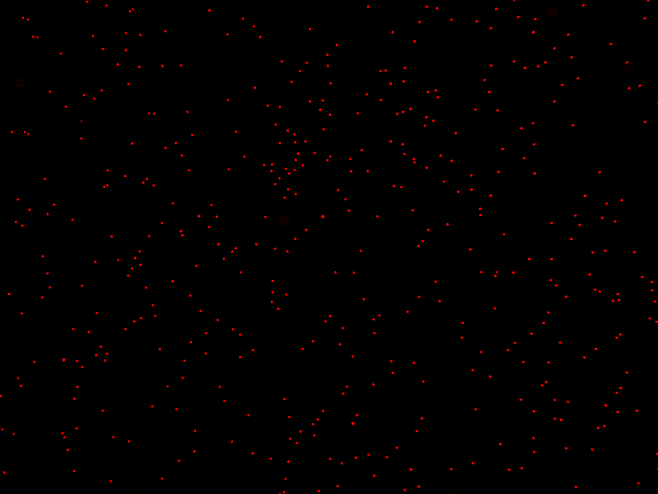
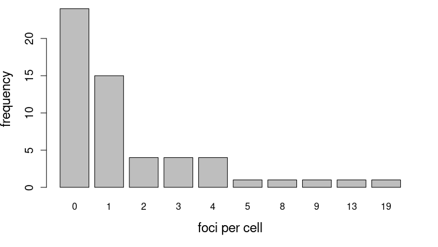

The primary design objectives for the development of our package were to ensure
low complexity, high maintainability, reliability, and a broad application
spectrum, including automation features. Specifically, the objective was to
reduce the number of dependencies on other packages in order to reduce overall
complexity. Parallel processing and automation with Gaussian process models were
incorporated to optimize the performance of pipelines for batch processing and
medium-throughput analysis. In this chapter, we will assess the reliability of
the `biopixR` package by comparing its performance with that of manual analysis
data. Furthermore, we will evaluate its suitability for use in the field of cell
biology, with a particular focus on the quantification of DNA damage.


## Batch Processing and Big Data in `R`

Microbead technology represents a highly versatile tool for the implementation
of highly parallelized quantitative multiparameter assays, which are capable of
detecting nucleic acids and proteins. This technology offers several advantages,
including low cost, minimal labor, high speed, and high-throughput automation,
which make it particularly appealing for POCT applications [@Roediger2014;
@Zhang2019]. Microbead assays are typically analyzed using fluorescence
microscopy of a 96-well plate, with each well typically generating five images,
resulting in up to 480 images for a single assay. Consequently, automation and
batch processing are essential for analyzing data in this area of research.

Although `R` is a programming language that naturally supports the customized
development of batch processing, we observed while collaborating with peers in
wet laboratories that it is beneficial to offer certain routines as simple and
easy-to-understand functions for average users. We have achieved this objective
by implementing the functions `imgPipe()` and `scanDir()`. To the best of our
knowledge, only the `FIELDimageR` and `pliman` packages provide comparable
approaches, though they cater to very specific use cases distinct from ours
[@Matias2020; @Olivoto2022]. Our approach enables users to analyze large data
sets in medium-sized batches, depending on the computing performance. In an
anecdotal example, we processed approximately 180 images with an average size
of 1.4 MB (bmp, single channel) in 20 minutes using a computer with the
specifications described in Chapter \@ref(con). This represents a substantial
reduction in the time required for scientific work, as many scientists
traditionally perform such tasks manually.

In the `R` programming language, the execution of for loops is a time-consuming,
sequential process that iterates through each provided variable in a linear
fashion. To enhance the efficiency of image data analysis,
vectorization was employed. This approach permits the application of
operations to entire vectors, which significantly accelerates the
calculations. Additionally, the `foreach` package was utilized to further
optimize the processing speed. This package enables parallel processing in `R`,
allowing the utilization of multiple CPU cores,
thereby markedly reducing the time required for computationally intensive tasks
[@Weston2009; @Corporation2011]. To enhance user-friendliness, the package
supports the importation of images in a variety of formats, which are
automatically converted to the `imager` format, 'cimg'. The function facilitates
the seamless importation of a variety of image formats (e.g., JPEG, PNG, BMP)
from a single folder. This capability represents a distinctive feature of our
batch processing function, allowing for the processing of images with
different formats in a single batch. Moreover, the function checks for the
presence of an alpha channel, which contains transparency information that can
interfere with several functions. To mitigate potential issues, the import
function ensures the removal of the alpha channel.

At this time, it is not evident that the existing implementation will yield any
further significant performance improvements. The primary factors influencing
the speed of processing are the speed of the CPU and the number of cores
available. Given the absence of a suitable implementation for graphics chips,
there is no potential for improvement in that area. However, the use of
Hierarchical Data Format 5 (HDF5) could potentially result in enhanced speeds
through the implementation of techniques such as chunking (including adjustments
to the chunk cache size), compression to improve input/output (I/O) performance,
parallelism at the CPU and file system levels, as well as access pattern
optimization [@Folk2011; @Koranne2011]. This approach has not yet been
subjected to evaluation and would be a task for future analysis projects.

Another objective for optimization could be the controlled import of images to
prevent Random-Access Memory (RAM) overload. Given that `R` utilizes memory to
store imported and generated data, directories containing a substantial volume
of images can readily overload the RAM, leading to process termination and
software crashes [@Prajapati2013]. At present, the issue can only be mitigated
manually by dividing the directory into multiple subdirectories and analyzing
them individually. Future advancements should include strategies to avoid memory
overload, such as reading images in batches. `R` provides a number of packages
that address this problem, including `disk.frame` [@Dai2019], `bigmemory`
[@Kane2008], and `ff` [@Adler2007]. Nevertheless, the applicability of these
packages for 'cimg-lists' has not been further evaluated and would also be
considered a task for future projects.


## Cyclomatic Complexity of `biopixR`

As previously stated, the `biopixR` package was designed with the intention of
maintaining a minimalistic approach, with the objective of reducing dependencies
and code complexity. It is of vital importance to ensure the reproducibility of
software, not only for the advancement of our own work but also for the broader
scientific community [@Gentleman2007; @Roediger2015]. One approach to
achieving this objective involves minimizing dependencies on external packages
or libraries, with the goal of relying on single archives whenever feasible.
Consequently, the `biopixR` package requires the `R` programming language
($\ge$ 4.2.0), the `imager`, `magick`, and `tcltk` libraries, the `data.table`
and `cluster` packages, and suggests the use of the `knitr`, `rmarkdown`,
`doParallel`, `kohonen`, `imagerExtra`, `GPareto`, and `foreach` packages, all
of which are available exclusively from CRAN.

A widely recognized metric used in both industry and research to evaluate code
complexity is the cyclomatic complexity metric, also known as the McCabe Metric,
which was introduced by @McCabe1976. This metric provides a quantitative measure
of code complexity based on graph theory. Given the importance of ensuring
long-term stability and reproducibility, it is crucial to maintain the
complexity of individual package functions at a low level [@McCabe1976;
@Ebert2016].

The complexity of the `biopixR` package is quantified using the `cyclocomp`
package, which measures the linearly independent paths through the code of a
function, taking into account structures such as functions, loops, and control
statements (e.g., if, break, next, and return)
[@Csardi2016].^[https://github.com/MangoTheCat/cyclocomp, accessed 07/03/2024] Higher cyclomatic
complexity values indicate more complex functions. The resulting complexity
values for the functions of the `biopixR` package are presented in Table
\@ref(tab:cyclocomp2). The user-accessible functions are highlighted, while the
helper functions, which are part of the main functions, are also listed. In the
context of the `R` programming language, cyclomatic complexity can be regarded as
an indicator of code maintainability, readability, and scalability. In general,
lower values indicate code that is logically structured and easy to maintain,
whereas higher values suggest more complex code that may be less maintainable.

```{r cyclocomp0}
# Load the 'kableExtra' library for enhanced table formatting
library(kableExtra)

# Calculate the cyclomatic complexity for the 'biopixR' package
cyclocomp_df <- cyclocomp::cyclocomp_package("biopixR")

# Remove row names from the data frame
rownames(cyclocomp_df) <- NULL
```

```{r cyclocomp1, echo=FALSE}
tab <- kable(
  cyclocomp_df,
  format = "markdown",
  booktabs = TRUE,
  align = "cc",
  caption = "Cyclomatic complexity in the `biopixR` package. Cyclomatic complexity measures the number of linearly independent paths through the code, with higher scores indicating more complex code and lower scores indicating simpler, more maintainable code. The cyclomatic complexity was calculated using the cyclocomp package. Main functions accessible by the user are highlighted in bold, while other functions include helper functions and global variables that are part of the main functions.",
  escape = FALSE
) 
```

```{r cyclocomp2, echo=FALSE}
row_spec(tab, c(1, 3:14, 16, 20), bold = TRUE)
```

In summary, all functions in the `biopixR` package have a cyclomatic complexity
value of less than 50, with complexity increasing in the pipeline functions. In
comparison, the `pliman` package, which offers a comparable pipeline for object
quantification as described in @Brauckhoff_unpublished, has its
`analyze_objects()` function scoring a cyclomatic complexity of 107.


## Capabilities and Limitations - A Comparative Analysis of Human and Software Performance

A number of illustrative examples demonstrate that each individual microbead is
accurately identified. However, the identification of aggregated microbeads,
which are referred to as doublets or multiplets, does not align with the
expected pattern. It is important to note that not every visually
distinguishable microbead is regarded as a single object. The observed
phenomenon, whereby doublets are identified as a single entity, is a consequence
of the disappearance of their edges along the contact surface. The same
principle applies to multiplets. Consequently, the software will undercount the
number of objects in an image when aggregated microbeads are present. This
variability could be addressed by integrating a watershed algorithm, a
specialized segmentation algorithm capable of distinguishing touching objects
[@Beucher1992; @Pau2010]. To demonstrate the discrepancy and comprehend the
capabilities, an experiment was conducted to compare the manual analysis of
three microbead images (Figure \@ref(fig:irr0)) (n=5) with the results
obtained using the `biopixR` package.

A statistical comparison of the data will be conducted using the `R` package
`irr`, which includes various methods for analyzing interrater reliability
[@irr]. To compare the manual and software-based methods, the Intraclass
Correlation Coefficient (ICC) will be utilized. The ICC was originally
introduced by @Fisher1992 and measures the correlation within a class of data,
such as repeated measurements of the same objective. Typically, ICC values range
between 0 and 1. Values below 0.5 indicate low reliability, while values
above 0.8 or 0.9 indicate good to excellent reliability [@Liljequist2019]. The
ICC is based on the analysis of variances and, for the chosen one-way model, can
be defined as the ratio of variances [@Bartko1966]. In the calculation, the
software is considered to be one rater, and the mean of the five manual analyses
is considered to be the other rater.

To further assess the differences between the two methods, a paired Student's
t-test will be applied to determine whether there are any statistically
significant differences in the obtained results. This test compares the mean
differences and is designed for paired data, such as pre- and post-treatment
measurements on a single individual [@Hsu2014]. To perform the test, the
single result obtained by the software was replicated five times, matching the
five measurements derived from the manual analysis. Both methods are regarded as
paired observations derived from the same images but employing different methods
(treatments). To ensure the accuracy of this test, the data from the manual
analysis will be tested for normal distribution using the Shapiro-Wilk normality
test [@Shapiro1965].

The manual analysis was conducted using a Shiny app, which is accessible at:

\phantom{x}\hspace{0.75cm}<https://brauckhoff.shinyapps.io/umfrage/>; language: German

The survey was conducted by three colleagues in the same field of study
(biotechnology), myself, and an independent individual from a completely
different field of study. The initial objective of this survey was to enumerate
each microbead, including those that are part of doublets or multiplets. The
second task was to enumerate only the individual microbeads that are part of the
aggregated structures. The aforementioned tasks were completed for
three images, which are displayed in Figure \@ref(fig:irr0). The images were
selected for analysis because they depict varying amounts of microbeads and the
phenomena of aggregated microbeads.

(ref:irr0) **Microbead Images for Manual Analysis**: These three images represent varying quantities of microbeads. Each image displays a unique combination of dimensions and the presence of doublets and multiplets at varying amounts. *Note: image1 - top; image2 - middle; image3 - buttom*

```{r irr0, fig.cap="(ref:irr0)", out.width="50%", echo=FALSE, fig.pos="H"}

include_graphics("figures/fig21.2_comparison.png")

```


### Preprocessing the Manual Analysis and Performing Analysis with `biopixR`

Initially, the data must be subjected to preprocessing in order to facilitate
the display of the results. This process entails combining the results of the
five individual analyses and running the `biopixR` package on the same images in
order to obtain the comparative data frame. Subsequently, the two data frames,
derived from the manual and software analysis, are merged for further
processing. The individual processing steps are illustrated in the code below,
and the final data utilized for analysis is depicted in Tables \@ref(tab:irr3)
and \@ref(tab:irr5).

The design of the algorithm suggests that the software will yield lower count
values for the first task. This discrepancy can be attributed to the algorithm's
approach to doublets and multiplets, which are treated as single entities. In
contrast, humans are able to visually distinguish individual microbeads even
when they are part of doublets or multiplets. The results of task 1 are
presented in Table \@ref(tab:irr3). It is evident that manual counting for the
image1 with fewer microbeads was accurate, with a standard deviation of 3.27.
However, for the two larger images (Figure \@ref(fig:irr0) image2 & 3) with
higher numbers of microbeads, the standard deviation of the manual analysis
increased to approximately 30. As anticipated, the algorithmic analysis produced
a smaller object count than that obtained via manual counting for the
first two images (Figure \@ref(fig:irr0) image1 & 2). To interpret these
findings, a statistical analysis was conducted and the results were visualized.

```{r irr1}
# Read CSV files containing manual count data
n1 <- read.csv("data/comparison/combined_data.csv")
n2 <- read.csv("data/comparison/combined_data_20240107084710.csv")
n3 <- read.csv("data/comparison/combined_data_20240302124005.csv")
n4 <- read.csv("data/comparison/combined_data_20240304210901.csv")
n5 <- read.csv("data/comparison/combined_data_20240701124906.csv")

# Calculate mean and standard deviation for manual analysis for each image (task 1)
manual_all <-
  data.frame(
    image1_all = c(
      mean(n1$Clicks[1], n2$Clicks[1], n3$Clicks[1], n4$Clicks[1], n5$Clicks[1]),
      sd(c(
        n1$Clicks[1], n2$Clicks[1], n3$Clicks[1], n4$Clicks[1], n5$Clicks[1]
      ))
    ),
    
    image2_all = c(
      mean(n1$Clicks[3], n2$Clicks[3], n3$Clicks[3], n4$Clicks[3], n5$Clicks[3]),
      sd(c(
        n1$Clicks[3], n2$Clicks[3], n3$Clicks[3], n4$Clicks[3], n5$Clicks[3]
      ))
    ),
    
    image3_all = c(
      mean(n1$Clicks[5], n2$Clicks[5], n3$Clicks[5], n4$Clicks[5], n5$Clicks[5]),
      sd(c(
        n1$Clicks[5], n2$Clicks[5], n3$Clicks[5], n4$Clicks[5], n5$Clicks[5]
      ))
    )
  )

# Calculate mean and standard deviation for manual analysis for each image (task 2)
manual_clott <-
  data.frame(
    image1_clot = c(
      mean(n1$Clicks[2], n2$Clicks[2], n3$Clicks[2], n4$Clicks[2], n5$Clicks[2]),
      sd(c(
        n1$Clicks[2], n2$Clicks[2], n3$Clicks[2], n4$Clicks[2], n5$Clicks[2]
      ))
    ),
    
    image2_clot = c(
      mean(n1$Clicks[4], n2$Clicks[4], n3$Clicks[4], n4$Clicks[4], n5$Clicks[4]),
      sd(c(
        n1$Clicks[4], n2$Clicks[4], n3$Clicks[4], n4$Clicks[4], n5$Clicks[4]
      ))
    ),
    
    image3_clot = c(
      mean(n1$Clicks[6], n2$Clicks[6], n3$Clicks[6], n4$Clicks[6], n5$Clicks[6]),
      sd(c(
        n1$Clicks[6], n2$Clicks[6], n3$Clicks[6], n4$Clicks[6], n5$Clicks[6]
      ))
    )
  )

# Transpose and modify column names
manual_all <- t(manual_all)
colnames(manual_all) <- c("Count", "sd")

manual_clott <- t(manual_clott)
colnames(manual_clott) <- c("Count", "sd")

# Import images for comparison with manual analysis
image1 <- importImage("figures/fig21.1_comparison.bmp")
image2 <- importImage("figures/fig21.2_comparison.png")
image3 <- importImage("figures/fig21.3_comparison.bmp")

# Perform object detection on the images (comparison for task 1)
comparison1_img1 <- objectDetection(image1, alpha = 0.8, sigma = 0.7)
comparison1_img2 <- objectDetection(image2, alpha = 0.4, sigma = 0)
comparison1_img3 <- objectDetection(image3, alpha = 1, sigma = 0)

# Use pipeline function with size filtering to estimate amount of aggregated 
# microbeads (comparison for task 2)
comparison2_img1 <- imgPipe(image1,
                            alpha = 0.8,
                            sigma = 0.7,
                            sizeFilter = T)
comparison2_img2 <- imgPipe(image2,
                            alpha = 0.4,
                            sigma = 0,
                            sizeFilter = T)
comparison2_img3 <- imgPipe(image3,
                            alpha = 1,
                            sigma = 0,
                            sizeFilter = T)

# Create a data frame for the first comparison
df_comparison1 <- data.frame(
  factor = c("image1", "image2", "image3"),
  software = c(
    length(comparison1_img1$centers$value),
    length(comparison1_img2$centers$value),
    length(comparison1_img3$centers$value)
  ),
  manual = as.numeric(manual_all[, 1]),
  manual_sd = as.numeric(manual_all[, 2])
)

# Create a data frame for the second comparison
df_comparison2 <- data.frame(
  factor = c("image1", "image2", "image3"),
  software = c(
    comparison2_img1$summary$estimated_rejected,
    comparison2_img2$summary$estimated_rejected,
    comparison2_img3$summary$estimated_rejected
  ),
  manual = as.numeric(manual_clott[, 1]),
  manual_sd = as.numeric(manual_clott[, 2])
)
```

```{r irr2, echo=FALSE}
tab_comp1 <- kable(
  df_comparison1,
  format = "markdown",
  booktabs = TRUE,
  align = "cccc",
  col.names = c("image", "software", "manual", "sd(manual)"),
  caption = "Comparison in object quantification for task 1. The table summarizes the quantification of all microbeads, including singlets and individual microbeads within doublets or multiplets. The analysis was conducted on the three example images presented at the beginning of this chapter. The `biopixR` package was used for software-based quantification, while the manual analysis is presented as the average count (n = 5) with the standard deviation.",
  escape = FALSE,
)
```

```{r irr3, echo=FALSE}
footnote(tab_comp1, general = "", general_title = "Abbreviations: sd - standard deviation")
```

```{r irr4, echo=FALSE}
tab_comp2 <- kable(
  df_comparison2,
  format = "markdown",
  booktabs = TRUE,
  align = "cccc",
  col.names = c("image", "software", "manual", "sd(manual)"),
  caption = "Comparison in object quantification for task 2. The table presents the results of counting individual microbeads within aggregated clusters, such as doublets or multiplets. The analysis was performed on the three aforementioned images using the `biopixR` package and manual analysis (n = 5). For the manual analysis, the average count and standard deviation are reported.",
  escape = FALSE,
)
```

```{r irr5, echo=FALSE}
footnote(tab_comp2, general = "", general_title = "Abbreviations: sd - standard deviation")
```


### Visualization of Comparison between Human and Software Analysis

To assess the reliability of the software in comparison to manual
analysis, the ICC was calculated. The count data for both tasks were subjected
to a Shapiro-Wilk test to ascertain their normal distribution. The resulting
p-values, all greater than 0.05, indicate that the data is normally
distributed. Subsequently, a paired Student's t-test was conducted to compare
the two methods. The results are presented in the corresponding plots for each
task, with statistically significant differences marked with an asterisk (*) (p
< 0.05).

In the first image, the software produced a significantly lower result compared
to manual counting, which is an expected outcome. In contrast, for the other two
images, the software results fall within the standard deviation of the manual
analysis, with no statistically significant difference (Figure
\@ref(fig:irr6)). The ICC calculated for the first task was 0.998, indicating
excellent reliability between the results obtained by the software and those
obtained through manual analysis.

(ref:irr6) **Comparison of Software and Manual Object Quantification** (Task 1): All microbeads, including those in doublets or multiplets, are quantified manually by five different individuals (n = 5) and by the software `biopixR`. The resulting counts for each method are shown, with software results in darkcyan and manual analysis results in orange. The manual analysis is shown as mean $\pm$ standard deviation. *Note*: *Statistical significance was calculated using a paired Student's t-test, with* * *p < 0.05*.

```{r irr6, fig.cap="(ref:irr6)"}
# Load the 'irr' library for calculating the ICC
library(irr)

# Calculate the ICC for the 'software' and 'manual' columns in df_comparison1
icc_result1 <- icc(df_comparison1[, 2:3])

# Print the ICC result
print(icc_result1)

# Vectorized approach for running Shapiro-Wilk test and checking normality
normality_p_values <- sapply(1:6, function(i) {
  shapiro.test(c(n1$Clicks[i], 
                 n2$Clicks[i], 
                 n3$Clicks[i], 
                 n4$Clicks[i], 
                 n5$Clicks[i]))$p.value
})

# Check normality and print results
for (i in 1:6) {
  if (normality_p_values[i] < 0.05) {
    message <- "Data is not normally distributed."
  } else {
    message <- "Data is normally distributed."
  }
  print(paste(
    "Test",
    i,
    ":",
    message,
    "(p-value =",
    round(normality_p_values[i], digits = 3),
    ")"
  ))
}

# Define indices for the paired t-tests
indices1 <- c(1, 3, 5)   # Rows represnting the results for task 1
indices2 <- 1:3          # Rows in comparative data frame for task 1

# Perform paired t-test for each selected pair of indices and collect p-values
p_values <- mapply(function(i, j) {
  t.test(
    rep(df_comparison1$software[j], 5),
    c(n1$Clicks[i], n2$Clicks[i], n3$Clicks[i], n4$Clicks[i], n5$Clicks[i]),
    paired = TRUE
  )$p.value
}, indices1, indices2)

# Significance threshold for the t-tests
significance_threshold <- 0.05

# Set up the plot area with custom x and y limits
plot(
  1:nrow(df_comparison1),
  df_comparison1$software,
  type = "n",
  xaxt = "n",
  xlim = c(0.5, nrow(df_comparison1) + 0.5),
  ylim = range(
    c(
      df_comparison1$software,
      df_comparison1$manual + df_comparison1$manual_sd
    )
  ),
  main = "Comparison of Methods",
  xlab = "Factors",
  ylab = "Counts"
)

# Add custom x-axis labels
axis(1,
     at = 1:nrow(df_comparison1),
     labels = df_comparison1$factor)

# Add points for the 'software' method
points(
  1:nrow(df_comparison1),
  df_comparison1$software,
  pch = 16,
  col = "darkcyan",
  cex = 1.5
)

# Add points for the 'manual' method
points(
  1:nrow(df_comparison1),
  df_comparison1$manual,
  pch = 16,
  col = "orange",
  cex = 1.5
)

# Add error bars for the 'manual' method
arrows(
  x0 = 1:nrow(df_comparison1),
  y0 = df_comparison1$manual - df_comparison1$manual_sd,
  x1 = 1:nrow(df_comparison1),
  y1 = df_comparison1$manual + df_comparison1$manual_sd,
  angle = 90,
  code = 3,
  length = 0.1,
  col = "orange"
)

# Add asterisks to indicate significant differences based on p-values
for (i in 1:nrow(df_comparison1)) {
  if (p_values[i] < significance_threshold) {
    text(
      i,
      max(df_comparison1$software[i], df_comparison1$manual[i]) + 40,
      "*",
      cex = 1.5,
      col = "black"
    )
  }
}

# Add legend to the plot
legend(
  "topright",
  legend = c("Software", "Manual"),
  col = c("darkcyan", "orange"),
  pch = 16
)
```

The second task is to estimate the number of microbeads present within doublets
and multiplets. The data for this analysis is presented in Table \@ref(tab:irr5).
The results from both the software and manual analysis of images one and three
are comparable, with a low standard deviation for the latter. The first image,
with lower image dimensions, and the third, with a low number of doublets and
multiplets, are comparatively straightforward to analyze. In contrast, the
second image depicts a larger number of these structures, resulting in greater
variability in the results obtained by manual analysis, with a standard
deviation of nearly 30 (Figure \@ref(fig:irr0) and Table \@ref(tab:irr5)). In
order to create a comparable software result for this task, the `imgPipe()`
function with an enabled `sizeFilter()` was employed. The algorithm estimates
the number of rejected microbeads within these structures by dividing the number
of discarded pixels by the mean size of the remaining objects (microbeads). The
aforementioned results are illustrated in Figure \@ref(fig:irr7), which
demonstrates that the software and manual analysis yield nearly identical
outcomes for images one and three. However, the differing outcome for image two
is illustrated, with a statistically significant difference between the methods.
The calculated ICC for task 2 indicates a high degree of reliability between the
methods, with a score of 0.86.

(ref:irr7) **Comparison of Software and Manual Object Quantification** (Task 2): Only microbeads that are part of doublets or multiplets are counted. Manual analysis was conducted by five different individuals (n = 5) and compared to the software `biopixR`. The resulting counts for each method are shown, with software results in darkcyan and manual analysis results in orange. The manual analysis is depicted as mean $\pm$ standard deviation. *Note*: *Statistical significance was calculated using a paired Student's t-test, with* * *p < 0.05*.

```{r irr7, fig.cap="(ref:irr7)"}
# Same for task 2
# Load the 'irr' library for calculating the ICC
library(irr)

# Calculate the ICC for the 'software' and 'manual' columns in df_comparison2
icc_result2 <- icc(df_comparison2[, 2:3])

# Print the ICC result
print(icc_result2)

# Check for normality see analysis of task 1

# Perform paired t-test for each selected pair of indices and collect p-values
p_values <- sapply(1:nrow(df_comparison2), function(i) {
  t.test(
    rep(df_comparison2$software[i], 5),
    c(n1$Clicks[i * 2], 
      n2$Clicks[i * 2], 
      n3$Clicks[i * 2], 
      n4$Clicks[i * 2], 
      n5$Clicks[i * 2]),
    paired = TRUE
  )$p.value
})

# Significance threshold for the t-tests 
significance_threshold <- 0.05

# Set up the plot area with custom x and y limits
plot(
  1:nrow(df_comparison2),
  df_comparison2$software,
  type = "n",
  xaxt = "n",
  xlim = c(0.5, nrow(df_comparison2) + 0.5),
  ylim = range(
    c(
      df_comparison2$software,
      df_comparison2$manual + df_comparison2$manual_sd
    )
  ),
  main = "Comparison of Methods",
  xlab = "Factors",
  ylab = "Counts"
)

# Add custom x-axis labels
axis(1,
     at = 1:nrow(df_comparison2),
     labels = df_comparison2$factor)

# Add points for the 'software' method
points(
  1:nrow(df_comparison2),
  df_comparison2$software,
  pch = 16,
  col = "darkcyan",
  cex = 1.5
)

# Add points for the 'manual' method
points(
  1:nrow(df_comparison2),
  df_comparison2$manual,
  pch = 16,
  col = "orange",
  cex = 1.5
)

# Add error bars for the 'manual' method
arrows(
  x0 = 1:nrow(df_comparison2),
  y0 = df_comparison2$manual - df_comparison2$manual_sd,
  x1 = 1:nrow(df_comparison2),
  y1 = df_comparison2$manual + df_comparison2$manual_sd,
  angle = 90,
  code = 3,
  length = 0.1,
  col = "orange"
)

# Add asterisks to indicate significant differences based on p-values
for (i in 1:nrow(df_comparison2)) {
  if (p_values[i] < significance_threshold) {
    text(
      i,
      max(df_comparison2$software[i], df_comparison2$manual[i]) - 90,
      "*",
      cex = 1.5,
      col = "black"
    )
  }
}

# Add legend to the plot
legend(
  "topright",
  legend = c("Software", "Manual"),
  col = c("darkcyan", "orange"),
  pch = 16
)
```

In conclusion, as the complexity of images increases, as evidenced by an
elevated number of objects and the occurrence of phenomena such as doublets and
multiplets, manual analysis becomes increasingly inaccurate, resulting in high
standard deviations and compromised reproducibility. This highlights the
necessity of the `biopixR` package for the reproducible quantification of image
objects. In terms of reliability, the results obtained using the `biopixR`
package are comparable to those obtained through manual analysis, but without
the variation introduced by human error, as indicated by the calculated ICC. In
conclusion, this section demonstrates the significance of the `biopixR` package
in enhancing the reliability, quality, and reproducibility of object
quantification in image analysis.


## Exploring New Areas of Applicability

The `biopixR` package was initially designed and developed with a primary focus
on microbeads. However, its applicability extends beyond this area of research.
The package can be utilized for any image analysis task requiring feature
extraction of spherical or round objects, including fields such as microplastic
analysis and tracking [@Bannerman2016; @Ding2020] and cell biology
[@Schneider2019]. To illustrate the diverse applications of the `biopixR`
package beyond microbeads, we present an example of its use in analyzing images
obtained from cell biology studies.

DNA Double-strand breaks (DSBs) represent a particularly severe form of DNA
damage, frequently resulting in apoptotic cell death in the absence of repair.
The quantification of these breaks can be achieved through immunofluorescence
staining, which employs antibodies directed against the phosphorylated histone
protein H2AX ($\gamma$H2AX). This staining technique results in the formation of
$\gamma$H2AX foci, which serve as a quantitative representation of the number of
DNA DSBs. The number of DSBs is proposed to reflect the efficacy
of anti-tumor agents and, therefore, facilitate the assessment of individual
patient responses to therapies. Furthermore, the number of DSBs
may be used to evaluate the general cytotoxic effects of treatments *in vivo*.
This approach allows for the precise modulation of therapy according to the
individual needs of patients [@Roediger2018; @Ruhe2019;
@Schneider2019].

In the following example, the `biopixR` package was employed to highlight
extracted $\gamma$H2AX foci. To quantify the green fluorescent $\gamma$H2AX
foci, the green color channel was initially extracted to enable the
distinct identification of each individual foci using the `objectDetection()`
function. The extracted foci were then visualized using the `changePixelColor()`
function, with a unique color assigned to each distinct foci (Figure
\@ref(fig:DSB1)B). Subsequently, the number of foci per cell was determined in
order to assess the state of the culture or tissue. This entailed the
segmentation of cells through the application of the `objectDetection()`
function to the blue color channel, which represents the DAPI-stained nuclei. By
comparing the coordinates, the number of foci per cell was extracted. As
illustrated in Figure \@ref(fig:DSB3), the majority of cells exhibit no DNA
damage, with 27 % displaying a single foci and a small proportion demonstrating
higher levels of damage with multiple foci. 

```{r DSB0, eval=FALSE}
# Import the image from the specified file path
DSB_img <- importImage("figures/tim_242602_c_s6c1+2+3m3.tif")

# Extract the green channel from the image representing yH2AX
yH2AX <- DSB_img[, , , 2] |> as.cimg()

# Perform object detection on the green channel image using the 'edge' method
# with specified parameters alpha and sigma
DSB <-
  objectDetection(yH2AX,
                  method = 'edge',
                  alpha = 1.3,
                  sigma = 0)

# Change the pixel colors of the detected objects
colored_DSB <-
  changePixelColor(yH2AX,
                   DSB$coordinates,
                   color = factor(DSB$coordinates$value),
                   vis = FALSE)

# Plot the imported image without axes
plot(DSB_img, axes = FALSE)

# Add a text annotation "A" at coordinates (50, 60) with dark red color and size 6
text(c(50), c(60), c("A"), col = "darkred", cex = 6)

# Plot the image with colored objects without axes
plot(colored_DSB, axes = FALSE)

# Add a text annotation "B" at coordinates (50, 60) with dark red color and size 6
text(c(50), c(60), c("B"), col = "darkred", cex = 6)
```

(ref:DSB1) **Visualization of the Application of `biopixR` in Cell Biology**: **A**) The image shows HepG2 cells with nuclei stained using DAPI. The quantitative marker for DNA double-strand breaks, $\gamma$H2AX, is targeted with a specific antibody and appears as green fluorescent foci. The experimental procedure adheres to the method described in @Roediger2018. **B**) The $\gamma$H2AX foci are quantified using the `biopixR` package, with the detected foci highlighted in different colors by the `changePixelColor()` function.

```{r DSB1, echo=FALSE, out.width="89%", fig.cap="(ref:DSB1)"}
knitr::include_graphics("figures/fig1_DSB_analysis.png")
```

```{r DSB2, eval=FALSE}
# Extract the blue channel from the image representing nuclei
core <- DSB_img[, , , 3] |> as.cimg()

# Perform object detection on the blue channel using the 'threshold' method
cores <- objectDetection(core, method = 'threshold')

# Function to compare coordinates from two data frames
compareCoordinates <- function(df1, df2) {
  # Create a single identifier for each coordinate pair in both data frames
  df1$coord_id <- paste(round(df1$mx), round(df1$my), sep = ",")
  df2$coord_id <- paste(df2$x, df2$y, sep = ",")
  
  # Find matches between the coordinate identifiers
  matches <- df2$coord_id %in% df1$coord_id
  
  DT <- data.table(df2)
  DT$DSB <- matches
  
  # Summarize the results
  result <-
    DT[, list(count = length(which(DSB == TRUE))), by = value]
  
  return(result)
}

# Compare coordinates between detected DSB centers and cores' coordinates
count <- compareCoordinates(DSB$centers, cores$coordinates)

# Extract the counts for further analysis
to_analyze <- count[, 2]

# Create a frequency table of the counts
event_counts <- table(to_analyze)

# Create a barplot of the frequency distribution of yH2AX foci per cell
barplot(
  event_counts,
  xlab = "foci per cell",
  ylab = "frequency",
  cex.axis = 1.2,
  cex.lab = 1.4,
  cex.main = 1.6
)
```

(ref:DSB3) **Quantification of $\gamma$H2AX Foci per Cell**: The bar plot displays the results of quantitative foci extraction from cellular images using the `biopixR` package. It shows the distribution of $\gamma$H2AX foci per cell, revealing that most cells exhibit few or no DNA double-strand breaks, indicated by the absence of $\gamma$H2AX foci. The frequency of events (number of foci per cell) is plotted to illustrate this distribution.

```{r DSB3, fig.cap="(ref:DSB3)", echo=FALSE, out.width="70%"}

```

In conclusion, this illustrative example of DNA damage assessment illustrates
the capabilities of the `biopixR` package in cell biology. The utilization of
edge detection for foci extraction in conjunction with thresholding for nuclei
identification serves to demonstrate the suitability of `biopixR` for complex
imaging tasks. The integration of multiple segmentation strategies within a
unified function enhances the flexibility of `biopixR`, rendering it applicable
across diverse fields within the life sciences.

