An overview of the functions present in the `biopixR` package is provided in
Figure \@ref(fig:foodweb1), as the function in relation to the `imgPipe()` function
are displayed.

```{r foodweb0, eval=FALSE}
foodweb(biopixR::imgPipe) |> plot()
```

(ref:foodweb1) **Dependency Graph of Functions in the `biopixR` Package**: This graph illustrates the levels of complexity by depicting the descendants and ancestors of the `imgPipe()` function. The figure was created using the `foodwebr` package (version 0.1.1) from @AppletonFox2022, with RStudio 2023.09.0+463 and `R` 4.3.2 on Linux (Ubuntu 22.04.3 LTS).

```{r foodweb1, echo=FALSE, fig.show='hold', fig.cap="(ref:foodweb1)", out.width="99%"}
include_graphics("figures/fig4_dependency.png")
```

The `biopixR` package includes a series of microbead images to demonstrate its
capabilities in the analysis and processing of biological images (Figure
\@ref(fig:examples2)). For further information regarding microbead assays and
their utilisation in biomedical research, please refer to the following
reference [@Roediger2014].

The sample images illustrate the package's functionalities,
allowing users to explore and experiment with image analysis and manipulation
within the context of biotechnology and life sciences. Researchers and
practitioners may utilize these illustrations to comprehend the applicability of
`biopixR` to their particular imaging requirements, whether pertaining to cell
biology, microscopy, or other biological imaging applications.

```{r examples0, eval=FALSE}
# Load the biopixR package
library(biopixR)

# Set up a 2x2 plotting area
par(mfrow = c(2, 2))

# Plot example images without axes and with a title
plot(beads, axes = FALSE, main = "beads")
plot(beads_large1, axes = FALSE, main = "beads_large1")
plot(beads_large2, axes = FALSE, main = "beads_large2")
plot(droplet_beads, axes = FALSE, main = "droplet_beads")

# Reset the plotting area to a single plot
par(mfrow = c(1, 1))
```

```{r examples1, echo=FALSE, out.width="95%"}
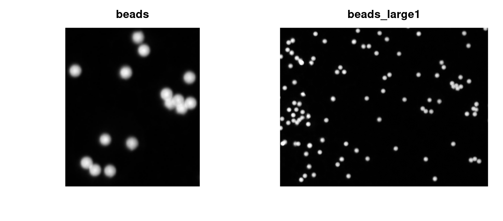
```

(ref:examples2) **Examples**: Images of microbeads provided by the `biopixR` package.

```{r examples2, echo=FALSE, fig.cap="(ref:examples2)", out.width="95%"}
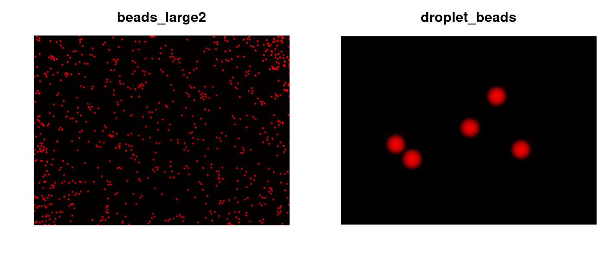
```

A selection of these microbead images will be employed in the forthcoming
demonstration of the `biopixR` functions. As previously mentioned, the primary
development objective was to analyze data derived from microbead-based and
cell-based assays. 

This vignette will focus on the analysis of microbead particles made of 
polymethylmethacrylate (PMMA), which are
approximately 12 µm in size [@Geithe2024]. __In the following sections and 
illustrations, there is no further mention of the size of microbeads or 
any specifications provided in the images. All algorithms are indifferent to 
diameter.__ At the end of this vignette, you will find a brief example for 
analyzing cell-based assays.


## `importImage()` - Importing Images into the `R` Environment

The `biopixR` package features an import function called `importImage()`. The
function supports the importation of digital images in various file formats,
including Joint Photographic Experts Group (JPEG), Portable Network Graphics
(PNG), Bitmap Image File (BMP), and Tagged Information Interchange Format
(TIFF). This function acts as a wrapper, integrating the capabilities of the
`magick` and `imager` packages for import and class conversion. Since most image processing operations in
`biopixR` rely on `imager`, the `importImage()` function converts all formats
into the `imager` class 'cimg'. During the development process, it was
frequently observed that images exhibited more than three dimensions within the
color channel, specifically an additional transparency layer, also known as
alpha. Such images often lead to challenging and elusive errors. To address this
issue, the `importImage()` function employs a process of detection and removal
of the fourth color dimension, if present.

The import function is demonstrated in Figure \@ref(fig:import2), where it is
used to import two microbead images in BMP and PNG formats.

```{r import0}
# Get the path to the 'beads.png' image file within the 'biopixR' package
path2img <- system.file("images/beads.png", package = "biopixR")

# Import the image from the path specified by 'path2img' and store it in the 
# 'microbeads' object
microbeads <- importImage(path2img)

# Import the image 'fig6.1_transparent.bmp' from the 'figures' directory and 
# store it in the 'transparent_bead' object
transparent_bead <- importImage("figures/fig6.1_transparent.bmp")

# Display the class of the 'microbeads' object
class(microbeads)
```

```{r import1, eval=FALSE}
# Set up a 1x2 plotting area
par(mfrow = c(1, 2))

# Display imported images
plot(microbeads, axes = FALSE)
plot(transparent_bead, axes = FALSE)

# Reset the plotting area to a single plot
par(mfrow = c(1, 1))
```

(ref:import2) **Example Images**: Showcasing the functionality of the function for image import - `importImages()`, with two images of microbeads.

```{r import2, echo=FALSE, out.width="99%", fig.cap="(ref:import2)"}
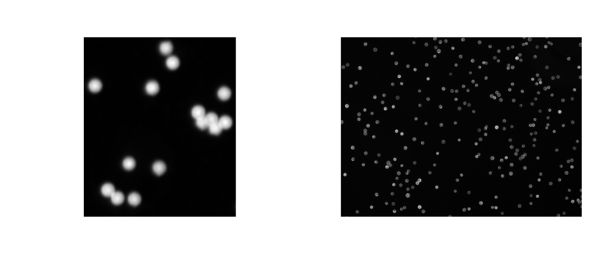
```


## `edgeDetection()` - A modified Canny Edge Detector {#edge}

Edge detection (e.g., contours, lines) is crucial in various applications 
such as computer vision and object recognition, particularly in 
medical image analysis. It aids in identifying regions with significant 
changes or transitions within an image, thereby extracting valuable information 
by highlighting key elements like shapes, patterns, or specific areas of interest.
Various edge detection algorithms are available in `R`,
with the Canny edge detector, developed by @Canny1986, being the most widely
implemented across multiple packages, including those by @Barthelme2015
(`imager`); @Ooms2016 (`magick`); @Mouselimis2016 (`OpenImageR`); and @Beare2018
(`SimpleITK`). Other noteworthy edge detection algorithms in the `R` package
`OpenImageR` includes those by @Prewitt1970, @Sobel2014, @Roberts1980, and
@Scharr2000. After evaluating the different results (e.g., Figure
\@ref(fig:edge1)), the Canny edge detection algorithm from the `imager` package
was selected for edge detection. The resulting binary image serves as a
foundation for subsequent feature extraction. Furthermore, the `cannyEdges()`
function in `imager` offers adjustable parameters for `alpha` and `sigma`,
enabling users to customize thresholding and smoothing, providing the desired
flexibility.

The process of Canny edge detection using the `imager` package comprises a
series of steps. Initially, a Gaussian filter is applied to the image, resulting
in the smoothing of the image to remove noise. The degree of smoothing
can be adjusted by varying the value of the `sigma` parameter. Subsequently, the
intensity gradient is calculated to determine the magnitude of the
edges. This is followed by the application of non-maximum suppression, which
serves to minimize the blur introduced previously. Subsequently, a double
threshold is applied. In the absence of provided thresholds, they are estimated
through *k-means* clustering. The calculated threshold can be adjusted using the
`alpha` parameter. These thresholds are employed to classify edges as either
weak or strong. Finally, hysteresis is employed to combine these edges, with
weak edges being discarded if they are not in proximity to strong edges
[@Barthelme2015; @Barthelme2019].^[http://dahtah.github.io/imager/canny.html, accessed 06/26/2024]

```{r edge0, eval=FALSE}
# Set up a 1x2 plotting area
par(mfrow = c(1, 2))

# Edge detection with 'Prewitt' method
OpenImageR::edge_detection(as.matrix(beads),
                           method = "Prewitt") |>
  as.cimg() |>
  plot(axes = FALSE,
       main = "Prewitt - edge detection",
       cex.main = 3.5)
text(c(10), c(10), c("A"), col = "darkred", cex = 3.5)

# Edge detection with 'Canny' method
cannyEdges(beads) |> plot(axes = FALSE,
                          main = "Canny - edge detection",
                          cex.main = 3.5)
text(c(10), c(10), c("B"), col = "darkred", cex = 3.5)

# Reset the plotting area to a single plot
par(mfrow = c(1, 1))
```

(ref:edge1) **Comparison of Two Edge Detection Algorithms**: **A**) Resulting image using the @Prewitt1970 edge detection algorithm from the `OpenImageR` package. The contours have higher intensity, but the image is not binary. **B**) The Canny edge detection algorithm produces a binary image with distinct contours.

```{r edge1, echo = FALSE, out.width="86%", fig.cap="(ref:edge1)"}
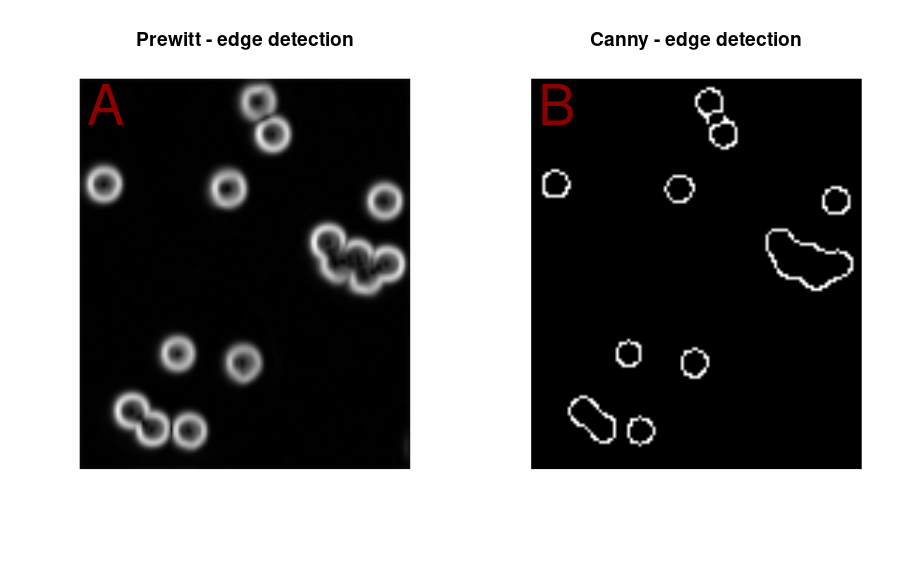
```

In the context of microbead images, the contours that were identified frequently
exhibited gaps, rendering them inaccessible for subsequent labeling (Figure
\@ref(fig:edge3)A). The figure depicts filled circles representing successfully
labeled microbeads, while the contours indicate unsuccessful labeling.
Consequently, segmentation with fragmented contours is incomplete, rendering the
objects inaccessible for further analysis. To address this issue, the `magick`
package was employed to identify line ends (Figure \@ref(fig:edge3)B). Line
ends can then be reconnected to a neighboring line, provided that the line end
does not share the same label. This process of reconnection is constrained by a
specific radius to prevent line ends from connecting across the entire image.

```{r edge2, eval=FALSE}
# Set up the plotting area to have 1 row and 2 columns
par(mfrow = c(1, 2))

# Apply Canny edge detection to the image 'beads_large1' with specified parameters
edge_canny <- cannyEdges(beads_large1, alpha = 0.8, sigma = 0)

# Label the detected edges
labeled_canny <- label(edge_canny)

# Plot the labeled edges without axes
plot(labeled_canny, axes = FALSE)
text(c(475), c(355), c("A"), col = "darkred", cex = 5)

# Draw red arrows at specified coordinates
arrows(
  x0 = 23,
  y0 = 29,
  x1 = 24,
  y1 = 30,
  col = "red",
  lwd = 3
)
arrows(
  x0 = 412,
  y0 = 148,
  x1 = 413,
  y1 = 147,
  col = "red",
  lwd = 3
)
arrows(
  x0 = 73,
  y0 = 210,
  x1 = 72,
  y1 = 210,
  col = "red",
  lwd = 3
)

# Mirror the detected edges across the x-axis
edge_canny_m <- mirror(edge_canny, axis = "x")

# Convert the mirrored edge image to magick format
canny_magick <- cimg2magick(edge_canny_m)


# Detect the coordinates of all line ends using morphology operation
lineends_canny <- image_morphology(canny_magick,
                                   "HitAndMiss", "LineEnds")

# Convert the extracted coordinates back into 'cimg' format
lineends_cimg <- magick2cimg(lineends_canny)

# Find the coordinates of the line ends and transform into a data frame
end_points <- which(lineends_cimg == TRUE, arr.ind = TRUE)
end_points_df <- as.data.frame(end_points)
colnames(end_points_df) <- c("x", "y", "dim3", "dim4")

# Highlight the line end pixel in green color on the original edge image
endpoints_img <- changePixelColor(as.cimg(edge_canny),
                                  end_points_df,
                                  color = "green",
                                  visualize = FALSE)

# Plot the image with highlighted line ends without axes
plot(endpoints_img, axes = FALSE)
text(c(475), c(355), c("B"), col = "darkred", cex = 5)

# Highlight the line ends in green color on the original edge image
points(end_points_df$x, end_points_df$y, col = "green", lwd = 2)

# Draw red arrows at specified coordinates
arrows(
  x0 = 23,
  y0 = 29,
  x1 = 24,
  y1 = 30,
  col = "red",
  lwd = 3
)
arrows(
  x0 = 412,
  y0 = 148,
  x1 = 413,
  y1 = 147,
  col = "red",
  lwd = 3
)
arrows(
  x0 = 73,
  y0 = 210,
  x1 = 72,
  y1 = 210,
  col = "red",
  lwd = 3
)

# Set up the plotting area back to normal
par(mfrow = c(1, 1))
```

(ref:edge3) **Segmentation Result with Canny Edge Detector**: **A**) Segmentation result using the `label()` function. The segmentation is incomplete, as not all microbeads are identified as foreground. Only the contours are detected in these cases (highlighted by red arrows). **B**) Result of the `cannyEdges()` function, showing detected line end pixels, which are colored and circled in green.

```{r edge3, echo = FALSE, out.width="99%", fig.cap="(ref:edge3)"}
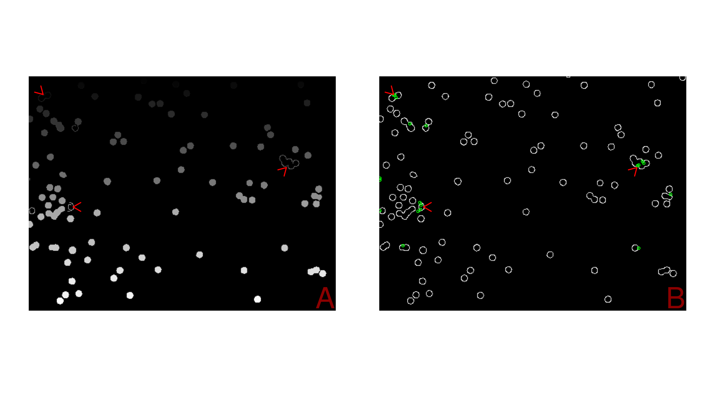
```

As illustrated in Figure \@ref(fig:edge5)A, the modified Canny edge detector,
`edgeDetection()`, is capable of successfully rejoining line ends, thereby
enabling the detection of previously unlabeled microbeads, as shown in Figure
\@ref(fig:edge3)A. For further visualization, the `objectDetection()` function
was employed. This function employs the `edgeDetection()` function and provides
visual feedback as an output (Figure \@ref(fig:edge5)B).

```{r edge4, eval = FALSE}
# Set up a 1x2 plotting area
par(mfrow = c(1, 2))

# Detect objects in the 'beads_large1' image using the edge method with
# specified alpha and sigma values
object_biopixR <-
  objectDetection(beads_large1,
                  method = 'edge',
                  alpha = 0.8,
                  sigma = 0)

# Perform edge detection on the 'beads_large1' image with specified alpha and
# sigma values
edge_biopixR <- edgeDetection(beads_large1, alpha = 0.8, sigma = 0)

# Label the detected edges in the 'edge_biopixR' image
labeled_biopixR <- label(edge_biopixR)

# Plot the labeled edges without axes
plot(labeled_biopixR, axes = FALSE)
text(c(475), c(355), c("A"), col = "darkred", cex = 5)

# Plot the marked objects from the object detection without axes
plot(object_biopixR$marked_objects, axes = FALSE)
text(c(475), c(355), c("B"), col = "darkred", cex = 5)

# Reset the plotting area to a single plot
par(mfrow = c(1, 1))
```

(ref:edge5) **Segmentation Result with Modified Canny Edge Detector**: **A**) Segmentation result using the `label()` function, showing successful segmentation with all microbeads identified as part of the foreground. **B**) Successful segmentation visualized using the `objectDetection()` function, with purple contours around each microbead and green dots indicating their centers.

```{r edge5, echo = FALSE, out.width="99%", fig.cap="(ref:edge5)"}
include_graphics("figures/fig5.2_edgeDetection.png")
```


## `objectDetection()` - A Function for Feature Extraction

The `objectDetection()` function of the `biopixR` package serves as a
segmentation tool, offering various methods for the extraction of objects
of interest from an image. The extracted information includes the center,
size, and coordinates of each detected object. In the case of microbeads, it is
essential to distinguish between individual entities. Consequently, the
`objectDetection()` function provides tools for segmentation using either
thresholding or edge detection. Both methods have distinct advantages depending
on the specific application, and their respective use cases will be presented in
the following sections.


### Edge Detection Method in `objectDetection()`

When edge detection is selected, the modified Canny edge detector, provided by
the `edgeDetection()` function, is used. As previously described in Chapter
\@ref(edge), the selection of the `alpha` and `sigma` parameters plays a pivotal
role in the performance of feature extraction. The objective is to modify the
threshold (`alpha`) to detect all objects without detecting noise, and to
maintain a minimal level of smoothing (`sigma`) to avoid merging proximate
objects and to ensure accurate edge detection. To facilitate the selection of
parameters, the `biopixR` package offers a range of methods designed to assist
users in this process:

**Automated Parameter selection**:

The `biopixR` package encompasses two distinct methods for the automated
parameter selection process. Both automation methods employ a fitness function
to extract shape information via the `shapeFeatures()` function. The fitness
function evaluates the results using various input parameters, operating under
the assumption that the objects in question are circular. While the grid search
method is time-consuming due to its exhaustive testing of every possible
parameter combination, the Pareto front optimization method samples and analyzes
a subset of combinations, allowing for a more rapid estimation of the optimal
parameters.

\phantom{x}\hspace{0.5cm} *Grid Search* - To conduct a grid search,
it is first necessary to create a parameter grid containing all possible
combinations of the `alpha` and `sigma` parameters. The range of `alpha` is
predetermined and fixed at 0.1 to 1.5, while the range of `sigma` is also
predetermined and fixed at 0 to 2, with both ranges incrementing by 0.1. This
process yields a grid of 315 objects, which represent the potential parameter
combinations to be tested. For each combination, a fitness value is calculated
using the fitness function, with the entire parameter grid being scanned in
sequence. To achieve a balance between the two objectives of attaining
circular shaped objects and detecting all objects, the fitness value
representing the shape is combined with the number of detected objects. The
results of this method are presented in Figure \@ref(fig:object2). The image
analysis process is relatively time-consuming, with a runtime of approximately
five minutes for the example image. Additionally, four of the microbeads could
not be successfully detected.

```{r object0, eval=FALSE}
# Start the timer to measure the execution time of the code block
tictoc::tic()

# Perform automated object detection on the 'beads_large1' image
static_result <- objectDetection(beads_large1,
                                   method = 'edge',
                                   alpha = 'static',
                                   sigma = 'static')

# Stop the timer and display the elapsed time
tictoc::toc()
```

```{r object1, echo=FALSE}
cat("257.414 sec elapsed")

static_result <- objectDetection(beads_large1,
                                   method = 'edge',
                                   alpha = 1,
                                   sigma = 0.6)
```

(ref:object2) **Results of Automated Feature Extraction Using Grid Search**:  The successfully detected microbeads are highlighted through the internal visualization of the `objectDetection()` function. The contours are outlined in purple, and the center of each object is marked with a green circle. Notably, four microbeads were not detected by the algorithm (indicated by the red arrow).

```{r object2, echo=FALSE, fig.cap="(ref:object2)", out.width="86%"}
# Display the result of the automated parameter calculation using grid search
plot(static_result$marked_objects, axes = FALSE)

# Visualize undetected microbeads
arrows(456, 45, 455, col = "red", lwd = 2)
arrows(374, 82, 375, col = "red", lwd = 2)
arrows(386, 175, 385, col = "red", lwd = 2)
arrows(50, 170, 49, 171, col = "red", lwd = 2)
```

\phantom{x}\hspace{0.5cm} *Multi-objective Optimization* - As mentioned above,
automation must strike a balance between detecting only objects with perfect
shapes (losing information about the phenomena discussed above) and detecting
noise or unwanted areas around the objects, which can lead to the merging of
nearby objects as seen in thresholding (Figure \@ref(fig:object7)). In
grid search, combining both quality (shape features) and quantity (number of
objects detected) measures into a single value while maintaining this balance is
a significant challenge. These measures are controlled by the input parameters
`alpha` and `sigma`. To solve this problem, another method specifically designed
to optimize multiple parameters, known as multi-objective optimization, has been
used.

In `R`, this method is accessible through the `GPareto` package, which is
designed for 'Gaussian process-based multi-objective optimization'. This
approach is particularly well-suited to computationally intensive optimization
tasks [@Binois2019]. This criterion is met because the optimal parameter
combination must be identified through the extraction of shape features for each
parameter combination, which is a process that requires significant
computational resources.

The objectives to be optimized are the parameters `alpha` and `sigma`. The
Gaussian process is used to model the objective functions based on a limited
number of sample points. Gaussian regression predicts unknown values by modeling
the spatial correlation between sample points [@Binois2019]. The optimization
task can be formulated as follows: to detect all objects while maintaining
circular shape characteristics and avoiding the merging of nearby objects
(quality/quantity trade-off).

The `GPareto` package aims to identify the set of optimal compromises, known as
the Pareto set, consisting of non-dominated points (points where no other point
has better objectives). The visualization of the Pareto set in the objective
space is called the Pareto front [@Binois2019] (Figure \@ref(fig:object4)).

The default criterion selected is SMS-(EGO) - S-metric Selection Efficient
Global Optimization, an extension of the EGO algorithm tailored for
multi-objective optimization. This method, used as an infill criterion, selects
new sample points by maximizing hypervolume improvement, effectively balancing
exploration (finding new areas) and exploitation (refining known good areas).
Particle Swarm Optimization (PSO) is used as the internal optimization routine
to find the optimal sampling point [@Binois2019].

The principle of this method involves: 

1. Generating an initial set of observations.
2. Fitting the Gaussian process models to each objective independently.
3. Running an inner optimization loop to find the best point (new point as the maximizer of an infill criterion).
4. Obtaining a new observation by running the simulator and updating the models accordingly.

The last two steps are repeated until the simulation budget of 20 is exhausted
or a stopping criterion is met [@Binois2019].

```{r object3}
# Start the timer to measure the execution time of the code block
tictoc::tic()

# Perform automated object detection on the 'beads_large1' image
gaussian_result <- objectDetection(beads_large1,
                                   method = 'edge',
                                   alpha = 'gaussian',
                                   sigma = 'gaussian')

# Stop the timer and display the elapsed time
tictoc::toc()
```

(ref:object4) **Uncertainty Plot of the Objective Space** (left) & **Pareto Front Approximation** (right): The Uncertainty Plot provides a visualization of the confidence levels in the estimate of the Pareto front using Gaussian process modeling (x-axis: `alpha`; y-axis: `sigma`). The sample points used to construct the model are highlighted in yellow, while the actual realizations of the Pareto set are highlighted in green. In addition, the probability shades categorize regions of interest as white (indicating regions of high interest), black (indicating regions of low interest), and gray (indicating regions of uncertainty). The Pareto Front Plot visualizes the non-dominated solutions, known as the Pareto set. The optimal point within this set is highlighted in green. The input parameters `alpha` and `sigma` corresponding to this optimal point were used for the final analysis of the microbead image.

```{r object4, echo=FALSE, fig.cap="(ref:object4)", out.width="49%"}
include_graphics("figures/fig18_uncertainty.png")
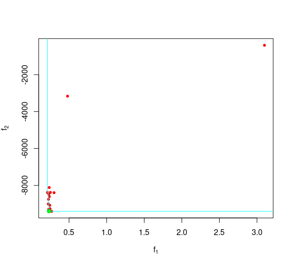
```

The optimal `alpha` and `sigma` parameters, obtained through Gaussian process
modeling, are utilized as input for the `edgeDetection()` algorithm within the
`objectDetection()` function. The detected microbeads are displayed in Figure
\@ref(fig:object5), with all microbeads being successfully identified.

(ref:object5) **Results of Automated Feature Extraction Using Multi-objective Optimization**:  The detected microbeads are highlighted through the internal visualization of the `objectDetection()` function. The contours are outlined in purple, and the center of each object is marked with a green circle. Notably, all the microbeads are detected.

```{r object5, fig.cap="(ref:object5)", out.width="86%"}
# Display the result of the automated parameter calculation using multi-objective 
# optimization
plot(gaussian_result$marked_objects, axes = FALSE)
```


### Thresholding Method in `objectDetection()`

Thresholding is a technique used in image processing to divide an image 
into various regions based on their brightness or intensity values. By 
setting a specific threshold, it is possible to distinguish between foreground 
objects (above the threshold) and background areas (below the threshold). 
This differs from edge detection, which focuses on identifying abrupt 
changes in pixel intensities within images to locate boundaries of objects or shapes.
The thresholding method is particularly well-suited for images with high and
inhomogeneous backgrounds, as it incorporates background correction by solving
the Screened Poisson Equation (SPE) before applying the threshold. This
correction is achieved through the use of the `SPE()` function from the
`imagerExtra` package [@Ochi2018], which is based on the method described by
@Morel2014. This approach addresses image artifacts such as inhomogeneous
illumination and low contrast while preserving image details [@Morel2014].
Consequently, the method allows for the detection of low-contrast objects
against inconsistent backgrounds, such as transparent microbeads (Figure
\@ref(fig:object7)). The thresholding method does not require any additional
input, is highly robust and also performs well on fluorescent microbead images.
However, this approach has one disadvantage: the threshold is less strict than
edge detection, which may result in the merging of objects in proximity that
would be regarded as separate entities by the edge detection method.

```{r object6, eval=FALSE}
# Set up the plotting area to have 1 row and 2 columns
par(mfrow = c(1, 2))

# Import the image of transparent beads
transparant_beads <-
  importImage("figures/fig6_transparent_beads.bmp")

# Plot the imported image without axes
plot(transparant_beads, axes = FALSE)
text(c(70), c(70), c("A"), col = "darkred", cex = 5)

# Perform object detection on the transparent beads image using the 'threshold'
# method
result_transparant <-
  objectDetection(transparant_beads, method = 'threshold')

# Plot the marked objects from the object detection result without axes
plot(result_transparant$marked_objects, axes = FALSE)
text(c(70), c(70), c("B"), col = "darkred", cex = 5)

# Visualize merged microbeads
arrows(900, 800, 899, 801, col = "red", lwd = 7.5)

# Reset the plotting area to the default 1 row and 1 column
par(mfrow = c(1, 1))
```

(ref:object7) **Transparent Microbeads**: **A**) Original image of transparent microbeads, showing low contrast between the microbeads and the background. **B**) Application of the threshold method, resulting in the detection of the outer layer (halo) of the microbeads, successfully capturing the ligand signal. Detected coordinates are colored in purple, with centers marked in green. The merging of proximate microbeads into a single entity is exemplified by the red arrow.

```{r object7, echo=FALSE, fig.cap="(ref:object7)", out.width="99%"}
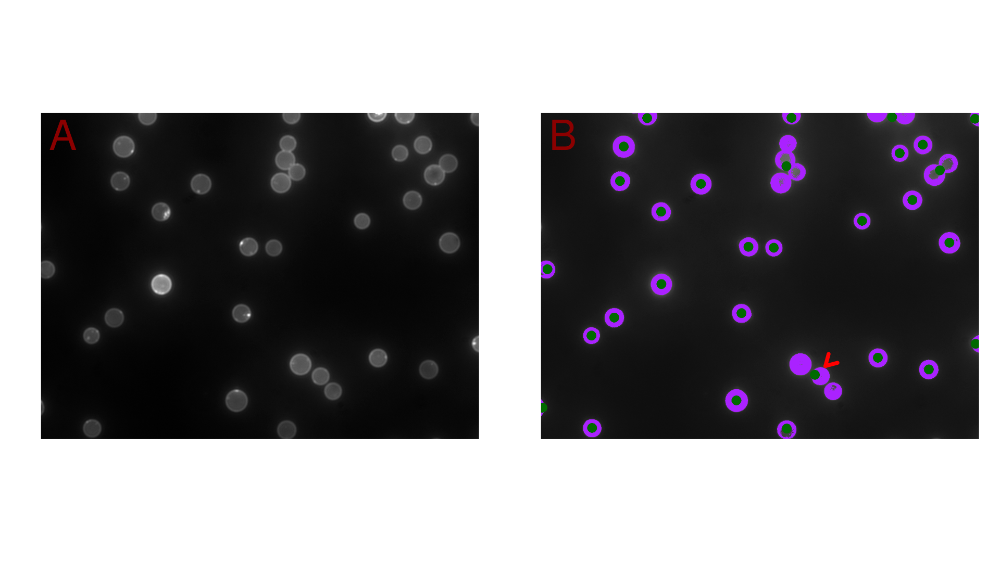
```


### Interactive Approach in `objectDetection()`

To facilitate parameter selection, an interactive object detection function was
developed using the `R` package `tcltk`, which provides access to Tcl/Tk in `R`.
The Graphical User Interface (GUI) is invoked via the
`interactive_objectDetection()` function (Figure \@ref(fig:object9)). The
`alpha` and `sigma` parameters of the `edgeDetection()` function, discussed in
Chapter \@ref(edge), represent the threshold adjustment factor and the smoothing
factor, respectively. The corresponding sliders in the Tcl/Tk interface enable
users to adjust these parameters to optimize object detection. The detected
objects are highlighted with purple contours and green centers. The "Switch
Method" button enables the user to toggle between edge detection and the
threshold method for object detection. Figure \@ref(fig:object9) illustrates
that the threshold adjustment factor - `alpha` - must be decreased, as not all
microbeads are currently being detected. To facilitate the analysis of smaller
images, a scaling slider was incorporated into the interface, utilizing the
`imresize()` function from the `imager` package. This function employs bilinear
interpolation to adjust the image size according to user input
[@Barthelme2015].

```{r object8, eval=FALSE}
# Open interactive Tcl/Tk interface for object Detection
interactive_objectDetection(beads_large1)
```

(ref:object9) **Graphical User Interface for Interactive Parameter Selection**: The `interactive_objectDetection()` function offers a user-friendly interface with sliders to adjust threshold, smoothing, and scale. It also includes a button to switch between edge detection and thresholding methods. Object contours are highlighted in purple and centers in green for easy visualization. This example was executed in RStudio 2023.09.0+463 with `R` 4.3.2 on Linux (Ubuntu 22.04.3 LTS), displaying fluorescent microbeads. The rendering process, including timestamps and the current state, is shown in the console.

```{r object9, echo=FALSE, out.width="99%", fig.cap="(ref:object9)"}
include_graphics("figures/fig8_GUI.png")
```

In conclusion, the `objectDetection()` function gathers comprehensive data about
image objects, which facilitates the identification and differentiation of
individual features. This process provides precise coordinates for each object
in the image, which serve as the foundation for further analysis and
characterization of features within the `biopixR` package. Moreover, the
function provides a variety of methods for extracting objects within an image,
thereby ensuring its adaptability for a broad range of applications.


## Dealing with Fluorescence Reflection and Aggregation with `sizeFilter()` and `proximityFilter()`

In microbead-based assays, two phenomena must be avoided to prevent the
generation of low-quality or incorrect results. These issues are exemplified in
one of the images provided by the package (Figure \@ref(fig:filter0)). The first
issue arises when microbeads are in proximity to one another. As
laterally-emitted light [@Goeroecs2015] has the potential to cause reflection
from adjacent microbeads, potentially generating false positive signals. To
address this issue, we developed the `proximityFilter()` function.

(ref:filter0) **Unwanted Microbead Phenomena**: The image is part of the `biopixR` package and illustrates the various occurrences within a microbead sample. It is evident that some microbeads are situated in proximity to one another, as indicated by the green arrow. Moreover, the microbeads have the potential to aggregate, forming clusters such as doublets (highlighted by the red arrow) and multiplets (marked by the cyan arrow).

```{r filter0, out.width="85%", fig.cap="(ref:filter0)"}
# Highlight unwanted microbead phenomena
plot(beads, axes = FALSE)
arrows(
  x0 = 60,
  y0 = 17,
  x1 = 61,
  y1 = 16,
  col = "green",
  lwd = 2
)
arrows(
  x0 = 90,
  y0 = 75,
  x1 = 91,
  y1 = 74,
  col = "cyan",
  lwd = 2
)
arrows(
  x0 = 30,
  y0 = 116,
  x1 = 29,
  y1 = 117,
  col = "red",
  lwd = 2
)
```

The `proximityFilter()` function is used to filter objects based on a specified
radius (Figure \@ref(fig:filter1)). For each object, a square region is
defined around its center, representing an area in which no other object is
permitted. In the event that another object is detected within this region, both
objects are discarded. The user has the option to specify the radius in pixels,
or alternatively, it can be calculated automatically by the algorithm. In the
case of the latter, the algorithm assumes that the objects are circular and
determines the radius based on their size. The calculated radius is then
extended by a factor called `elongation`. The default elongation factor is 2,
which means that an area of two radii (with one radius overlapping with the
object) around the object must be free of other objects for the object to pass
the filter. The `elongation` factor can be adjusted according to the user's
specific requirements.

(ref:filter1) **Proximity Filtering Process**: The `objectDetection()` function is initially employed for the purpose of identifying all objects within the image. The resulting data from this function is then employed as input for the `proximityFilter()`, with the radius set to automatic calculation. The final result is presented through the use of the `changePixelColor()` function, wherein each passing object is highlighted in a distinct color.

```{r filter1, out.width="85%", fig.cap="(ref:filter1)"}
# Perform object detection on the 'beads' image using the 'edge' method
objects <-
  objectDetection(beads,
                  method = 'edge',
                  alpha = 1,
                  sigma = 0)

# Apply a proximity filter to the detected objects
filter_prox <-
  proximityFilter(objects$centers,
                  objects$coordinates,
                  radius = "auto",
                  elongation = 2)

# Change the pixel color of passing microbeads and highlight distinct objects in
# different colors
visual <- changePixelColor(
  beads,
  filter_prox$coordinates,
  color = factor(filter_prox$coordinates$value),
  visualize = F
)

plot(visual, axes = FALSE)
```

The second phenomenon is the aggregation of microbeads, which results in the
formation of doublets and multiplets. These aggregated microbeads must be
discarded to achieve consistent and reproducible results consisting of single
microbeads. To address this issue, the `sizeFilter()` function was developed (
Figure \@ref(fig:filter2)). This function filters objects based on their individual
size, using specified lower and upper limits. These limits can be set manually,
interactively, or automatically. In the interactive approach, the size
distribution is plotted in the `R` environment, and the user is prompted in the
console to enter the limits based on the visualized distribution. In the
automated approach, which is applicable when the number of objects exceeds 50,
the interquartile range (IQR) is used to calculate the limits. Specifically, the
filter applies the 1.5 * IQR rule to determine the size thresholds. As
described in several publications, the IQR rule is more suitable and reliable
for outlier estimation when dealing with large data sets. Consequently, the
conventional statistical threshold of n = 50 was selected [@Miller1991;
@Iglewicz1993; @pittir7948]. This implies that at least 25 objects must be
included in the IQR to produce a representative range.

(ref:filter2) **Size Filtering Process**: The same input utilized for the previously demonstrated proximity filtering, obtained via the `objectDetection()` function, is employed in this instance. Due to an insufficient number of objects for automated calculation, the size limits are provided manually based on the size distribution shown on the left (in pixel - px). The provided limit is visualized through a red horizontal line. On the right, the `changePixelColor()` visualization tool is employed to highlight the objects that meet the size criteria in different colors.

```{r filter2, fig.cap="(ref:filter2)", out.width="89%"}
# Set up the plotting area to have 1 row and 2 columns
par(mfrow = c(1, 2))

# Apply a size filter to the detected objects from the previous chunk
filter_size <-
  sizeFilter(
    objects$centers,
    objects$coordinates,
    lowerlimit = 0,
    upperlimit = 150
  )

# Plot the sizes of the detected objects and display upper limit
plot(objects$centers$size, ylab = "size in px")
abline(h = 150, col = "red")           # Add a horizontal line at y = 150

# Change the pixel color of the passing microbeads and highlight distinct
# objects in different colors
visual <- changePixelColor(
  beads,
  filter_size$coordinates,
  color = factor(filter_size$coordinates$value),
  visualize = F
)

plot(visual, axes = FALSE)

# Reset the plotting area to the default 1 row and 1 column
par(mfrow = c(1, 1))
```

As has been demonstrated, the `biopixR` package is an effective tool for
addressing the undesired phenomena present in microbead-based assays. The
package provides automated filter functions, some of which include interactive
modules that facilitate applicability in laboratory settings.


## Interpretation with `resultAnalytics()` {#result}

The `resultAnalytics()` function is designed to summarize the most important
information about the extracted features. This includes details such as the
number of objects, center coordinates, size, intensity, and the number of
objects that did not pass the filtering process, if applied. It also provides
coverage information, which indicates the percentage of the image that is
considered part of the objects. The function takes the object coordinates and
the image as input and calculates these properties. 

The results are presented in
the form of a list comprising two tables: one representing the average of all
features, providing a comprehensive summary of the entire image in a single row
(Table \@ref(tab:result3)), and the second providing detailed information
about each detected object (Table \@ref(tab:result6)), which is useful but
can be overwhelming when there are hundreds of objects in the image. Users can
also provide the unfiltered coordinates if filtering was used; in this case, the
function estimates the number of rejected objects based on the average size of
all detected objects.

```{r result0}
# Extract the results from the previous extraction and filtering in a concise manner
result <- resultAnalytics(beads,
                          coordinates = filter_size$coordinates,
                          unfiltered = objects$coordinates)
```

```{r result1, eval=FALSE}
# Displaying the summarized results for the whole image
result$summary
```

```{r result2, echo=FALSE}
summary <- kable(
  result$summary,
  format = "markdown",
  booktabs = TRUE,
  caption = "Summary of extracted features in an image.",
  col.names = c(
    "number of objects",
    "mean (size)",
    "sd (size)",
    "mean (intensity)",
    "sd (intensity)",
    "estimated rejected",
    "coverage"
  ),
  align = "cccccc",
  escape = FALSE
)
```

```{r result3, echo=FALSE}
summary <- summary |>
  kable_styling(full_width = F, position = "center") |>
  column_spec(1, width = "1.6cm", extra_css = "word-wrap: break-word;") |>
  column_spec(2, width = "1.4cm", extra_css = "word-wrap: break-word;") |>
  column_spec(3, width = "1.4cm", extra_css = "word-wrap: break-word;") |>
  column_spec(4, width = "1.9cm", extra_css = "word-wrap: break-word;") |>
  column_spec(5, width = "1.9cm", extra_css = "word-wrap: break-word;") |>
  column_spec(6, width = "1.5cm", extra_css = "word-wrap: break-word;") |>
  column_spec(7, width = "1.5cm", extra_css = "word-wrap: break-word;")

footnote(summary, general = "", general_title = "Abbreviations: sd - standard deviation")
```

```{r result4, eval=FALSE}
# The output is obtained as list
# Displaying the detailed results for every microbead
result$detailed
```

```{r result5, echo=FALSE}
detailed <- kable(
  result$detailed,
  format = "markdown",
  booktabs = TRUE,
  caption = "Detailed results of the individual extracted features.",
  col.names = c(
    "objectnumber",
    "size in px",
    "intensity",
    "sd(intensity)",
    "x",
    "y"
  ),
  align = "ccccrr",
  escape = FALSE
)
```

```{r result6, echo=FALSE}
footnote(detailed, general = "", general_title = "Abbreviations: px - pixel, sd - standard deviation")
```


## Batch Proccesing Functions within the `biopixR` Package

This section presents two pipeline functions designed for the analysis of
images. The initial function, termed `imgPipe()`, integrates a number of
functions from the `biopixR` package, thereby enabling comprehensive analysis
and filtering of an image through a single function. The second function,
`scanDir()`, expands the functionality of `imgPipe()` to encompass batch processing.
This functionality enables the analysis of entire directories, incorporating all
the options, parameter adjustments, and individual filtering capabilities
provided by the `imgPipe()` function.


### `imgPipe()` - One Image, One Function 

The `imgPipe()` function combines multiple functions into a unified pipeline,
including `objectDetection()`, `sizeFilter()`, `proximityFilter()`, and
`resultAnalytics()`. This function is capable to analyse a single image, but
was also designed to be capable of processing multiple color channels
concurrently. As an illustration, if an image contains objects that are
distinguishable by color, with each object detectable in a separate channel,
these images can be submitted for analysis using the `imgPipe()` function. The
function will analyze both images and combine the results, providing a summary
of the number of objects detected in each image. This feature is particularly
advantageous for the analysis of dual-colored microbeads.

This section illustrates the application of the `imgPipe()` function. Figure
\@ref(fig:imgPipe2) presents the initial state, which depicts the dual-colored
microbead image (A) and the two single-color channels (B & C). The images are
imported via the `importImage()` function, which automatically converts the
imported TIFF image into a 'cimg' object. Subsequently, the images are
transformed into grayscale and utilized as input for the `imgPipe()` function.
Edge detection is employed for feature extraction, with the identical `alpha`
and `sigma` parameters applied to both images (Figure \@ref(fig:imgPipe2)B and
C). It can be observed in Figure \@ref(fig:imgPipe2)A that overlapping microbeads
are present. To exclude these from the subsequent analysis, the
`proximityFilter()` is enabled within the `imgPipe()` function. The output is in
similar format as presented in Chapter \@ref(result), with the addition of a data
frame comparing the differently encoded microbeads (Table \@ref(tab:imgPipe6)
and \@ref(tab:imgPipe8)).

```{r imgPipe0}
# Import the dual-color microbead image
dual_color <- importImage("figures/fig19.2_dual_color.tif")

# Import the green fluorescence channel
green_beads <- importImage("figures/fig19.3_green_channel.tif")

# Import the red fluorescence channel
red_beads <- importImage("figures/fig19.1_red_channel.tif")
```

```{r, echo=FALSE}
# This is an internal script to make the microbeads, which are only a few pixel 
# in size, accessible in a printed copy of this vignette
green_beads1 <-
  as.cimg(green_beads[1:dim(green_beads)[1], 
                      1:dim(green_beads)[2], 
                      1, 
                      1:dim(green_beads)[4]]) |> 
  grayscale()

# Discard second image present in image depth and transform into grayscale (red)
red_beads1 <-
  as.cimg(red_beads[1:dim(red_beads)[1], 
                    1:dim(red_beads)[2], 
                    1, 
                    1:dim(red_beads)[4]]) |> 
  grayscale()

res_pipe <- imgPipe(green_beads1,
                    color1 = "green",
                    red_beads1,
                    color2 = "red",
                    method = 'edge',
                    alpha = 0.7,
                    sigma = 2,
                    sizeFilter = FALSE,
                    proximityFilter = FALSE)

# Import the dual-color microbead image
dual_color <- importImage("figures/fig19.2_dual_color.tif")

# Import the green fluorescence channel
green_beads <- importImage("figures/fig19.3_green_channel.tif")

# Import the red fluorescence channel
red_beads <- importImage("figures/fig19.1_red_channel.tif")
```

```{r, warning=FALSE, eval=FALSE, echo=FALSE}
# Internal visualization script
# Set up the plotting area to have 1 row and 3 columns
par(mfrow = c(1, 3))

colors <- c("green", "red")

# Plot the dual-color microbeads without axes
plot(dual_color, axes = FALSE)
text(c(60), c(60), c("A"), col = "darkred", cex = 5)
points(res_pipe$detailed$x,
       res_pipe$detailed$y, 
       col = colors[factor(res_pipe$detailed$color)],
       pch = 19,
       lwd = 0.1)

# Plot the green channel image without axes
plot(green_beads, axes = FALSE)
text(c(60), c(60), c("B"), col = "darkred", cex = 5)
points(res_pipe$detailed$x[res_pipe$detailed$color == "green"],
       res_pipe$detailed$y[res_pipe$detailed$color == "green"], 
       col = "green",
       pch = 19,
       lwd = 0.1)

# Plot the red channel image without axes
plot(red_beads, axes = FALSE)
text(c(60), c(60), c("C"), col = "darkred", cex = 5)
points(res_pipe$detailed$x[res_pipe$detailed$color == "red"],
       res_pipe$detailed$y[res_pipe$detailed$color == "red"], 
       col = "red",
       pch = 19,
       lwd = 0.1)

# Reset the plotting area to the default 1 row and 1 column
par(mfrow = c(1, 1))
```

```{r imgPipe1, warning=FALSE, eval=FALSE}
# Set up the plotting area to have 1 row and 3 columns
par(mfrow = c(1, 3))

# Plot the dual-color microbeads without axes
plot(dual_color, axes = FALSE)
text(c(60), c(60), c("A"), col = "darkred", cex = 5)

# Plot the green channel image without axes
plot(green_beads, axes = FALSE)
text(c(60), c(60), c("B"), col = "darkred", cex = 5)

# Plot the red channel image without axes
plot(red_beads, axes = FALSE)
text(c(60), c(60), c("C"), col = "darkred", cex = 5)

# Reset the plotting area to the default 1 row and 1 column
par(mfrow = c(1, 1))
```

(ref:imgPipe2) **Dual Colored Microbeads**: Images to be analyzed using the `imgPipe()` function. **A**) The image displays both microbead populations with different emission spectra, as indicated by the green and red signals. **B**) Shows the first input image with only the green emission detected. **C**) Shows the second input image with only the red emission detected. *Note*: *The microbeads in this image are only a few pixels in size and are highlighted in the respective color for easy identification.*

```{r imgPipe2, out.width="99%", fig.cap="(ref:imgPipe2)", echo=FALSE}
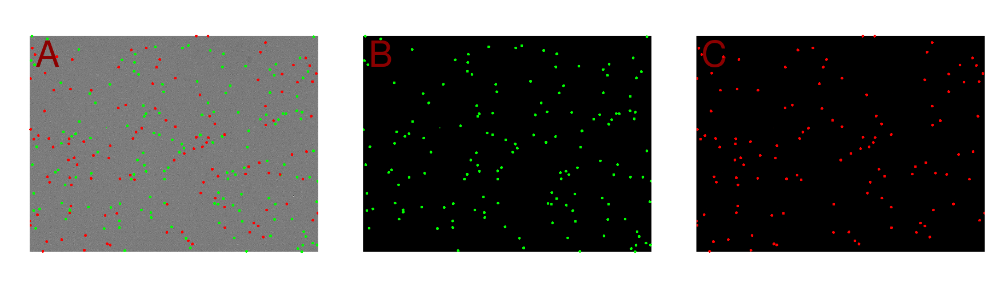
```

```{r imgPipe3}
# Discard second image present in image depth and transform into grayscale (green)
green_beads <-
  as.cimg(green_beads[1:dim(green_beads)[1], 
                      1:dim(green_beads)[2], 
                      1, 
                      1:dim(green_beads)[4]]) |> 
  grayscale()

# Discard second image present in image depth and transform into grayscale (red)
red_beads <-
  as.cimg(red_beads[1:dim(red_beads)[1], 
                    1:dim(red_beads)[2], 
                    1, 
                    1:dim(red_beads)[4]]) |> 
  grayscale()
```

```{r imgPipe4}
# Applying pipeline to analyse both fluorescence channels with enabled 
# proximity filter
res_pipe <- imgPipe(green_beads,
                    color1 = "green",
                    red_beads,
                    color2 = "red",
                    method = 'edge',
                    alpha = 0.7,
                    sigma = 2,
                    sizeFilter = FALSE,
                    proximityFilter = TRUE)
```

```{r imgPipe5, echo=FALSE}
extr_features <- kable(
  res_pipe$summary,
  format = "markdown",
  booktabs = TRUE,
  caption = "Summary of extracted features from dual-color microbeads",
  col.names = c(
    "number of objects",
    "mean (size)",
    "sd (size)",
    "mean (intensity)",
    "sd (intensity)",
    "estimated rejected",
    "coverage",
    "of color 1",
    "of color 2"
  ),
  align = "cccccc",
  escape = FALSE
)
```

```{r imgPipe6, echo=FALSE}
extr_features <- extr_features |>
  kable_styling(full_width = F, position = "center") |>
  column_spec(1, width = "1.5cm", extra_css = "word-wrap: break-word;") |>
  column_spec(2, width = "1.3cm", extra_css = "word-wrap: break-word;") |>
  column_spec(3, width = "1.1cm", extra_css = "word-wrap: break-word;") |>
  column_spec(4, width = "1.6cm", extra_css = "word-wrap: break-word;") |>
  column_spec(5, width = "1.6cm", extra_css = "word-wrap: break-word;") |>
  column_spec(6, width = "1.3cm", extra_css = "word-wrap: break-word;") |>
  column_spec(7, width = "1.3cm", extra_css = "word-wrap: break-word;") |>
  column_spec(8, width = "1.3cm", extra_css = "word-wrap: break-word;") |>
  column_spec(9, width = "1.3cm", extra_css = "word-wrap: break-word;") 

footnote(extr_features, general = "", general_title = "Abbreviations: sd - standard deviation")
```

```{r imgPipe7, echo=FALSE}
dual_col <- kable(
  res_pipe$dual,
  format = "markdown",
  booktabs = TRUE,
  caption = "Detailed information about encoded Objects",
  col.names = c(
    "color",
    "number of objects",
    "mean(size)",
    "sd(size)",
    "mean(intensity)",
    "sd(intensity)"
  ),
  align = "cccccc",
  escape = FALSE
)
```

```{r imgPipe8, echo=FALSE}
footnote(dual_col, general = "", general_title = "Abbreviations: sd - standard deviation")
```

To provide a conclusive visual representation of the findings, the original
image, which depicts both populations of microbeads, is presented. Each detected
microbead is indicated by a colored circle: microbeads with green emission are
highlighted with a blue circle, and those with red emission are marked with an
orange circle. Overlapping microbeads are not marked, as they are excluded from
the analysis (Figure \@ref(fig:imgPipe9)).

(ref:imgPipe9) **Result of the Analysis of dual colored Microbeads**: The original image showing both microbead populations is presented. Detected microbeads with green emission are circled in blue, and those with red emission are circled in orange. Overlapping microbeads are not circled, due to their proximity and the resulting exclusion from the analysis.

```{r imgPipe9, fig.cap="(ref:imgPipe9)", out.width="85%"}
# Define a vector of colors
colors <- c("blue", "orange")

# Plot the dual-color microbead image
plot(dual_color, axes = FALSE)

# Add points to the plot at the center coordinates of the microbeads
# The points are colored based on their fluorescent signal (green/red)
points(res_pipe$detailed$x,
       res_pipe$detailed$y,
       col = colors[factor(res_pipe$detailed$color)],
       lwd = 3)
```

In conclusion, this function provides a comprehensive pipeline for image
analysis, encompassing both the initial preprocessing tasks, such as filtering,
and the final analysis. The function may be applied to a single image devoid of
encoded objects or to multiple images representing a single population of
encoded objects.


### `scanDir()` - Whole Directory Analysis {#scan}

The `scanDir` function enables the analysis of images across entire directories.
To ensure reliability and performance, the software includes a number of
features designed to enhance the robustness and efficiency of the analysis
process. These include double file checks via Message Digest 5 (MD5) sum
comparison, multi-core processing capabilities, and the option to generate a log
file that documents the analysis process and results.

\phantom{x}\hspace{0.5cm} *MD5 sum* - To increase the quality of the
analysis, the function incorporates a verification process to check that the
data is unique within the analysis directory. This is accomplished through the
utilization of the MD5 algorithm, originally developed by @Rivest1992. The MD5
algorithm is a standard practice in computer science for
ensuring file integrity and identifying identical files. The application of this
algorithm results in the generation of a unique "fingerprint" for each file
[@Rivest1992; @Cechova2020]. In `R` this can be accomplished by invoking the
`md5sum()` function from the `tools` package, which computes a 128-bit summary
of the file contents, represented by 32 hexadecimal digits. Subsequently, the
fingerprints are subjected to analysis to identify any duplicates. In the event
that duplicate files are identified, the function is terminated and the user is
prompted to remove the duplicated files. However, due to its relatively short 
length (128-bit, 32 character, hexadecimal string) and the nature of hashing 
algorithms, it is possible for two different files to have the same MD5 value. 
This is called MD5 collision. In theory, this can be problematic in scenarios 
where hash values are used as a security measure or for data integrity checks 
since it may lead to false positives or negatives. However, we can additionally
employ the file name and meta data (e.g., file creation date) alongside these
hash values to counteract this issue.

\phantom{x}\hspace{0.5cm} *Parallel Processing* - In `R`, each image and its
respective analysis script is sequentially processed on a single core of the
Central Processing Unit (CPU), by default. This approach is especially
time-consuming when analyzing multiple images from an entire experiment. The use
of parallel processing in `R` allows for the simultaneous execution of multiple
processes, thereby enhancing performance and speed. The use of packages such as
`parallel`, `snow`, `foreach`, and `doParallel` allows computations to be
distributed across multiple cores, within `R`. This is particularly advantageous
for complex data analysis tasks and data-intensive applications, where parallel
programming can significantly reduce computation time [@Weston2009;
@Schmidberger2009; @Corporation2011;
@Peng2022].^[https://nceas.github.io/oss-lessons/parallel-computing-in-r/parallel-computing-in-r.html, accessed 06/27/2024]

The `foreach` package provides a straightforward and efficient approach to
implementing parallel processing. Consequently, this package was employed to
enable parallel processing in the `scanDir()` function. The function was
designed with the objective of achieving high parallelizability, thereby
enabling each image to be analyzed on a separate core. For instance, if six
cores are available, six images can be analyzed concurrently, thereby markedly
accelerating the analysis process. The user may specify the number of cores to
be utilized; alternatively, 75 % of all cores are used for computation.

The following section illustrates the functionality of the `scanDir()` function
through an analysis of a directory containing the example images provided by the
`biopixR` package (Figure \@ref(fig:examples2)). The 'threshold' method is
employed without enabling any additional filtering processes. The resulting
Table \@ref(tab:scan3) will be saved in the working directory path in
comma-separated value (CSV) format, if the `Rlog` parameter is set to `TRUE`.

```{r scan0}
# Get the path to the 'images' directory within the 'biopixR' package
path2dir <- system.file("images", package = "biopixR")

# Scan the directory for images and process them using the 'threshold' method
res_scanDir <- scanDir(
  path = path2dir,
  method = 'threshold',
  sizeFilter = FALSE,
  proximityFilter = FALSE,
  Rlog = FALSE
)
```

```{r scan1, eval=FALSE}
# Display an excerpt of the obtained results
# Showing columns 3 to 9 of the results, excluding file paths and md5 sums
res_scanDir[, 3:9]
```

```{r scan2, echo=FALSE}
tab_scan <- kable(
  res_scanDir[, 3:9],
  format = "markdown",
  booktabs = TRUE,
  caption = "Results obtained by the whole directory analysis.",
  col.names = c(
    "number of objects",
    "mean (size)",
    "sd (size)",
    "mean (intensity)",
    "sd (intensity)",
    "estimated rejected",
    "coverage"
  ),
  align = "cccccc",
  escape = FALSE
)
```

```{r scan3, echo=FALSE, fig.pos="ht"}
tab_scan <- tab_scan |>
  kable_styling(full_width = F, position = "center") |>
  column_spec(1, width = "1.9cm", extra_css = "word-wrap: break-word;") |>
  column_spec(2, width = "1.6cm", extra_css = "word-wrap: break-word;") |>
  column_spec(3, width = "1.1cm", extra_css = "word-wrap: break-word;") |>
  column_spec(4, width = "1.8cm", extra_css = "word-wrap: break-word;") |>
  column_spec(5, width = "1.8cm", extra_css = "word-wrap: break-word;") |>
  column_spec(6, width = "1.8cm", extra_css = "word-wrap: break-word;") |>
  column_spec(7, width = "1.8cm", extra_css = "word-wrap: break-word;")

footnote(tab_scan, general = "", 
         general_title = "Abbreviations: sd - standard deviation")
  #column_spec(1:6, width = "10em", extra_css = "word-wrap: break-word;")
```

\phantom{x}\hspace{0.5cm} *Log File* - As one of the fundamental principles of
this package is to facilitate reproducible research, the function documents the
analysis process in an `RMarkdown` file and generates a comprehensive log file
in Portable Document Format (PDF) format. `R` and `RMarkdown` are widely
recognized tools for reproducible research [@Baumer2014; @Roediger2015;
@CaleroValdez2020]. This package facilitates reproducibility through its
open-source nature, which allows for the straightforward publication of analysis
scripts. Furthermore, the log file provides visual quality control and
comparability. Moreover, the detailed results (similar to Table \@ref(tab:result6)) for
each individual image within a directory are accessible via the `R` Data
Serialization (RDS) files, saved as part of the logging process.

The following page (Figure \@ref(fig:scan4)) presents the log file generated from
the `RMarkdown` file representing the results for this analysis. The directory
of the analysis is first noted in the caption, followed by a series of logging
steps that indicate the current status of the image being analyzed. Furthermore,
the log file will indicate any instances of analysis failure resulting from
errors in image processing. Subsequently, all images within the specified
directory are plotted with the file name serving as the title. The detection of
objects is indicated by green circles around their centers, providing an
overview for verification of the analysis's compliance with expectations and the
option of reanalyzing specific files if necessary.

(ref:scan4) **Log file created by the `scanDir()` function.** (first page)

```{r scan4, echo=FALSE, fig.cap="(ref:scan4)"}
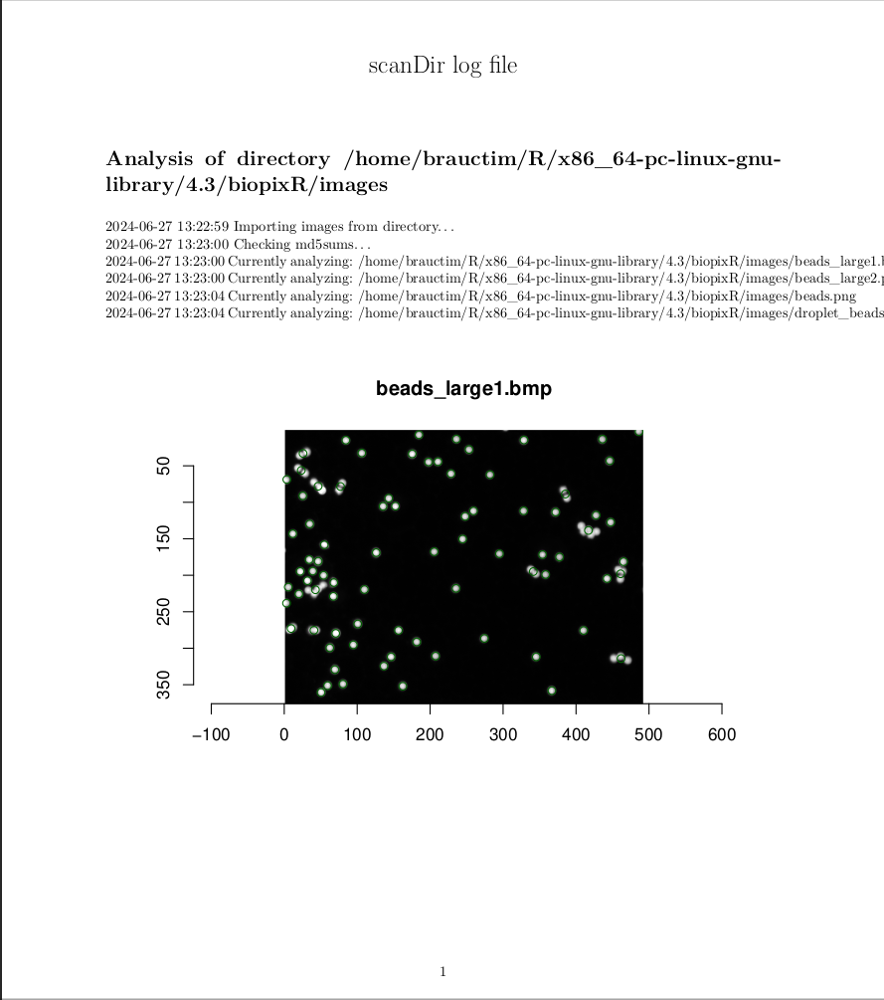
```


## Functions for Droplet Analysis

In attempts involving microbead emulsions, the focus lies on situations where
microbeads exist within a watery reaction environment that is surrounded by a
hydrophobic matrix, particularly fluorinated oils. This results in the formation
of small (sherical or non-spherical) microbead-water compartments with nanoliter
to microliter volumes, which are often called partitions (Figures
\@ref(fig:fill1)A). The objective of this approach is to separate individual
microbeads from their surrounding reaction environments to avoid
cross-reactions. Applications include the clonal amplification, single molecule
detection and absolute quantification. Depending on the emulsification method
employed, partitions of homogeneous size or heterogeneous (dispersed) size may
be generated. [@Roediger2014].

Here, a common and challenging problem encountered in image analysis is the presence
of discontinuous contours. This phenomenon presents a significant challenge to
image processing tasks, such as segmentation, labeling, and feature extraction.
Consequently, ensuring edge connectivity is an essential aspect of an effective
and reliable edge detector [@Mittal2019]. However, addressing low-level
connectivity from the outset can present significant challenges, and there
appear to be limited to no options available in `R` for addressing this issue.
To address this issue, we propose the `fillLineGaps()` function.


### `fillLineGaps()` - Restoring Edge-Connectivity in Compartmented Images

To demonstrate the functionality of the `fillLineGaps()` function in
restoring edge connectivity, a practical example will be presented from a
microbead-based emulsion Polymerase Chain Reaction (ePCR) assay. This area can
benefit from imaging techniques, particularly to enhance applicability in
Point-of-Care Testing (POCT), as the current method, Fluorescence-Activated Cell
Sorting (FACS), is less suited for this purpose. The following example
demonstrates the integration of data from two images to quantify droplets and
microbeads. The objective is to identify the frequency of events where a single
microbead joins a droplet in comparison to those where multiple microbeads are
present within one droplet.

The images utilized in this section comprise a brightfield view and a
fluorescent channel image. The brightfield view displays droplets with
fragmented edges, some of which contain microbeads. In contrast, the fluorescent
channel image exclusively reveals the microbeads (Figures \@ref(fig:fill1)A
and B).

```{r fill0, eval=FALSE}
# Set up the plotting area to have 1 row and 2 columns
par(mfrow = c(1, 2))

# Plot the droplets containing microbeads without axes
plot(droplets, axes = FALSE)
text(c(10), c(10), c("A"), col = "darkred", cex = 6)

# Plot the fluorescence channel (only microbeads) without axes
plot(droplet_beads, axes = FALSE)
text(c(10), c(10), c("B"), col = "darkred", cex = 6)

# Reset the plotting area to the default 1 row and 1 column
par(mfrow = c(1, 1))
```

(ref:fill1) **Images from an ePCR Assay**: **A**) Brightfield view of a water-oil emulsion, showing droplets, some of which contain microbeads. The droplet contours are highly fragmented. **B**) Fluorescent channel of the same image, displaying only the microbeads.

```{r fill1, echo=FALSE, out.width="99%", fig.cap="(ref:fill1)"}
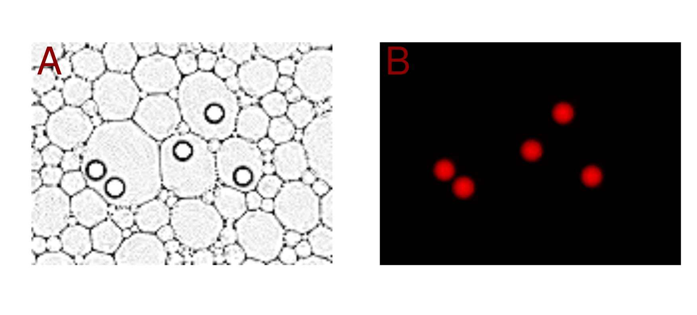
```

The initial stage of the analysis involves the utilization of the
`fillLineGaps()` function with the objective of restoring edge connectivity
within the droplet image. This function identifies line endpoints and
interpolates pixels to generate continuous contours. Initially, a threshold is
applied to segment the contours and microbeads. Afterwards, object detection
is performed on the fluorescence image to extract the coordinates of the
objects, which are then excluded from the droplet image to prevent false
reconnections between partition contours and microbeads.

Subsequently, an iterative scanning for line ends is initiated using the
`image_morphology()` function from the `magick` package. The area surrounding
the line ends is scanned within a specific radius, and reconnected with the
closest contour using the `adaptiveInterpolation()` function. Following the
reconnection phase, the contours undergo a thinning process, which is carried
out by the `image_morphology()` function. These steps are repeated until the
predefined number of iterations has been reached. The function includes an
internal visualization that highlights the added pixels in purple (Figure
\@ref(fig:fill2)). The method creates discrete partitions by closing the gaps in
their contours, thus facilitating the correct labeling of the droplet
partitions.

(ref:fill2) **Image of Droplets with Restored Edge Connectivity**: The result of utilizing the `fillLineGaps()` function is displayed. The pixels added by the function are highlighted in purple. It can be seen that the performance is accurate in simpler regions where straight lines are reconnected. However, in areas where smaller droplets are present between larger droplets, the reconstruction appears to be more challenging.

```{r fill2, fig.cap="(ref:fill2)", warning=FALSE, out.width="89%"}
# Restoring edge connectivity
closed_gaps <- fillLineGaps(droplets,
  droplet_beads,
  threshold = "13%",
  alpha = 1,
  sigma = 0.1,
  radius = 5,
  iterations = 3,
  visualize = TRUE
)
```

Having addressed the initial issue of discontinuous edges, the focus now shifts
back to characterizing the partitions. This is achieved by labeling the
'closed_gaps' image. Once the partitions have been labeled and are therefore
regarded as distinct, the next step is to ascertain the number of microbeads
within each partition. This is achieved by utilizing the centroid coordinates of
the microbeads, as opposed to analyzing each individual pixel. Each partition is
then examined to identify which ones contain coordinates that correspond to the
centers of the microbeads.

```{r fill3}
# Label the resulting image without discontinuous contours
lab_partitions <- label(closed_gaps)

# Convert the labeled droplet partitions to a data frame and keep values 
# greater than 0
df_lab_part <- as.data.frame(lab_partitions) |>
  subset(value > 0)

# Perform object detection on the microbeads within the droplets
e_beads <- objectDetection(droplet_beads,
                           method = 'edge',
                           alpha = 1,
                           sigma = 2)

# Extract the relevant columns (containing coordinates)
coords1 <- df_lab_part[, 1:2]               # Coordinates of doplet partitions
coords2 <- round(e_beads$centers[, 2:3])    # Center coordinates of microbeads

# Convert the coordinates to character strings for easy matching
coords1_str <- apply(coords1, 1, paste, collapse = ",")
coords2_str <- apply(coords2, 1, paste, collapse = ",")

# Find the matching indices between the two sets of coordinates
matches <- which(coords1_str %in% coords2_str)

# Subset the data frame using the matching indices
bead_partition <- df_lab_part[matches, ]

# Create a table of the frequency of each partition value
numeration <- table(as.character(bead_partition$value))
```

The results are presented in Table \@ref(tab:fill6). The first column of the
Table specifies the number of partitions, and the second column lists those that
are devoid of microbeads. Column three shows the number of partitions that
contain microbeads. The final two columns indicate the frequency of occurrence
of single microbeads within a droplet, as well as the occurrence of multiple
microbeads within a single droplet. Figure \@ref(fig:fill7) provides a visual
representation of the result. The different microbead containing droplets are
highlighted in distinct colors, demonstrating the successful restoration of
partition contours and subsequent labeling process.

```{r fill4}
# Create resulting data frame highlighting the number of events with one 
# microbead and multiple microbeads per droplet partition
res_df <- data.frame(
  partitions = length(unique(df_lab_part$value)),
  empty_partitions = 
    length(unique(df_lab_part$value)) - length(unique(bead_partition$value)),
  bead_partitions = length(unique(bead_partition$value)),
  single_bead = length(which(numeration == 1)),
  muliple_beads = length(which(numeration > 1))
)
```

```{r fill5, eval=FALSE}
# Display resulting data frame
res_df
```

```{r fill6, echo=FALSE}
kable(
  res_df,
  format = "markdown",
  booktabs = TRUE,
  caption = "Analysis of microbead-based ePCR",
  col.names = c(
    "partitions",
    "empty partitions",
    "microbead partitions",
    "single microbead",
    "multiple microbeads"
  ),
  align = "cccc",
  escape = FALSE
)
```

(ref:fill7) **Visualizing the Result of the Droplet Analysis**: The visualization obtained by the `objectDetection()` function, representing the detected microbeads, is combined with the highlighting of microbead-containing droplets using the `changePixelColor()` function. The partitions formed by the droplets are highlighted in different colors, indicating that they are distinct from one another.

```{r fill7, fig.cap="(ref:fill7)", out.width="77%"}
# Identify the droplets, which contain the microbeads
vis <- which(df_lab_part$value %in% bead_partition$value)

# Change the pixel color of the partitions containing microbeads and
# Highlight their distinctivness with different colors
colored_droplets <- changePixelColor(
  droplets,
  df_lab_part[vis, ],
  color = factor(df_lab_part$value[vis]),
  visualize = F
)

# Add the colored droplets and the marked microbeads to visualize the result
add(list(colored_droplets, e_beads$marked_objects)) |> plot(axes = FALSE)
```

In conclusion, this function displays considerable capacity to serve as a tool
for image preprocessing, rendering more intricate images accessible for
subsequent analysis. It enables the implementation of novel experimental
approaches, as exemplified by the approach presented in this section. Moreover,
it is currently the only available tool in `R` with a dedicated function for
this purpose. It is important to note that the function does have certain
limitations. One such limitation is that the restoration of connectivity can
create small partitions that were not present in the original image.


## Shape, Texture and unsupervised Machine Learning

Digital images are numerical representations of physical objects, combined with
a point spread function (PSF). The PSF describes the intensity distribution of
an image and serves as a physical reference, often utilized in image
restoration, denoising, and object detection [@Siddik2023; @Song2024]. This
numerical representation enables a variety of computational approaches to gain
insights into the object's characteristics, such as texture and shape
extraction. To facilitate pattern recognition of these characteristics, the
`biopixR` package incorporates two clustering algorithms that employ
unsupervised machine learning techniques, namely Self-Organizing Maps (SOM) and
the Partitioning Around Medoids (PAM) algorithm.


### `shapeFeatures()` - Object Clustering Based on Shape Features

The `shapeFeatures()` function employs the `objectDetection()` function to
extract objects from an image. Subsequently, these objects are analyzed with
respect to their individual shape and intensity characteristics, including
features such as pixel-intensity, area, perimeter, radius, eccentricity,
circularity, and aspect ratio (AR). Subsequently, the extracted features are
summarized by incorporating these characteristics into the `resultAnalytics()`
output.

The `shapeFeatures()` function is capable of utilizing unsupervised machine
learning techniques, specifically SOM. When SOMs are enabled, the function can
classify detected objects based on their shape and intensity features, with the
final output table including a row with classes that indicate the corresponding
group for each object as determined by the SOM. This entails that the features
are projected onto a two-dimensional plane, with similar features situated in
proximity and dissimilar features positioned at a greater distance. The features
are mapped to specific positions, designated as units, with each unit being
associated with a codebook vector, representing the average of all features
mapped to that unit. The number of these codebook vectors can be controlled
through the `somegrid()` function of the `kohonen` package [@Kohonen1990;
@Wehrens2006; @Kohonen2013; @Wehrens2018]. In `biopixR`, this is managed via
the `xdim` and `ydim` parameters, providing the dimensions for the codebook
vector gird. To utilize SOMs in `R`, the `kohonen` package is employed
[@Wehrens2006]. The `biopixR` package, enables the usage of SOMs to access
patterns in shape-related and pixel-intensity characteristics of image objects.

The aforementioned characteristics can be employed to distinguish image objects
such as microbeads. The functionality of this classification is illustrated in
Figure \@ref(fig:shape2)A, where non-circular objects (doublets and multiplets)
are classified as a distinct group in comparison to single microbeads. The
individual shape and intensity features of each microbead in the image are
displayed as boxplots (Figure \@ref(fig:shape2)B). The characteristics of the
microbeads marked with a red point in Figure \@ref(fig:shape2)A are also
highlighted with a red point within the boxplot. The distinction between
doublets and multiplets is readily apparent. Doublets and multiplets are
characterized by their larger size, perimeter, and radius, as well as lower
circularity and higher eccentricity. This reflects their oval appearance, which
differentiates them from single microbeads.

```{r shape0}
# Extract shape related features and group them using SOM
shape_features <-
  shapeFeatures(beads,
                alpha = 1,
                sigma = 0,
                xdim = 2,
                ydim = 1,
                SOM = TRUE)
```

```{r shape1, eval=FALSE}
par(mfrow = c(2, 1))

# Define a vector of colors
colors <- c("darkgreen", "darkred")

# Plot the example image containing microbeads
beads |> plot(axes = FALSE)

# Add solid circles to the plot with coordinates at the microbeads' centers
# The points are colored based on the 'class' factor in 'shape_features'
points(
  shape_features$x,
  shape_features$y,
  col = colors[factor(shape_features$class)],
  pch = 19,
  cex = 1.2
)
text(c(15), c(15), c("A"), col = "darkred", cex = 3.5)

# Create a data frame from 'shape_features' with selected columns
shape_df <- data.frame(
  size = shape_features$size,
  intensity = shape_features$intensity,
  perimeter = shape_features$perimeter,
  circularity = shape_features$circularity,
  eccentricity = shape_features$eccentricity,
  radius = shape_features$mean_radius,
  aspectRatio = shape_features$aspect_ratio
)

# Min-Max Normalization Function
min_max_norm <- function(x) {
  (x - min(x)) / (max(x) - min(x))
}

# Apply the Min-Max Normalization function to each column of the data frame
df_normalized <- as.data.frame(lapply(shape_df, min_max_norm))

# Create a boxplot of the normalized data
boxplot(
  df_normalized,
  ylab = "normalized values",
  xaxt = "n"
)

# Add axis ticks and diagonal labels
axis(1, at = 1:ncol(shape_df), labels = FALSE)  # Add axis ticks but no labels
text(
  x = seq_len(ncol(df_normalized)),
  y = -0.1,
  labels = colnames(df_normalized),
  adj = 0,
  srt = -45,
  xpd = TRUE
)

# Extract rows to highlight where 'shape_features$class' equals 2
highlight_rows <-
  which(shape_features$class == 2)  # Example row indices to highlight

# Add points for the specific rows for each column
for (col in 1:ncol(df_normalized)) {
  points(
    rep(col, length(highlight_rows)),
    df_normalized[highlight_rows, col],
    col = "red",
    pch = 19,
    cex = 1.5
  )
}
text(c(0.5), c(0.9), c("B"), col = "darkred", cex = 3.5)
```

(ref:shape2) **Clustering of Microbeads Using SOM within `shapeFeatures()`**: **A**) This simple example demonstrates the use of the `shapeFeature()` function to group microbeads. One group is marked by a green point at its center, and the other group is marked by a red circle. **B**) The different features used as input characteristics for analysis by the SOM are plotted to compare the different groups. Features corresponding to objects marked by red circles in **A** are highlighted in red.

```{r shape2, out.width="89%", fig.cap="(ref:shape2)", echo=FALSE}
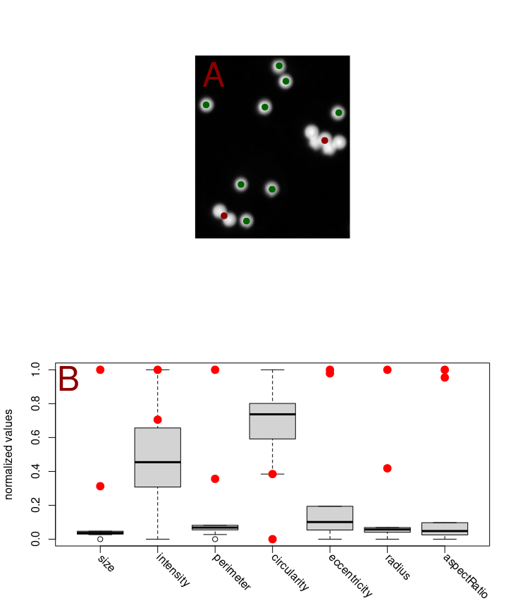
```

To validate the AR calculations performed using the `biopixR` package, a
reference figure containing circles with known ground truth ARs was employed for
comparison (Figure \@ref(fig:shape3)). The AR represents the ratio of an
object's dimensions and can be described as follows [@Takashimizu2016]:

\begin{equation}
  AR = \frac{length \; of \; major \; axis}{length \; of \; minor \; axis}
  (\#eq:one)
\end{equation}

A simplified method is utilized to calculate the major and minor axes. The
distance from each perimeter pixel to the object's center is measured, with the
largest distance representing the major radius and the smallest distance
representing the minor radius. This function is based on the assumption that the
object is symmetrical. The major and minor axes are then obtained by multiplying
the respective radii by a factor of two. The validity of this simplification for
symmetrical objects is illustrated in the following comparison.

(ref:shape3) **Circles with different Aspect Ratios** (ARs): This is a modified image, originally derived from the publication of @Takashimizu2016. The enumeration of objects is read from left to right, beginning with the object in the top left (Table \@ref(tab:shape8)).

```{r shape3, echo=FALSE, fig.cap="(ref:shape3)"}
include_graphics("figures/fig2_circularity.png")
```

The results of the analysis of Figure \@ref(fig:shape3) using the `shapeFeatures()`
function are presented in Table \@ref(tab:shape8), which demonstrates the ability
to access shape-related information. It is noteworthy that circularity begins at
a value of approximately one, which represents a perfect circle, and then
decreases with an increasing AR. In contrast, eccentricity begins at zero and
reaches 0.8 for the final circle. The radius represents the mean of the largest
and smallest distances from a perimeter pixel to the microbeads' center. As the
circle becomes more oval, the standard deviation increases, which can be
explained by the aforementioned calculation. The AR is compared with the ground
truth data (Figure \@ref(fig:shape9)). Notably, the calculations for the
individual circles are accurate, with the exception of objects 5 and 6, where
the AR deviates by 0.3 and 0.5, respectively.

```{r shape4}
# Import the image of different circles
circles <- importImage("figures/fig3_analysis_circ.png")

# Convert the imported image to grayscale
circles <- grayscale(circles)

# Extract shape related features from the grayscale image
shapes <- shapeFeatures(circles, alpha = 1, sigma = 0) 
```

```{r shape5, echo=FALSE}
# Quick fix to restore order - first objects in the second row have switched order
seven <- shapes[6, 2:12]
six <- shapes[7, 2:12]

shapes[6, 2:12] <- six
shapes[7, 2:12] <- seven
```

```{r shape6}
# Display the obtained shape related information
data <- shapes[, c(1,8:12)]
```

```{r shape7, echo=FALSE}
tab_AR <- kable(
  data,
  format = "markdown",
  booktabs = TRUE,
  col.names = c(
    "objectnumber",
    "circularity",
    "eccentricity",
    "mean(radius)",
    "sd(radius)",
    "aspect ratio"
  ),
  align = "cccccc",
  caption = "Comparison of aspect ratios.",
  escape = FALSE
)
```

```{r shape8, echo=FALSE}
footnote(tab_AR, general = "", general_title = "Abbreviations: sd - standard deviation")
```

(ref:shape9) **Performance of the `shapeFeatures()` function in regards to the Aspect Ratio**: This plot compares the aspect ratio calculated by the `biopixR` package with ground truth data from a publication [@Takashimizu2016]. The ground truth data is shown in blue, and the obtained results are shown in green.

```{r shape9, echo=FALSE, fig.cap="(ref:shape9)"}
# Create a data frame for ground truth AR data
truth <- data.frame(index = seq_len(nrow(shapes)),
                    AR = c(1, 10 / 9, 10 / 8, 10 / 7, 10 / 6, 2, 10 / 4, 10 /
                             3, 5, 10))

# Plot the ground true data
plot(
  truth$index,
  truth$AR,
  main = "Comparison of data frames",
  xlab = "Objectnumber",
  ylab = "Aspect Ratio",
  pch = 19,
  col = "blue"
)

# Add points from the second data frame for comparison
points(shapes$objectnumber,
       shapes$aspect_ratio,
       pch = 20,
       col = "green")

# Add a legend to the plot
legend(
  "topleft",
  legend = c("Ground Truth", "shapeFeatures"),
  col = c("blue", "green"),
  pch = c(19, 20)
)
```

In summary, the AR calculations performed by the `biopixR` package are
found to be generally accurate in comparison to the ground truth data, with most
calculations demonstrating close alignment with the reference data. Minor
discrepancies were observed at ARs of 10/6 and 2. The output obtained
by the function is presented in Table \@ref(tab:shape8). In the initial example,
the `shapeFeatures()` function was successful in clustering the microbeads
according to their shape characteristics, thereby demonstrating its utility as a
tool for pattern recognition based on these features.


### `haralickCluster()` - Image Classification Based on Texture Features

One aspect of interest in bioimage informatics is texture-related information. 
In bioimage informatics, texture refers to the spatial arrangement or pattern of 
structures within an image. It can provide important information like intensity 
variations, frequency content, and spatial relationships between pixels or 
regions in an image. Texture is crucial for various applications such as 
classification, segmentation, and diagnosis (e.g., to distinguish different 
microbeads, types of tissues, cells, or pathological conditions within histology 
images).

To extract this information from images, several computational methods were
proposed by @Haralick1973. The `haralickCluster()` function incorporates several
of these calculations, including contrast, angular second moment, correlation,
variance, sum average, and entropy. As proposed by @Haralick1973, these texture
features are employed for image classification in the `biopixR` package.
Consequently, the `haralickCluster()` function incorporates a clustering
algorithm, namely PAM.

The `haralickCluster()` function accepts a directory path as input, ensuring
file uniqueness through the use of MD5 sums, as detailed in Chapter \@ref(scan).
To calculate the Haralick features, the image is first transformed into
a Gray Level Co-occurrence Matrix (GLCM). Therefore an empty square matrix is
generated with dimensions corresponding to the total number of gray levels in
the image. This matrix records the frequency of specific pixel intensities being
adjacent to each other. Subsequently, the matrix is normalized by dividing by
the total number of co-occurrence pairs. Adjacency is considered in four
directions: horizontal, vertical, left diagonal, and right diagonal
[@Haralick1973; @BinoSebastian2012; @Loefstedt2019]. Subsequently, the
features - contrast, angular second moment, correlation, variance, sum average,
and entropy - are calculated. Some calculations were derived from the `radiomics`
package, which also focuses on texture analysis but is currently not
maintained.^[https://CRAN.R-project.org/package=radiomics, accessed 06/30/2024] 
Subsequently, the extracted features are clustered using the PAM algorithm.

The PAM algorithm consists of two parts: BUILD, which selects a specified number
of objects as initial medoids, and SWAP, which improves the clustering process
towards a local optimum by assigning each object to the closest medoid and
recalculating the medoids to enhance within-cluster similarity. The algorithm
starts this process by using a dissimilarity matrix as input which is then
organized into defined clusters, with the medoids serving as robust
representatives of cluster centers. The number of medoids is typically set with
a predetermined number of groups (*k*) [@Maechler1999; @Reynolds2006;
@Schubert2019]. To utilize the PAM algorithm and to determine the
number of *k* the `cluster` package was used [@Maechler1999]. The silhouette
method, proposed by @Rousseeuw1987, provides a relative quality measure of the
clustering, thereby providing a useful tool for approximating the optimal number
of clusters (*k*). The `haralickCluster()` function in the `biopixR` package
integrates the texture description of an image, as proposed by @Haralick1973,
with PAM clustering, enabling the classification of images in a directory based
on these characteristics.

The following example illustrates the application of the `haralickCluster()`
function to four images of microbeads, provided by the `biopixR` package (Figure \@ref(fig:examples2)). 
The resulting output is presented in Table \@ref(tab:haralickCluster1). 
The results of the Haralick texture feature
calculations for the different images, which served as input for the PAM
algorithm, are presented in Figure \@ref(fig:haralickCluster5). The results
presented in Table \@ref(tab:haralickCluster1) are represented in the plots,
which illustrate the different texture features for the various images. Notably,
*beads* and *beads_large1* are consistently quite similar, while
*beads_large2* and *droplet_beads* also exhibit similarities with each other.
However, these two groups differ between one another, as depicted in Figure
\@ref(fig:haralickCluster5).

```{r haralickCluster0}
# Get the path to the 'images' directory within the 'biopixR' package
path2dir <- system.file("images", package = "biopixR")

# Extract and group texture related characteristics based on Haralick texture features
img_clus <- haralickCluster(path2dir)
```

```{r haralickCluster1, echo=FALSE}
kable(
  img_clus[, 2:3],
  format = "markdown",
  booktabs = TRUE,
  col.names = c(
    "file name",
    "md5sum",
    "cluster"
  ),
  align = "llc",
  caption = "Result of grouping according to texture features.",
  escape = FALSE
)
```

(ref:haralickCluster2) Part of Figure \@ref(fig:haralickCluster5).

```{r haralickCluster2, echo=FALSE, out.width="99%", fig.cap="(ref:haralickCluster2)"}
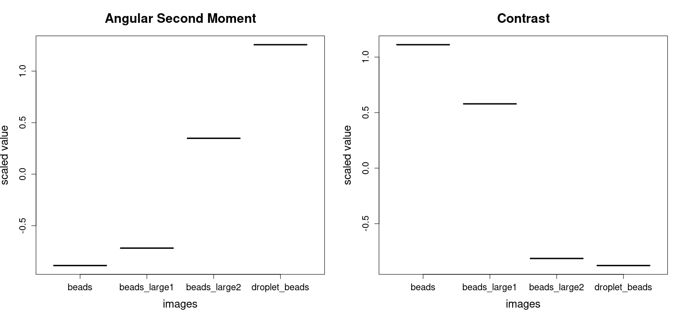
```

(ref:haralickCluster3) Part of Figure \@ref(fig:haralickCluster5).

```{r haralickCluster3, echo=FALSE, out.width="99%", fig.cap="(ref:haralickCluster3)"}
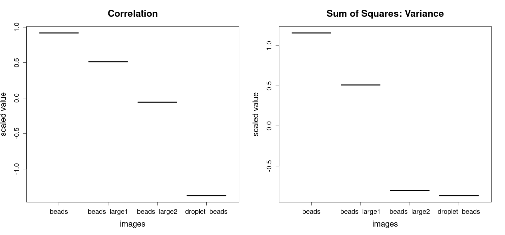
```

(ref:haralickCluster4) Part of Figure \@ref(fig:haralickCluster5).

```{r haralickCluster4, echo=FALSE, out.width="99%", fig.cap="(ref:haralickCluster4)"}
include_graphics("figures/fig20.3_haralick.png")
```

(ref:haralickCluster5) **Extracted Haralick Texture Features**: The scaled values of the calculated texture features for the four example images shown in Figure \@ref(fig:examples2) are depicted. The results for the calculation of *Angular Second Moment*, *Correlation*, *Sum of Squares: Variance*, *Inverse Difference Moment*, *Sum Average*, *Sum Variance*, and *Entropy* are presented for each image. *Note*: *These values were obtained during the execution of the function and are not included in the function's output*.

```{r haralickCluster5, echo=FALSE, out.width="99%", fig.cap="(ref:haralickCluster5)"}
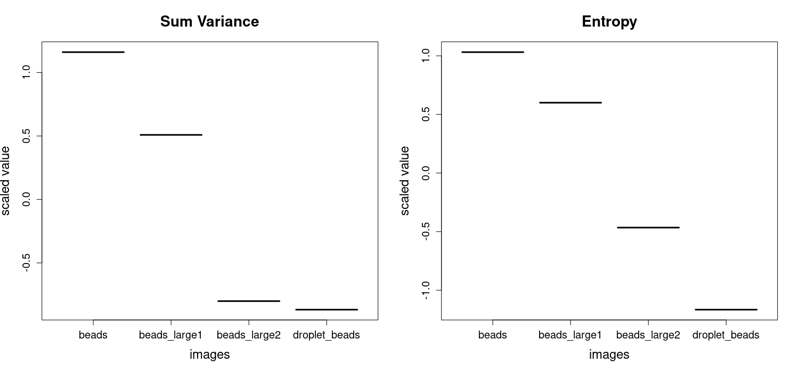
```

To sum up, the `haralickCluster()` function is capable of extracting texture
features and clustering images based on these features. To describe the texture
characteristics of an image, the Haralick features were employed
[@Haralick1973]. For the purpose of clustering, a derivative of the *k-means*
algorithm, PAM, was applied to classify the images according to the extracted
features. The `haralickCluster()` function utilizes eight of the fourteen texture
features proposed by @Haralick1973, thereby enabling the analysis and clustering
of entire directories within a single, user-friendly function.


## Helper Functions of the `biopixR` Package

The function `adaptiveInterpolation()` scans an increasing radius around the
provided coordinates and connects them with the nearest labeled region. This
function is designed to be incorporated into the `fillLineGaps()` function,
which performs the thresholding and line end detection preprocessing. The line
ends serve as coordinates and origins for interpolation. The
`adaptiveInterpolation()` function generates a matrix with dimensions matching
those of the original image. The initial matrix is populated solely with
background values (0), corresponding to a black image. Subsequently, the
function searches for line ends and identifies the nearest labeled region within
a specified radius of the line end, excluding the cluster of the line end itself
as a nearest neighbor. In the event that another cluster is identified, the
`interpolatePixels()` function, which connects two points in a matrix, array, or
image, is employed to connect the line end to this cluster. This results in the
transformation of specific pixels within the matrix into foreground pixels with
a value of 1.

The function `changePixelColor()` is a visualization tool that enables users to
modify the color of a specified set of pixels within an image. To
perform this operation, the coordinates of the targeted pixels must be provided.
