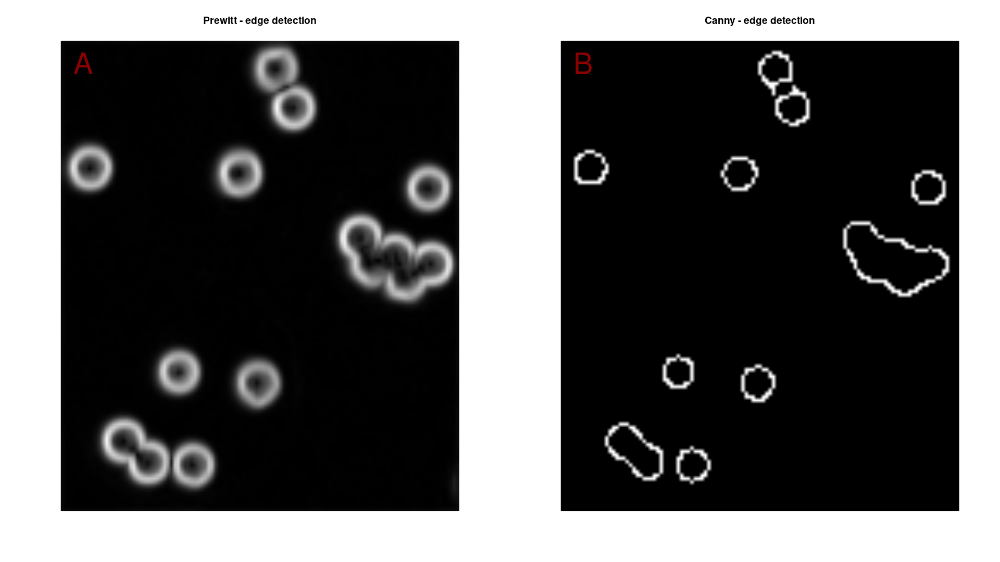
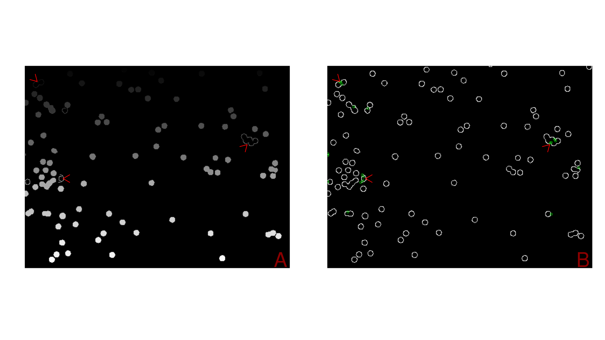
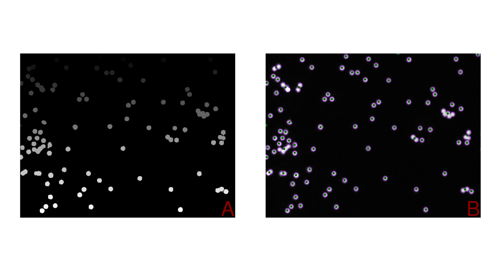
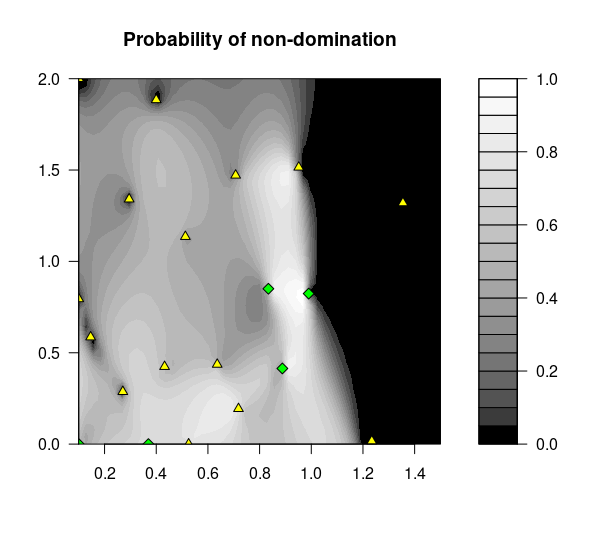
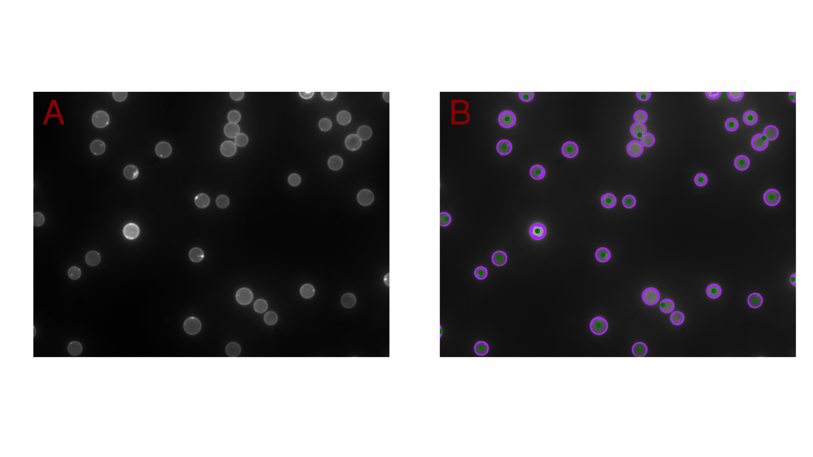
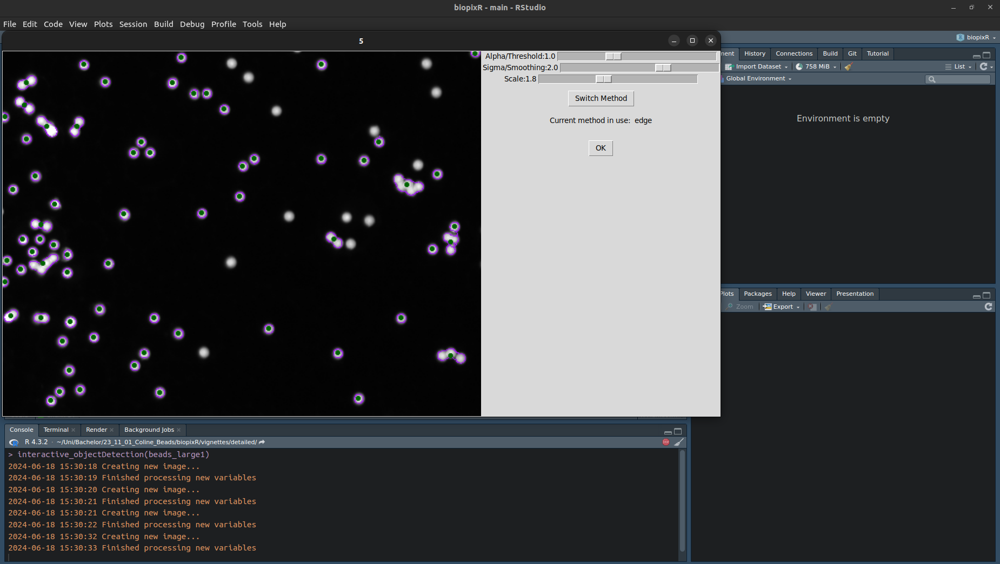
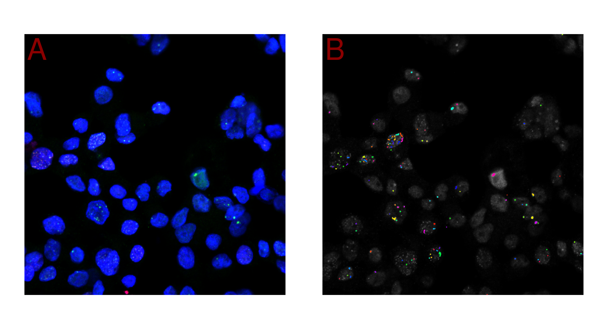

<style>
body {
text-align: justify}
</style>

```{r setup, include=FALSE}
knitr::opts_chunk$set(
  echo = TRUE,
  warning = FALSE,
  message = FALSE,
  cache = FALSE,
  comment = NA,
  verbose = TRUE,
  out.width = '99%',
  fig.align = 'center',
  fig.show = 'hold',
  fig.pos = 'ht'
)
original_options <- options()
options(digits = 3)

library(knitr)
library(foodwebr)
library(biopixR)
```

\tableofcontents

\pagebreak

```{r, echo=FALSE}
include_graphics("figures/fig0_logo.png")
```

# Introduction to Techniques in Bioimage Informatics for Feature detection

The quantity of image data has increased tremendously over time due to advancements 
in imaging technologies like microscopy, confocal microscopy, and super-resolution 
techniques. This surge in the volume of images generated by these devices makes it 
virtually impossible for researchers to process them manually without compromising 
their accuracy or reproducibility. Therefore, automatic 
processing of image data is crucial to ensuring objective and reproducible 
results. Objective results refer to outcomes that are consistent across different 
experiments or studies conducted under similar conditions. Reproducible results 
ensure that a particular outcome can be replicated consistently, regardless of 
the experimental setup or personnel involved in conducting the study. Here, 
dedicated software is a key element to achieve this goal. In particular, bioimage 
informatics plays a crucial role in edge detection and feature extraction due to its 
ability to analyze large volumes of image data efficiently using computational methods. 
These techniques enable researchers to identify specific features within an image that 
may not be apparent through traditional manual analysis. This automated approach 
ensures consistency, reproducibility, and objectivity in the results obtained. The 
following section explain how the `biopixR` package contributes to these goals.

# History, philosophy, and aims of the `biopixR` package

In 2018, we began developing algorithms for the R programming language 
as part of our research in bioimage informatics. Our focus was on analyzing data from 
microbead-based assays (nucleic acid and protein biomarker quantification) and 
cell-based assays (e.g., DNA damage analysis). Over time, we created various scripts 
for internal projects and contributed to repositories like codeberg.org. However, our 
early work did not adhere to high standards of software engineering, such as unit testing, 
version tagging, or continuous integration.

As the algorithms developed proved inefficient and unable to meet current 
scientific needs, we decided in 2023 to completely rewrite the software. 
This effort gained momentum in October 2023 when we transitioned to open repositories 
on GitHub, adopting modern approaches to ensure higher software quality and foster 
greater collaboration with the scientific and open-source communities.

Our most important goal was to publish the package on the trend because the 
trend infrastructure requires high quality software. We have achieved this goal. 
Since then, we have published several package versions, including our first milestone 
release (0.2.4) on CRAN on April 2, 2024, as well as a stable version (1.0) on June 3, 2024. 
Since our initial commits to CRAN, we've received valuable feedback and contributions from 
other package authors (e.g., the data.table package author).

The `biopixR` package was early used for the analysis of microbeads 
([https://doi.org/10.1101/2021.03.19.436219](https://doi.org/10.1101/2021.03.19.436219), 
Posted March 20, 2021), as demonstrated in the latest use case for quality control of 
microbeads [@Geithe2024]. The `biopixR` package has been employed in a recent 
publication [https://doi.org/10.1101/2023.01.10.523433](https://doi.org/10.1101/2023.01.10.523433) 
for precise quantification of signal intensities. In this study, we delve into the development 
of novel hydrophobic microbeads that can be used to quantify amphiphile molecules such as 
phospholipids on surfaces. These molecules play a crucial role in various diseases and conditions, 
including atherosclerosis, cardiovascular disease, infections, inflammatory disorders, cancer, 
and autoimmune diseases.However, its applications can be extended to any research
problem involving feature extraction from images and quantifying related image
data. These applications include the assessment of wastewater for the detection
of microplastics [@Ding2020], the real-time localization of microbead-based
drug delivery systems [@Bannerman2016], and other fields within the life
sciences, such as cell biology.

- Convenient import ...
- Batch processing (scanDir) ...

All technical and experimental aspects of `biopixR` are aimed to adhere to the
principles of reproducible research. The development process was guided by the
work of @Wickham2023 and the Guidelines provided by the @R_Core_Team.
Encompassing the package building, metastructure, licencing, testing,
documentation and distribution of the software. In accordance with the
principles of *Agile Software Development* and *Extreme Programming*, several
practices were implemented with the objective of ensuring the delivery of
high-quality software that meets the needs of both end users and developers.
These practices include version control, literate programming, unit testing, and
continuous integration [@Lanubile2010; @Myers2012; @Roediger2015;
@Gregory2021].

# Concepts and Methods

The following chapters provide an insight into the principles and methods used in the development process of the `biopixR` package, covering

- literate programming
- unit testing
- continuous integration
- version control

as recommended by @Peng2016 and @Wickham2023. The development workflow encompassed the following steps:

1. Developing accurate segmentation strategies for microbeads.
2. Creating filter functions to discard specific undesirable characteristics.
3. Developing preprocessing algorithms to enable segmentation for droplet-based experiments.
4. Employing unsupervised machine learning to extract useful information.
5. Optimizing existing functions and integrating them for batch processing.
6. Conducting unit tests for verification and validation.

In addition, the `biopixR` package provides a unique dataset of microbead images
and microbeads in water-oil emulsions. These images serve as straightforward
examples to demonstrate the capabilities and applications of the `biopixR`
package. The core functionality of `biopixR` was recently employed in the study
by @Geithe2024 to perform quality control on microbeads.

For the development and testing of the `biopixR` package, a Lenovo ThinkPad E15
Gen2 was utilized, featuring 16 GB of RAM, an 11th Gen Intel® Core™ i5-1135G7
@ 2.40GHz × 8 processor, and a NV137 / Mesa Intel® Xe Graphics (TGL GT2)
graphics chip. The operating system employed was Ubuntu 22.04.3 LTS 64-bit. The
`R` version used was 4.3.2, and the development environment was
RStudio 2023.09.0+463 "Desert Sunflower" Release 2023-09-25.

## Development, Implementation and Installation

The field of bioimage informatics has emerged to meet the need for quantitative
information from images to advance biological concepts [@Eliceiri2012;
@Murphy2014; @Chessel2017; @Moen2019; @Schneider2019]. It focuses on automating
the analysis of image data and provides tools for visualization, storage,
processing, and analysis [@Swedlow2009; @Peng2012]. Key applications include
cell phenotype screening, drug discovery, cancer diagnosis, gene function,
metabolic pathways, and protein expression patterns. Fundamental operations in
bioimage informatics include feature extraction, segmentation, registration,
clustering, classification, annotation, and visualization [@Peng2008].

## License and wider open source context

`biopixR` is an open-source software package (licensed under the LGPL
$\ge$ 3)^[https://www.gnu.org/licenses/lgpl-3.0.de.html] for the statistical
programming language `R`, which is widely used in statistics, bioinformatics,
and data science. `R`'s active community has developed numerous packages for a
multitude of applications, which facilitate the development of customized
workflows, including data import, preprocessing, analysis, post-processing, and
visualization, within a reproducible environment [@Roediger2015; @Giorgi2022].
The growing significance of image acquisition, processing, segmentation, feature
extraction, and visualization in biological research underscores the importance
of comprehensive data processing and automation capabilities. Although initially
designed for statistical analysis, `R`, with its associated
packages, is capable of effectively supporting image analysis and automation
[@Chessel2017; @Haase2022].

A summary of the functions present in the `biopixR` package is provided in
Figure \@ref(fig:depend), as the function in relation to the `imgPipe()` function
are displayed.

(ref:depend) **Dependency Graph of Functions in the `biopixR` Package**: This graph illustrates the levels of complexity by depicting the descendants and ancestors of the `imgPipe()` function. The figure was created using the `foodwebr` package (version 0.1.1) from @AppletonFox2022, with RStudio 2023.09.0+463 and R 4.3.2 on Linux (Ubuntu 22.04.3 LTS).

```{r, eval=FALSE}
foodweb(biopixR::imgPipe) |> plot()
```

```{r depend, echo=FALSE, fig.show='hold', fig.cap="(ref:depend)", out.width="99%"}
include_graphics("figures/fig4_dependency.png")
```

The core contributors are listed in the `DESCRIPTION` file of the `biopixR` package. The following paragraphs describe methods applied for the `biopixR` package.

## Version Control and Continuous Integration

For the purpose of version control, the widely used Git system, which is
available on all major development platforms, was employed. Version control with
Git enables the revision of changes and older versions of the code by providing
complete repository copies. Additionally, it permits individual adaptation by
creating distinct "branches" for the purpose of working on and experimenting
with different versions while maintaining a stable one. Most importantly, it
facilitates the organized sharing and merging of changes among team members,
thereby significantly enhancing collaboration [@Lanubile2010; @Blischak2016;
@Vuorre2018].

GitHub, a Git repository hosting provider, offers a web-based user interface to
facilitate collaboration in open source projects. It incorporates tools for the
reporting of bugs (Issues), collaboration (Pull requests), and workflows
(Actions) [@Spinellis2012; @Cosentino2016; @PerezRiverol2016]. The source code
of the `biopixR` package is accessible at:

\phantom{x}\hspace{0.75cm} https://github.com/Brauckhoff/biopixR

Continuous integration (CI) is widely regarded as a good practice in software
development. As team members frequently integrate their code, sometimes multiple
times a day, the combination of code from different contributors can lead to
significant issues in the software's integrity and functionality. To address
this issue, CI is employed as an automated build and test system. It verifies
the package's functionality and compatibility across various operating systems
(OS). This ensures that the code, package structure, metadata, and format remain
functional. This process of error catching is simplified by CI, as it can
identify potential issues in the integration process [@Meyer2014; @Soares2022].

For `R`, the standard test suite is the `R CMD check`, which includes over 50
individual checks. These tests encompass a range of topics, including metadata
validation, package structure, `DESCRIPTION` files, Namespace, `R` code, and
documentation.^[https://r-pkgs.org/r-cmd-check.html] The `R CMD check`
workflow for the `biopixR` package, based on the work of @Hester2021, involves
testing across all major operating systems. The tests were conducted on Windows,
macOS, and Linux. Furthermore, the developer version of `R` was tested on the
Linux operating system. The source code for the CI setup using GitHub workflows, 
as well as the test history can be accessed at:

\phantom{x}\hspace{0.75cm} https://github.com/Brauckhoff/biopixR/actions/workflows/R-CMD-check.yml


## Naming Convention and Literate Programming

`biopixR` is an `R` package ($\ge$ 4.2.0), designed using the S3 object system.
S3 incorporates object-oriented programming features while simplifying
development through naming conventions [@Chambers2014]. Typically, functions
and parameters in R packages are written using underscore separation
[@Rasmus2012]. However, for the purpose of differentiation, this convention
was adapted. Underscore separation is employed solely for variables and
parameters introduced within the package. In accordance with the nomenclature
convention proposed by @Rasmus2012, the functions of the `biopixR` package
adhere to the **lowerCamelCase** style (e.g., `objectDetection()`), with the
exception of those designated to be interactive, which also utilize the
**underscore_separated** style (e.g., `interactive_objectDetection()`).

To enhance the formatting, consistency, and readability of the code,
the `styler` package by @Mueller2017 was employed and applied to the code. The
`styler` package performs "non-invasive pretty printing of R code", whereby the
code is formatted according to the [*tidyverse style guide*](https://style.tidyverse.org/).

Literate programming, introduced by @Knuth1984, combines source code and
documentation in a single file. This approach uses markup conventions (e.g.,
'#') to format the documentation, generating outputs in typesetting
languages like **Markdown**. Literate programming is crucial for ensuring
reproducibility of analysis in software development [@Vassilev2016].
Additionally, inline code annotations have been added to every function in the
`biopixR` package.

The `roxygen2`, `rmarkdown`, and `knitr` packages were employed to write the
documentation inline with the code for the `biopixR` package.

## Unit Testing of the `biopixR` Package

Software testing is a fundamental technique for the verification and validation
of software, demonstrating the absence of errors. Module or unit testing is one
such testing procedure, whereby individual subprograms, routines, or in `R`,
functions are tested independently. This approach breaks down the entire package
into smaller, more manageable components, rather than testing the whole software
at once. A principal benefit of unit testing is the reduction of the debugging
search area, as the specific function causing an issue is identified during
testing [@Myers2012]. Given that `R` is a package-based programming ecosystem,
ensuring the correctness of distributed code is vital to guarantee the
functionality of dependent packages [@Vidoni2021]. A quantitative measure of
the number of statements in a given code or function that are executed without
error by a set of tests is described by the term *coverage* [@Zhu1997;
@Vidoni2021].

The objective of testing is to verify that specific inputs are processed
correctly to generate the expected outputs and to ensure that error and warning
statements operate as intended. In conclusion, tests confirm that the code
performs as expected, and these expectations are recorded in reproducible
scripts. In `R`, packages such as `RUnit`, `svUnit`, and `testthat` facilitate
these tests [@Wickham2011; @Myers2012].

Unit tests for the `biopixR` package were created using the `testthat` package
by @Wickham2009. The tests are executed automatically as part of the package
building process and during the `R CMD check`. The unit test corresponding to
each function is located in the `/tests/testthat/` subdirectory of the
`biopixR` package. The following example provides insight into the testing
procedure for the `changePixelColor()` function, with expectations that:

- The function throws an error when importing an object that is not a 'cimg'.
- It does not throw an error when the input is correct: a 'cimg' object and coordinates as an x|y dataframe.
- The `add.colour()` function (incorporated in `changePixelColor()`) transforms a grayscale image into one with three color channels.
- Normalization of `col2rgb()` results in values between 0 and 1 across three different channels.
- The color code is `0 0 1` for a pixel colored blue using the `changePixelColor()` function.
- The color code is `1 1 1` for a white pixel.
- The color code is `0 0 0` for a black pixel.

```{r, eval=FALSE}
# Expectations and examples used for the unit testing of the `biopixR` package
library(testthat)
library(biopixR)

test_that("changePixelColor", {
  mat <- matrix(0, 4, 4)
  mat[2:3, 2:3] <- 1
  img <- as.cimg(mat)
  coordinates <- data.frame(x = c(1, 3),
                            y = c(1, 3))

  expect_error(changePixelColor(mat, coordinates),
               regexp = "image must be of class 'cimg'")
  expect_no_error(changePixelColor(img, coordinates))

  expect_equal(dim(img)[4], 1)
  expect_equal(dim(add.colour(img))[4], 3)

  expect_equal(as.vector(col2rgb("red") / 255), as.vector(c(1, 0, 0)))
  expect_equal(as.vector(col2rgb("green") / 255), as.vector(c(0, 1, 0)))
  expect_equal(as.vector(col2rgb("blue") / 255), as.vector(c(0, 0, 1)))

  test <- changePixelColor(img, coordinates, color = "blue")
  expect_equal(test[1, 1, ,], as.vector(c(0, 0, 1)))
  expect_equal(test[2, 2, ,], as.vector(c(1, 1, 1)))
  expect_equal(test[1, 2, ,], as.vector(c(0, 0, 0)))
})
```


## Installation of the `biopixR` package

The ongoing developments will be consistently updated in the GitHub repository.
Consequently, the latest developer version of the `biopixR` package can be
accessed and downloaded directly from the repository using the `devtools`
package.

```{r, eval=FALSE}
# Install the 'devtools' package from CRAN.
# 'devtools' is required for installing R packages directly from GitHub repositories.
install.packages("devtools")

# Install the 'biopixR' package from a GitHub repository.
# 'install_github' is a function in 'devtools' that is used to install R packages
# hosted on GitHub.
# The argument "Brauckhoff/biopixR" specifies the GitHub username/repo of the package.
devtools::install_github("Brauckhoff/biopixR")
```

The `biopixR` package is available on The **C**omprehensive **R** **A**rchive
**N**etwork (CRAN), which can be accessed at
[https://CRAN.R-project.org/package=biopixR]. CRAN employs rigorous testing
procedures to ensure that the package can be downloaded and built on all major
operating systems. Additionally, it validates the examples and documentation
through the `R CMD check`. To utilize the `biopixR` package, it is
first necessary to install R (version 4.2.0 or higher) and then to execute the
following code:

```{r, eval=FALSE}
# Install the 'biopixR' package from the Comprehensive R Archive Network (CRAN).
install.packages("biopixR")
```

The results of the R CMD check conducted by CRAN can be accessed via the
following link:
[https://cran.r-project.org/web/checks/check_results_biopixR.html]

# Functions for Quantitative Data Analysis in `biopixR`

The `biopixR` package includes a series of microbead images to
demonstrate its capabilities in the analysis and processing of biological
imagery. The sample images illustrate the package's functionalities, allowing
users to explore and experiment with image analysis and manipulation within the
context of biotechnology and life sciences. Researchers and practitioners may
utilize these illustrations to comprehend the applicability of `biopixR` to
their particular imaging requirements, whether pertaining to cell biology,
microscopy, or other biological imaging applications.

(ref:examples) **Examples**: Images of microbeads provided by the `biopixR` package.

```{r examples, echo=FALSE, fig.cap="(ref:examples)"}
# Load the biopixR package
library(biopixR)

# Set up a 2x2 plotting area
par(mfrow = c(2, 2))

# Plot example images without axes and with a title
plot(beads, axes = FALSE, main = "beads")
plot(beads_large1, axes = FALSE, main = "beads_large1")
plot(beads_large2, axes = FALSE, main = "beads_large2")
plot(droplet_beads, axes = FALSE, main = "droplet_beads")

# Reset the plotting area to a single plot
par(mfrow = c(1, 1))
```

A selection of these images will be employed in the forthcoming demonstration of
the `biopixR` functions.

## `importImage()` - Importing Images into the R Environment

The `biopixR` package features an import function called `importImage()`. This
function acts as a wrapper, integrating the capabilities of the `magick` and
`imager` packages. Since most image processing operations rely on `imager`, the
`importImage` function converts all formats into the `imager` class 'cimg'. It
was frequently observed that images exhibited more than three dimensions within
the color channel, specifically an additional transparency layer, also called
alpha. Such images frequently give rise to challenging and elusive errors. To
address this issue, the `imageImport()` function employs a process of detection
and removal of a fourth color dimension, should it be present. The function
supports importing images in JPEG, PNG, BMP, and TIFF formats.

```{r}
# Get the path to the "beads.png" image file within the `biopixR` package
path2img <- system.file("images/beads.png", package = "biopixR")

# Import the image from the path specified by 'path2img' and store it in the 
# 'microbeads' object
microbeads <- importImage(path2img)

# Import the image "fig6.1_transparent.bmp" from the "figures" directory and 
# store it in the 'transparent_bead' object
transparent_bead <- importImage("figures/fig6.1_transparent.bmp")

# Display the class of the 'microbeads' object
class(microbeads)
```

(ref:beads) **Example images**: Showcasing the functionality of the function for image import - `importImages()`.

```{r beads, fig.align='center', fig.show='hold', out.width="79%", fig.cap="(ref:beads)", fig.pos="ht"}
# Set up a 1x2 plotting area
par(mfrow = c(1, 2))

# Display imported images
plot(microbeads, axes = FALSE)
plot(transparent_bead, axes = FALSE)

# Reset the plotting area to a single plot
par(mfrow = c(1, 1))
```


## `edgeDetection()` - A modified Canny edge Detector {#edge}

Various edge detection algorithms are available in the `R` programming
language, with the Canny edge detector, developed by @Canny1986, being the most
widely implemented across multiple packages, including those by @Barthelme2015;
@Ooms2016; @Mouselimis2016; and @Beare2018. Other noteworthy edge detectors in
the `R` package `OpenImageR` includes those by @Prewitt1970, @Sobel2014,
@Roberts1980, and @Scharr2000 [@Mouselimis2016]. After evaluating the
different results (exemplary see \@ref(fig:compare)), the Canny edge detection
algorithm from the `imager` package was selected for edge detection. The
resulting binary image serves as a foundation for subsequent feature detection.
Furthermore, the `cannyEdges()` function in `imager` offers adjustable
parameters for alpha and sigma, enabling users to customize thresholding and
smoothing, providing the desired flexibility.

The process of Canny edge detection using the `imager` package comprises a
series of steps. Initially, a Gaussian filter is applied to the image, resulting
in the smoothing of the image to remove noise. The degree of smoothing
can be adjusted by varying the value of the `sigma` parameter. Subsequently, the
intensity gradient is calculated to determine the magnitude of the
edges. This is followed by the application of non-maximum suppression, which
serves to minimize the blur introduced previously. Subsequently, a double
threshold is applied. In the absence of provided thresholds, they are estimated
through k-means clustering. The calculated threshold can be adjusted using the
`alpha` parameter. These thresholds are employed to classify edges as either
weak or strong. Finally, hysteresis is employed to integrate these edges, with
weak edges being discarded if they are not in proximity to strong edges
[@Barthelme2015; @Barthelme2019].^[http://dahtah.github.io/imager/canny.html]

(ref:compare) **Comparison of Two Edge Detection Algorithms**: **A**) Resulting image using the @Prewitt1970 edge detection algorithm from the `OpenImageR` package. The contours have higher intensity, but the image is not binary. **B**) The Canny edge detection algorithm produces a binary image with distinct contours.

```{r, eval=FALSE}
# Set up a 1x2 plotting area
par(mfrow = c(1, 2))

OpenImageR::edge_detection(as.matrix(beads), method = "Prewitt") |> as.cimg() |> plot(axes = FALSE, main = "Prewitt - edge detection", cex.main = 2)
text(c(7.5), c(7.5), c("A"), col = "darkred", cex = 3.5)

cannyEdges(beads) |> plot(axes = FALSE, main = "Canny - edge detection", cex.main = 2)
text(c(7.5), c(7.5), c("B"), col = "darkred", cex = 3.5)

# Reset the plotting area to a single plot
par(mfrow = c(1, 1))
```

```{r compare, echo = FALSE, fig.show='hold', fig.align='center', out.width="99%", fig.pos="ht", fig.cap="(ref:compare)"}

```

In the context of microbead images, the contours that were identified frequently
exhibited gaps, rendering them inaccessible for subsequent labeling (see
\@ref(fig:cannyE)A). The figure depicts filled circles representing successfully
labeled microbeads, while the contours indicate unsuccessful labeling.
Consequently, segmentation with fragmented contours is incomplete, rendering the
objects inaccessible for further analysis. To address this issue, the `magick`
package was employed to identify line ends (see \@ref(fig:cannyE)B). Line ends
can then be reconnected to a neighboring line, provided that the line end does
not share the same label. This process of reconnection is constrained by a
specific radius to prevent line ends from connecting across the entire
image.

(ref:cannyE) **Segmentation Result with Canny Edge Detector**: **A**) Segmentation result using the `label()` function. The segmentation is incomplete, as not all microbeads are identified as foreground. Only the contours are detected in these cases (highlighted by red arrows). **B**) Result of the `cannyEdges()` function, showing detected line end pixels, which are colored and circled in green.

```{r, eval=FALSE}
# Set up the plotting area to have 1 row and 2 columns
par(mfrow = c(1, 2))

# Apply Canny edge detection to the image 'beads_large1' with specified parameters
edge_canny <- cannyEdges(beads_large1, alpha = 0.8, sigma = 0)

# Label the detected edges
labeled_canny <- label(edge_canny)

# Plot the labeled edges without axes
plot(labeled_canny, axes = FALSE)

# Add a text label "A" in dark red color at coordinates (475, 360)
text(c(475), c(360), c("A"), col = "darkred", cex = 4)

# Draw red arrows at specified coordinates
arrows(
  x0 = 23,
  y0 = 29,
  x1 = 24,
  y1 = 30,
  col = "red",
  lwd = 2
)
arrows(
  x0 = 412,
  y0 = 148,
  x1 = 413,
  y1 = 147,
  col = "red",
  lwd = 2
)
arrows(
  x0 = 73,
  y0 = 210,
  x1 = 72,
  y1 = 210,
  col = "red",
  lwd = 2
)

# Mirror the detected edges across the x-axis
edge_canny_m <- mirror(edge_canny, axis = "x")

# Convert the mirrored edge image to magick format
canny_magick <- cimg2magick(edge_canny_m)


# Detect the coordinates of all line ends using morphology operation
lineends_canny <- image_morphology(canny_magick,
                                   "HitAndMiss", "LineEnds")

# Convert the extracted coordinates back into 'cimg' format
lineends_cimg <- magick2cimg(lineends_canny)

# Find the coordinates of the line ends and transform into a data frame
end_points <- which(lineends_cimg == TRUE, arr.ind = TRUE)
end_points_df <- as.data.frame(end_points)
colnames(end_points_df) <- c("x", "y", "dim3", "dim4")

# Highlight the line end pixel in green color on the original edge image
endpoints_img <- changePixelColor(as.cimg(edge_canny),
                                  end_points_df,
                                  color = "green",
                                  visualize = FALSE)

# Plot the image with highlighted line ends without axes
plot(endpoints_img, axes = FALSE)

# Highlight the line ends in green color on the original edge image
points(end_points_df$x, end_points_df$y, col = "green")

# Draw red arrows at specified coordinates
arrows(
  x0 = 23,
  y0 = 29,
  x1 = 24,
  y1 = 30,
  col = "red",
  lwd = 2
)
arrows(
  x0 = 412,
  y0 = 148,
  x1 = 413,
  y1 = 147,
  col = "red",
  lwd = 2
)
arrows(
  x0 = 73,
  y0 = 210,
  x1 = 72,
  y1 = 210,
  col = "red",
  lwd = 2
)

# Add a text label "B" in dark red color at coordinates (475, 360)
text(c(475), c(360), c("B"), col = "darkred", cex = 4)

# Set up the plotting area back to normal
par(mfrow = c(1, 1))
```

```{r cannyE, echo = FALSE, fig.show='hold', fig.align='center', out.width="99%", fig.cap="(ref:cannyE)", fig.pos="ht"}

```

As illustrated in \@ref(fig:edgeD)A, the modified Canny edge detector,
`edgeDetection()`, is capable of successfully rejoining line ends, thereby
enabling the detection of previously unlabeled microbeads, as shown in
\@ref(fig:cannyE)A. For further visualization, the `objectDetection()` function
was employed. This function employs the `edgeDetection()` function and provides
visual feedback as an output (\@ref(fig:edgeD)B).

(ref:edgeD) **Segmentation Result with Modified Canny Edge Detector**: **A**) Segmentation result using the `label()` function, showing successful segmentation with all microbeads identified as part of the foreground. **B**) Successful segmentation visualized using the `objectDetection()` function, with purple contours around each microbead and green dots indicating their centers.

```{r, eval = FALSE}
# Set up a 1x2 plotting area
par(mfrow = c(1, 2))

# Detect objects in the 'beads_large1' image using the edge method with 
# specified alpha and sigma values
object_biopixR <-
  objectDetection(beads_large1,
                  method = 'edge',
                  alpha = 0.8,
                  sigma = 0)

# Perform edge detection on the 'beads_large1' image with specified alpha and 
# sigma values
edge_biopixR <- edgeDetection(beads_large1, alpha = 0.8, sigma = 0)

# Label the detected edges in the 'edge_biopixR' image
labeled_biopixR <- label(edge_biopixR)

# Plot the labeled edges without axes
plot(labeled_biopixR, axes = FALSE)

# Add text "A" to the plot at coordinates (475, 360) with dark red color and size 4
text(c(475), c(360), c("A"), col = "darkred", cex = 4)

# Plot the marked objects from the object detection without axes
plot(object_biopixR$marked_objects, axes = FALSE)

# Add text "B" to the plot at coordinates (475, 360) with dark red color and size 4
text(c(475), c(360), c("B"), col = "darkred", cex = 4)

# Reset the plotting area to a single plot
par(mfrow = c(1, 1))
```

```{r edgeD, echo = FALSE, fig.show='hold', fig.align='center', out.width="79%", fig.cap="(ref:edgeD)", fig.pos="ht"}

```


## `objectDetection()` - A Function for Feature extraction

The `objectDetection()` function of the `biopixR` package serves as a
segmentation tool, offering a variety of methods for the extraction of objects
of interest from an image. The extracted information includes the coordinates,
centers, and sizes of each detected object. In the case of microbeads, it is
essential to distinguish between individual entities. Consequently, the
`objectDetection()` function provides tools for segmentation using either
thresholding or edge detection. Both methods have distinct advantages depending
on the specific application, and their respective use cases will be presented in
the following sections.

### Edge Detection Method in `objectDetection`

When edge detection is selected, the modified Canny edge detector, provided by
the `edgeDetection()` function, is used. As previously described in chapter
\@ref(edge), the selection of the `alpha` and `sigma` parameters plays a pivotal
role in the performance of feature extraction. The objective is to modify the
threshold (`alpha`) to detect all objects without detecting noise, and
to maintain a minimal level of smoothing (`sigma`) to avoid merging
proximate objects and to ensure accurate edge detection. To facilitate the
parameter selection process, the `biopixR` package offers a variety of methods
to assist with the parameter selection process:

**Automated Parameter selection**:

Both automation methods employ a fitness function to extract shape information
via the `shapeFeatures` function. The fitness function evaluates the results
using a variety of input parameters, operating under the assumption that the
objects in question are circular in shape. While the grid search method is
time-consuming due to its exhaustive testing of every possible parameter
combination, the Pareto front optimization method samples and analyzes a subset
of combinations, allowing for a more rapid estimation of the optimal parameters.

\phantom{x}\hspace{0.5cm} *Grid Search* - To conduct a grid search,
it is first necessary to create a parameter grid containing all possible
combinations of the alpha and sigma parameters. The range of alpha is
predetermined and fixed at 0.1 to 1.5, while the range of sigma is also
predetermined and fixed at 0 to 2, with both ranges incrementing by 0.1. This
process yields a grid of 315 objects, which represent the potential parameter
combinations to be tested. For each combination, a fitness value is calculated
using the fitness function, with the entire parameter grid being scanned in
sequence. To achieve a balance between the two objectives of attaining
circular shaped objects and detecting all objects, the fitness value
representing the shape is combined with the number of detected objects. The
results of this method are presented in Figure \@ref(fig:static). The image
analysis process is relatively time-consuming, with a runtime of approximately
five minutes for the example image. Additionally, four of the microbeads could
not be successfully detected.

(ref:static) **Results of Automated Feature Extraction Using Grid Search**:  The successfully detected microbeads are highlighted through the internal visualization of the `objectDetection()` function. The contours are outlined in purple, and the center of each object is marked with a green circle. Notably, four microbeads were not detected by the algorithm (indicated by the red arrow).

```{r, eval=FALSE}
# Start the timer to measure the execution time of the code block
tictoc::tic()

# Perform automated object detection on the 'beads_large1' image
static_result <- objectDetection(beads_large1,
                                   method = 'edge',
                                   alpha = 'static',
                                   sigma = 'static')

# Stop the timer and display the elapsed time
tictoc::toc()
```

```{r, echo=FALSE}
cat("257.414 sec elapsed")

static_result <- objectDetection(beads_large1,
                                   method = 'edge',
                                   alpha = 1,
                                   sigma = 0.6)
```

```{r static, echo=FALSE, fig.cap="(ref:static)"}
# Display the result of the automated parameter calculation using grid search
plot(static_result$marked_objects, axes = FALSE)

# Visualize undetected microbeads
arrows(456, 45, 455, col = "red", lwd = 2)
arrows(374, 82, 375, col = "red", lwd = 2)
arrows(386, 175, 385, col = "red", lwd = 2)
arrows(50, 170, 49, 171, col = "red", lwd = 2)
```


\phantom{x}\hspace{0.5cm} *Multi-objective Optimization* - As mentioned above,
automation must strike a balance between detecting only objects with perfect
shapes (losing information about the phenomena discussed above) and detecting
noise or unwanted areas around the objects, which can lead to the merging of
nearby objects as seen in normal thresholding. In grid search, combining both
quality (shape features) and quantity (number of objects detected) measures into
a single value while maintaining this balance is a significant challenge. These
measures are controlled by the input parameters `alpha` and `sigma`. To
solve this problem, another method specifically designed to optimize multiple
parameters, known as multi-objective optimization, has been used.

In `R`, this method is accessible through the `GPareto` package, which is
designed for 'Gaussian process-based multi-objective optimization'. This approach
is particularly suitable for computationally intensive optimization tasks. This
criterion is met because finding an optimal parameter combination requires the
extraction of shape features for each parameter combination to evaluate
them [@Binois2019].

The Gaussian process is used to model the objective functions based on a limited
number of sample points. Gaussian regression predicts unknown values by modeling
the spatial correlation between sample points [@Binois2019]. The objectives to
be optimized are the parameters `alpha` and `sigma`. The optimization task can
be formulated as: detect as many objects as possible, while maintaining good
shape characteristics for most of the detected objects and avoiding merging of
nearby objects (quality/quantity trade-off).

The `GPareto` package aims to identify the set of optimal compromises, known as
the Pareto set, consisting of non-dominated points (points where no other point
has better objectives). The visualization of the Pareto set in the objective
space is called the Pareto front [@Binois2019].

The principle of this method involves:
1. Generating an initial set of observations.
2. Fitting the Gaussian process models to each objective independently.
3. Running an inner optimization loop to find the best point (new point as the maximizer of an infill criterion).
4. Obtaining a new observation by running the simulator and updating the models accordingly.

The last two steps are repeated until the simulation budget of 20 is exhausted
or a stopping criterion is met [@Binois2019].

The default criterion selected is SMS-(EGO) - S-metric Selection Efficient
Global Optimization, an extension of the EGO algorithm tailored for
multi-objective optimization. This method, used as an infill criterion, selects
new sample points by maximizing hypervolume improvement, effectively balancing
exploration (finding new areas) and exploitation (refining known good areas).
Particle Swarm Optimization (PSO) is used as the internal optimization routine
to find the optimal sampling point [@Binois2019].

```{r}
# Start the timer to measure the execution time of the code block
tictoc::tic()

# Perform automated object detection on the 'beads_large1' image
gaussian_result <- objectDetection(beads_large1,
                                   method = 'edge',
                                   alpha = 'gaussian',
                                   sigma = 'gaussian')

# Stop the timer and display the elapsed time
tictoc::toc()
```

(ref:gpareto) **Uncertainty Plot of the Objective Space** (left) & **Pareto Front Approximation** (right): The Uncertainty Plot provides a visualization of the confidence levels in the estimate of the Pareto front derived using Gaussian process modeling. The sample points used to construct the model are highlighted in yellow, while the actual realizations of the Pareto set are highlighted in green. In addition, the probability shades categorize regions of interest as white (indicating regions of high interest), black (indicating regions of low interest), and gray (indicating regions of uncertainty). The Pareto Front Plot visualizes the non-dominated solutions, known as the Pareto set. The optimal point within this set is highlighted in green. The input parameters 'alpha' and 'sigma' corresponding to this optimal point were used for the final analysis of the microbead image.

```{r gpareto, echo=FALSE, fig.cap="(ref:gpareto)", out.width="49%"}

include_graphics("figures/fig17.png")
```

(ref:multip) **Results of Automated Feature Extraction Using Multi-objective Optimization**:  The successfully detected microbeads are highlighted through the internal visualization of the `objectDetection()` function. The contours are outlined in purple, and the center of each object is marked with a green circle. Notably, all the microbeads are detected.

```{r multip, fig.cap="(ref:multip)"}
# Display the result of the automated parameter calculation using multi-objective optimization
plot(gaussian_result$marked_objects, axes = FALSE)
```


### Thresholding Method in `objectDetection`

The thresholding method is particularly well-suited for images with high and
inhomogeneous backgrounds, as it incorporates background correction by solving
the Screened Poisson Equation before applying the threshold. This correction is
achieved through the use of the `SPE()` function from the `imagerExtra` package
[@Ochi2018], which is based on the method described by @Morel2014. This
approach addresses image artifacts such as inhomogeneous illumination and low
contrast while preserving image details [@Morel2014]. Consequently, the method
allows for the detection of low-contrast objects against inconsistent
backgrounds, such as transparent microbeads (see Figure \@ref(fig:transparent)A).
The thresholding method does not require any additional input, is highly robust
and performs also well on fluorescent microbead images. However, this approach
has one disadvantage: the threshold is less strict than edge detection, which
may result in the merging of objects in close proximity that would be regarded
as separate entities by the edge detection method.

(ref:transparent) **Transparent Microbeads**: **A**) Original image of transparent microbeads, showing low contrast between the microbeads and the background. **B**) Application of the threshold method, resulting in the detection of the outer layer (halo) of the microbeads, successfully capturing the ligand signal. Detected coordinates are colored in purple, with centers marked in green.

```{r, eval=FALSE}
par(mfrow = c(1,2))
transparant_beads <- importImage("figures/fig6_transparent_beads.bmp")
plot(transparant_beads, axes = FALSE)
text(c(80), c(80), c("A"), col = "darkred", cex = 5)
result_transparant <- objectDetection(transparant_beads, method = 'threshold')
plot(result_transparant$marked_objects, axes=FALSE)
text(c(80), c(80), c("B"), col = "darkred", cex = 5)
par(mfrow = c(1,1))
```

```{r transparent, echo=FALSE, fig.cap="(ref:transparent)", out.width="99%", fig.pos="ht"}

```

### Interactive Approach in `objectDetection`

To facilitate parameter selection, an interactive feature detection function was
developed using the R package `tcltk`, which provides access to Tcl/Tk in R. The
Graphical User Interface (GUI) is invoked via the
`interactive_objectDetection()` function (see Figure \@ref(fig:GUI)). The `alpha` and
`sigma` parameters of the `edgeDetection()` function, discussed in chapter
\@ref(edge), represent the threshold adjustment factor and the smoothing factor,
respectively. The corresponding sliders in the Tcl/Tk interface enable users to
adjust these parameters to optimize object detection. The detected
objects are highlighted with purple contours and green centers. The "Switch
Method" button enables the user to toggle between edge detection and the
threshold method for feature detection. Figure \@ref(fig:GUI) illustrates that the
threshold adjustment factor - `alpha` - must be decreased, as not all microbeads
are currently being detected. To facilitate the analysis of smaller
images, a scaling slider was incorporated into the interface, utilizing the
`imresize()` function from the `imager` package. This function employs bilinear
interpolation to adjust the image size according to user input
[@Barthelme2015].

(ref:GUI) **Graphical User Interface for Interactive Parameter Selection**: The `interactive_objectDetection()` function offers a user-friendly interface with sliders to adjust threshold, smoothing, and scale. It also includes a button to switch between edge detection and thresholding methods. Object contours are highlighted in purple and centers in green for easy visualization. This example was executed in RStudio 2023.09.0+463 with R 4.3.2 on Linux (Ubuntu 22.04.3 LTS), displaying fluorescent microbeads. The rendering process, including timestamps and the current state, is shown in the console.

```{r, eval=FALSE}
interactive_objectDetection(beads_large1)
```

```{r GUI, echo=FALSE, out.width="99%", fig.pos="ht", fig.cap="(ref:GUI)"}

```

In conclusion, the `objectDetection()` function gathers comprehensive data about
image objects, which facilitates the identification and differentiation of
individual features. This process provides precise coordinates for each object
in the image, which serve as the foundation for further analysis and
characterization of features within the `biopixR` package. Moreover, the
function provides a variety of methods for extracting objects within an image,
thereby ensuring its adaptability for a broad range of applications.


## Dealing with induced Fluorescence and Clotting with `sizeFilter()` and `proximityFilter()`

In microbead-based assays, two phenomena must be avoided to prevent the
generation of low-quality or incorrect results. These issues are exemplified in
one of the images provided by the package (see Figure \@ref(fig:error)). The
first issue arises when microbeads are in close proximity to one another, which
has the potential to induce fluorescence in adjacent beads and result in the
generation of false positive signals. To address this issue, we developed the
`proximityFilter()` function.

(ref:error) **Unwanted Microbead Phenomena**: The image is part of the biopixR package and illustrates the various occurrences within a microbead sample. It is evident that some microbeads are situated in close proximity to one another, as indicated by the green arrow. Moreover, the microbeads have the potential to aggregate, forming clusters such as doublets (highlighted by the red arrow) and multiplets (marked by the cyan arrow).

```{r error, out.width="79%", fig.pos="ht", fig.cap="(ref:error)"}
plot(beads)
arrows(
  x0 = 60,
  y0 = 17,
  x1 = 61,
  y1 = 16,
  col = "green",
  lwd = 2
)
arrows(
  x0 = 90,
  y0 = 75,
  x1 = 91,
  y1 = 74,
  col = "cyan",
  lwd = 2
)
arrows(
  x0 = 30,
  y0 = 116,
  x1 = 29,
  y1 = 117,
  col = "red",
  lwd = 2
)
```

The `proximityFilter()` function is used to filter objects based on a specified
radius. For each object, a square region is defined around its center,
representing an area in which no other object is permitted. In the event that
another object is detected within this region, both objects are discarded. The
user has the option to specify the radius in pixels, or alternatively, it can be
calculated automatically by the algorithm. In the case of the latter, the
algorithm assumes that the objects are circular and determines the radius based
on their size. The calculated radius is then extended by a factor called
"elongation." The default elongation factor is 2, which means that an area of
two radii (with one radius overlapping with the object) around the object must
be free of other objects for the object to pass the filter. The elongation
factor can be adjusted according to the user's specific requirements (see Figure
\@ref(fig:prox)).

(ref:prox) **Proximity Filtering Process**: The `objectDetection()` function is initially employed for the purpose of identifying all objects within the image. The resulting data from this function is then employed as input for the `proximityFilter()`, with the radius set to automatic calculation. The final result is represented through the use of the `changePixelColor()` function, wherein each passing object is highlighted in a distinct color.

```{r prox, out.width="79%", fig.pos="ht", fig.cap="(ref:prox)"}
objects <-
  objectDetection(beads,
                  method = 'edge',
                  alpha = 1,
                  sigma = 0)
filter_prox <-
  proximityFilter(objects$centers,
                  objects$coordinates,
                  radius = "auto",
                  elongation = 2)

changePixelColor(
  beads,
  filter_prox$coordinates,
  color = factor(filter_prox$coordinates$value),
  visualize = T
)
```

The second phenomenon is the aggregation of microbeads, which results in the
formation of doublets and multiplets. These aggregated microbeads must be
discarded to achieve consistent and reproducible results consisting of single
microbeads. To address this issue, the `sizeFilter` function was developed (see
Figure \@ref(fig:size)). This function filters objects based on their individual
sizes, using specified lower and upper limits. These limits can be set manually,
interactively, or automatically. In the interactive approach, the size
distribution is plotted in the R environment, and the user is prompted in the
console to enter the limits based on the visualized distribution. In the
automated approach, which is applicable when the number of objects exceeds 50,
the interquartile range (IQR) is used to calculate the limits. Specifically, the
filter applies the 1.5 * IQR rule to determine the size thresholds.

(ref:size) **Size Filtering Process**: The same input utilized for the previously demonstrated proximity filtering, obtained via the `objectDetection()` function, is employed in this instance. Due to an insufficient number of objects for automated calculation, the size limits are provided manually based on the size distribution shown on the left. On the right, the `changePixelColor()` visualization tool is employed to highlight the objects that meet the size criteria in different colors.

```{r size, fig.pos="ht", fig.cap="(ref:size)"}
par(mfrow = c(1, 2))
filter_size <-
  sizeFilter(
    objects$centers,
    objects$coordinates,
    lowerlimit = 0,
    upperlimit = 150
  )

plot(objects$centers$size, ylab = "size in px")
abline(h = 150)
changePixelColor(
  beads,
  filter_size$coordinates,
  color = factor(filter_size$coordinates$value),
  visualize = T
)
par(mfrow = c(1, 1))
```

As has been demonstrated, the `biopixR` package is an effective tool for
addressing the undesired phenomena present in microbead-based assays. The
package provides automated filter functions, some of which include interactive
modules that facilitate applicability in laboratory settings.


## Interpretation with `resultAnalytics()` {#result}

The `resultAnalytics()` function is designed to summarize the most important
information about the extracted features. This includes details such as the
number of objects, coordinates, size, intensity, and the number of objects that
did not pass the filtering process, if applied. It also provides coverage
information, which indicates the percentage of the image that is considered part
of the objects. The function takes the object coordinates and the image as input
and calculates these properties. The results are divided into two tables: one
representing the average of all features, providing a comprehensive summary of
the entire image in a single row (see table \@ref(tab:res2)), and the second
providing detailed information about each detected object (see table
\@ref(tab:res1)), which is useful but can be overwhelming when there are hundreds
of objects in the image. Users can also provide the unfiltered coordinates if
filtering was used; in this case, the function estimates the number of rejected
objects based on the average size of all detected objects.

```{r res1, echo=FALSE}
result <- resultAnalytics(beads,
                          coordinates = filter_size$coordinates,
                          unfiltered = objects$coordinates)

kable(
  result$detailed,
  format = "markdown",
  booktabs = TRUE,
  caption = "Detailed Results of extracted Features",
  col.names = c(
    "objectnumber",
    "size in px",
    "intensity",
    "sd(intensity)",
    "x",
    "y"
  ),
  align = "cccccc",
  escape = FALSE
)
```


```{r res2, echo=FALSE}
kable(
  result$summary,
  format = "markdown",
  booktabs = TRUE,
  caption = "Summary of extracted Features",
  col.names = c(
    "number of objects",
    "mean(size)",
    "sd(size)",
    "mean(intensity)",
    "sd(intensity)",
    "estimated rejected",
    "coverage"
  ),
  align = "cccccc",
  escape = FALSE
)
```


## Batch proccesing Functions within the `biopixR` package

This section presents two pipeline functions designed for the analysis of
images. The initial function, termed `imgPipe()`, integrates a number of
functions from the `biopixR` package, thereby enabling comprehensive analysis
and filtering of an image through a single function. The second function,
`scanDir`, expands the functionality of `imgPipe` to encompass batch processing.
This functionality enables the analysis of entire directories, incorporating all
the options, parameter adjustments, and individual filtering capabilities
provided by the `imgPipe()` function.

### `imgPipe()` - One image One function 

The `imgPipe()` function combines multiple functions into a unified pipeline,
including `objectDetection()`, `sizeFilter()`, `proximityFilter()`, and
`resultsAnalytics()`. This function is capable to analyse a single image, but
was also designed to be capable of processing multiple color channels
concurrently. As an illustration, if an image contains objects that are
distinguishable by color, with each object detectable in a separate channel,
these images can be submitted for analysis using the `imgPipe()` function. The
function will analyze both images and combine the results, providing a summary
of the number of objects detected in each image. This feature is particularly
advantageous for the analysis of dual-colored microbeads.

This section illustrates the application of the `imgPipe()` function. Figure
\@ref(fig:imgPipe1) presents the initial state, which depicts the dual-colored
microbead image (A) and the two single-color channels (B & C). The images are
imported via the `imageImport()` function, which automatically converts the
imported TIFF image into a 'cimg' object. Subsequently, the images are
transformed into grayscale and utilized as input for the `imgPipe()` function.
Edge detection is employed for feature extraction, with the identical `alpha`
and `sigma` parameters applied to both images (Figure \@ref(fig:imgPipe1)B and
C). It can be observed in Figure\@ref(fig:imgPipe1)A that overlapping microbeads
are present. To exclude these from the subsequent analysis, the
`proximityFilter` is enabled within the `imgPipe()` function. The output is in
similar format as presented in Chapter \@ref(result) (see Table
\@ref(tab:imgPipe3)), with the addition of a data frame comparing the differently
encoded microbeads (see Table \@ref(tab:imgPipe4)).

(ref:imgPipe1) **Dual Colored Microbeads**: Images to be analyzed using the `imgPipe()` function. **A**) The image displays both microbead populations with different emission spectra, as indicated by the green and red signals. **B**) Shows the first input image with only the green emission detected. **C**) Shows the second input image with only the red emission detected.

```{r imgPipe1, warning=FALSE, fig.cap="(ref:imgPipe1)"}
par(mfrow = c(1,3))
dual_color <- importImage("figures/fig19.2_dual_color.tif")
plot(dual_color, axes = FALSE)
text(c(60), c(60), c("A"), col = "darkred", cex = 5)
green_beads <- importImage("figures/fig19_green_channel.tif")
plot(green_beads, axes = FALSE)
text(c(60), c(60), c("B"), col = "darkred", cex = 5)
red_beads <- importImage("figures/fig19.1_red_channel.tif")
plot(red_beads, axes = FALSE)
text(c(60), c(60), c("C"), col = "darkred", cex = 5)
par(mfrow = c(1,1))
```

```{r}
green_beads <-
  as.cimg(green_beads[1:dim(green_beads)[1], 
                      1:dim(green_beads)[2], 
                      1, 
                      1:dim(green_beads)[4]]) |> 
  grayscale()

red_beads <-
  as.cimg(red_beads[1:dim(red_beads)[1], 
                    1:dim(red_beads)[2], 
                    1, 
                    1:dim(red_beads)[4]]) |> 
  grayscale()
```

```{r imgPipe2}
res_pipe <- imgPipe(green_beads,
                    color1 = "green",
                    red_beads,
                    color2 = "red",
                    method = 'edge',
                    alpha = 0.7,
                    sigma = 2,
                    sizeFilter = FALSE,
                    proximityFilter = TRUE)
```

```{r imgPipe3}
kable(
  res_pipe$summary,
  format = "markdown",
  booktabs = TRUE,
  caption = "Summary of extracted Features",
  col.names = c(
    "number of objects",
    "mean(size)",
    "sd(size)",
    "mean(intensity)",
    "sd(intensity)",
    "estimated rejected",
    "coverage",
    "of color 1",
    "of color 2"
  ),
  align = "cccccc",
  escape = FALSE
)
```

```{r imgPipe4}
kable(
  res_pipe$dual,
  format = "markdown",
  booktabs = TRUE,
  caption = "Detailed Information about encoded Objects",
  col.names = c(
    "color",
    "number of objects",
    "mean(size)",
    "sd(size)",
    "mean(intensity)",
    "sd(intensity)"
  ),
  align = "cccccc",
  escape = FALSE
)
```

To provide a conclusive visual representation of the findings, the original
image, which depicts both populations of microbeads, is presented. Each detected
microbead is indicated by a colored circle: microbeads with green emission are
highlighted with a blue circle, and those with red emission are marked with an
orange circle. Overlapping microbeads are not marked, as they are excluded from
the analysis (see Figure \@ref(fig:imgPipe5)).

(ref:imgPipe5) **Result of the Analysis of dual colored Microbeads**: The original image showing both microbead populations is presented. Detected microbeads with green emission are circled in blue, and those with red emission are circled in orange. Overlapping microbeads are not circled, due to their proximity and the resulting exclusion from the analysis.

```{r imgPipe5, fig.cap="(ref:imgPipe5)"}
colors <- c("blue", "orange")
plot(dual_color, axes = FALSE)
points(res_pipe$detailed$x, res_pipe$detailed$y, col = colors[factor(res_pipe$detailed$color)], lwd = 3)
```

In conclusion, this function provides a comprehensive pipeline for image
analysis, encompassing both the initial preprocessing tasks, such as filtering,
and the final analysis. The function may be applied to a single image devoid of
encoded objects or to multiple images representing a single population of
encoded objects.


### `scanDir()` - Whole Directory analysis

The images provided by the `biopixR` package depict fluorescent microbeads in
varying quantities and image dimensions.

The `scanDir` function enables the analysis of images across entire directories.
To ensure reliability and performance, the software includes a number of
features designed to enhance the robustness and efficiency of the analysis
process. These include double file checks via md5sum comparison, multi-core
processing capabilities, and the option to generate a log file that documents
the analysis process and results. The following section presents a simple
example of the function being run on the provided images using the 'threshold'
method without any filtering. A sample of the results is presented below.

In order to guarantee the quality of the analyses, the function incorporates a
verification process to ensure that the data is unique within the analysis
directory. This is accomplished through the utilization of the Message Digest 5
(MD5) algorithm, originally developed by @Rivest1992. The MD5 algorithm is a
standard practice in computer science for ensuring file integrity and
identifying identical files. The application of this algorithm results in the
generation of a unique "fingerprint" for each file [@Rivest1992; @Cechova2020].
In `R` this can be accomplished by invoking the `md5sum()` function from the
`tools` package, which computes a 128-bit summary of the file contents,
represented by 32 hexadecimal digits. Subsequently, the fingerprints are
subjected to analysis to identify any duplicates. In the event that duplicate
files are identified, the function is terminated and the user is prompted to
remove the duplicated files.

In R, each image and its respective analysis script is sequentially processed on
a single core of the central processing unit (CPU), by default. This approach is
especially time-consuming when analyzing multiple images from an entire
experiment. The use of parallel processing in `R` allows for the simultaneous
execution of multiple processes, thereby enhancing performance and speed. The
use of packages such as `parallel`, `snow`, `foreach`, and `doParallel` allows
computations to be distributed across multiple cores, within `R`. This is
particularly advantageous for complex data analysis tasks and data-intensive
applications, where parallel programming can significantly reduce computation
time [@Weston2009; @Schmidberger2009; @Corporation2011;
@Peng2022].^[https://nceas.github.io/oss-lessons/parallel-computing-in-r/parallel-computing-in-r.html]

The `foreach` package provides a straightforward and efficient approach to
implementing parallel processing. Consequently, this package was employed to
enable parallel processing in the `scanDir()` function. The function was
designed with the objective of achieving high parallelizability, thereby
enabling each image to be analyzed on a separate core. For instance, if six
cores are available, six images can be analyzed concurrently, thereby markedly
accelerating the analysis process. The user may specify the number of cores to
be utilized; alternatively, 75% of all cores are used for computation.

The following section illustrates the functionality of the `scanDir()` function
through an analysis of a directory containing the example images provided by the
`biopixR` package (see Figure \@ref(fig:examples)). The threshold method is
employed without enabling any additional filtering processes. The resulting
Table \@ref(tab:scanDir1) will be saved in the working directory path in
comma-separated value (CSV) format, if the `Rlog` parameter is set to `TRUE`.

```{r scanDir1}
path2dir <- system.file("images", package = "biopixR")

res_scanDir <- scanDir(
  path = path2dir,
  method = 'threshold',
  sizeFilter = FALSE,
  proximityFilter = FALSE,
  Rlog = FALSE
)

# First two columns contain file paths and md5 sums
kable(
  res_scanDir[, 3:9],
  format = "markdown",
  booktabs = TRUE,
  caption = "Results obtained by the whole directory analysis",
  col.names = c(
    "number of objects",
    "mean(size)",
    "sd(size)",
    "mean(intensity)",
    "sd(intensity)",
    "estimated rejected",
    "coverage"
  ),
  align = "cccccc",
  escape = FALSE
)
```

As one of the fundamental principles of this package is to facilitate
reproducible research, the function documents the analysis process in an
`RMarkdown` file and generates a comprehensive log file in PDF format. `R` and
`RMarkdown` are widely recognized tools for reproducible research [@Baumer2014;
@Roediger2015; @CaleroValdez2020]. This package facilitates reproducibility
through its open-source nature, which allows for the straightforward publication
of analysis scripts. Furthermore, the log file provides visual quality control
and comparability. Moreover, comprehensive data for each individual image within
a directory are accessible via the RDS (R Data Serialization) files, saved as
part of the logging process.

The following pages present the log file generated from the `RMarkdown` file
representing the results for this analysis. The directory of the analysis is
first noted in the caption, followed by a series of logging steps that indicate
the current status of the image being analyzed. Furthermore, the log will
indicate any instances of analysis failure resulting from errors in image
processing. Subsequently, all images within the specified directory are plotted
with the file name serving as the title. The detection of objects is indicated
by green circles around their centers, providing an expedient overview for
verification of the analysis's compliance with expectations and the option of
reanalyzing specific files if necessary.

```{r, fig.cap="**Log file created by the `scanDir()` function.**"}
include_graphics("data/log_file.pdf")
```


## Functions for Droplet Analysis


### `fillLineGaps()` - Restoring Edge-connectivity in an Image


(ref:fLG1)

```{r fLG1, fig.cap="(ref:fLG1)"}
par(mfrow = c(1,2))
plot(droplets, axes = FALSE)
text(c(15), c(15), c("A"), col = "darkred", cex = 4)
plot(droplet_beads, axes = FALSE)
text(c(15), c(15), c("B"), col = "darkred", cex = 4)
par(mfrow = c(1,1))
```


```{r fig.show='hold', out.width="49%"}
closed_gaps <- fillLineGaps(droplets,
  droplet_beads,
  threshold = "13%",
  alpha = 1,
  sigma = 0.1,
  radius = 5,
  iterations = 3,
  visualize = TRUE
)

closed_gaps |> plot()
```


```{r}
# label resulting image with filled gaps
lab_partitions <- label(closed_gaps)
df_lab_part <- as.data.frame(lab_partitions) |>
  subset(value > 0)
```

```{r}
library(data.table)
# summarizing data frame by cluster (value)
DT_droplet <- data.table(df_lab_part)

grouped_droplets <-
  DT_droplet[, .(mx = mean(x), my = mean(y)), by = value]

```


## Shape, Texture and unsupervised Machine Learning

Images contain more information than just the objects themselves, including
characteristics such as shape and texture, which enable further interpretation
of the captured objects. To facilitate pattern recognition regarding these
characteristics, the `biopixR` package incorporates two clustering algorithms
that utilize unsupervised machine learning techniques, namely Self-Organizing
Maps (SOM) and the Partitioning Around Medoids (PAM) algorithm.

### `shapeFeatures()` - Object clustering based on shape features

The `shapeFeatures()` function employs the `objectDetection()` function to
extract objects from an image. Subsequently, these objects are analyzed with
respect to their individual shape characteristics, including features such as
area, perimeter, radius, eccentricity, circularity, and aspect ratio.
Subsequently, the extracted features are summarized by incorporating these
characteristics into the `resultAnalytics()` output.

The `shapeFeatures` function is capable of utilizing unsupervised machine
learning techniques, specifically SOM. When SOMs are enabled, the function can
classify detected objects based on their shape features, with the final output
table including a row with classes that indicate the corresponding group for
each object as determined by the SOM. This entails that the features are
projected onto a two-dimensional plane, with similar features situated in close
proximity and dissimilar features positioned at a greater distance. The features
are mapped to specific positions, designated as units, with each unit being
associated with a codebook vector, representing the average of all features
mapped to that unit. The number of these codebook vectors can be controlled
through the `somegrid()` function of the `kohonen` package [@Kohonen1990;
@Wehrens2006; @Kohonen2013; @Wehrens2018]. In `biopixR`, this is managed via
the `xdim` and `ydim` parameters, providing the dimensions for the codebook
vector gird. To utilize SOMs in `R`, the `kohonen` package is employed
[@Wehrens2006]. In the `biopixR` package, SOMs are used to access patterns in
shape-related characteristics of image objects.

The following section presents a brief illustration of the `shapeFeatures()`
function in action, utilizing an example image from the `biopixR` package:

(ref:SOM) **Clustering of Microbeads Using SOM within `shapeFeatures()`**: **A**) This simple example demonstrates the use of the `shapeFeature()` function to group microbeads. One group is marked by a green point at its center, and the other group is marked by a red circle. **B**) The different features used as input characteristics for analysis by the SOM are plotted to compare the different groups. Features corresponding to objects marked by red circles in **A** are highlighted in red.

```{r}
shape_features <-
  shapeFeatures(beads,
                alpha = 1,
                sigma = 0,
                xdim = 2,
                ydim = 1,
                SOM = TRUE)
```

```{r SOM, fig.cap="(ref:SOM)"}
colors <- c("darkgreen", "darkred")
beads |> plot(axes = FALSE)
points(
  shape_features$x,
  shape_features$y,
  col = colors[factor(shape_features$class)],
  pch = 19,
  cex = 1.2
)
text(c(25), c(25), c("A"), col = "darkred", cex = 5)

df <- data.frame(
  size = shape_features$size,
  intensity = shape_features$intensity,
  perimeter = shape_features$perimeter,
  circularity = shape_features$circularity,
  eccentricity = shape_features$eccentricity,
  radius = shape_features$mean_radius,
  aspectRatio = shape_features$aspect_ratio
)

# Min-Max Normalization Function
min_max_norm <- function(x) {
  (x - min(x)) / (max(x) - min(x))
}

# Applying the function to each column
df_normalized <- as.data.frame(lapply(df, min_max_norm))
boxplot(
  df_normalized,
  ylab = "normalized values",
  xaxt = "n",
  cex.lab = 1.25,
  cex.axis = 1.25
)
axis(1, at = 1:ncol(df), labels = FALSE)  # Add axis ticks but no labels
text(
  cex = 1.2,
  x = seq_len(ncol(df_normalized)),
  y = -0.07,
  labels = colnames(df_normalized),
  adj = 0,
  srt = -45,
  xpd = TRUE
)
# Add diagonal labels

highlight_rows <-
  which(shape_features$class == 2)  # Example row indices to highlight

# Add points for the specific rows
# Adding points for each column
for (col in 1:ncol(df_normalized)) {
  points(
    rep(col, length(highlight_rows)),
    df_normalized[highlight_rows, col],
    col = "red",
    pch = 19,
    cex = 1.5
  )
}

text(c(0.5), c(1), c("B"), col = "darkred", cex = 5
)
```

To validate the aspect ratio calculations performed using the `biopixR` package,
a reference figure containing circles with known ground truth aspect ratios was
employed for comparison (see Figure \@ref(fig:circ)). The aspect ratio (AR)
represents the ratio of an object's dimensions and can be described as follows
[@Takashimizu2016]:

\begin{equation}
  AR = \frac{length \; of \; major \; axis}{length \; of \; minor \; axis}
  (\#eq:one)
\end{equation}

A simplified method is utilized to calculate the major and minor axes. The
distance from each perimeter pixel to the object's center is measured, with the
largest distance representing the major radius and the smallest distance
representing the minor radius. This function is based on the assumption that the
object is symmetrical. The major and minor axes are then obtained by multiplying
the respective radii by a factor of two. The validity of this simplification for
symmetrical objects is illustrated in the following comparison:

(ref:circ) **Circles with different Aspect Ratios**: This is a modified image, originally derived from the publication of @Takashimizu2016.

```{r circ, echo=FALSE, out.width="79%", fig.cap="(ref:circ)"}
knitr::include_graphics("figures/fig2_circularity.png")
```

```{r}
circles <- importImage("figures/fig3_analysis_circ.png")
circles <- grayscale(circles)

shapes <- shapeFeatures(circles, alpha = 1, sigma = 0) 
```

```{r, echo=FALSE}
seven <- shapes[6, 2:12]
six <- shapes[7, 2:12]

shapes[6, 2:12] <- six
shapes[7, 2:12] <- seven
```

```{r outp, echo=FALSE}
data <- shapes[, c(1,8:12)]

kable(
  data,
  format = "markdown",
  booktabs = TRUE,
  col.names = c(
    "objectnumber",
    "circularity",
    "eccentricity",
    "mean(radius)",
    "sd(radius)",
    "aspect ratio"
  ),
  align = "cccccc",
  caption = "Comparison of Aspect Ratios",
  escape = FALSE
)
```

(ref:comparison) **Performance of the `shapeFeatures()` function in regards to the Aspect Ratio**: This plot compares the aspect ratio calculated by the `biopixR` package with ground truth data from a publication [@Takashimizu2016]. The ground truth data is shown in blue, and the obtained results are shown in green.

```{r comparison, echo=FALSE, fig.cap="(ref:comparison)"}
truth <- data.frame(index = seq_len(nrow(shapes)),
                    AR = c(1, 10/9, 10/8, 10/7, 10/6, 2, 10/4, 10/3, 5, 10))

plot(truth$index, truth$AR, main = "Comparison of Dataframes",
     xlab = "Objectnumber", ylab = "Aspect Ratio", pch = 19, col = "blue")

# Add points from the second dataframe for comparison
points(shapes$objectnumber, shapes$aspect_ratio, pch = 20, col = "green")

# Add a legend to the plot
legend("topleft", legend = c("Ground Truth", "shapeFeatures"),
       col = c("blue", "green"), pch = c(19, 20))
```

In summary, the aspect ratio calculations performed by the `biopixR` package are
found to be generally accurate in comparison to the ground truth data, with most
calculations demonstrating close alignment with the reference data. Minor
discrepancies were observed at aspect ratios of 10/6 and 2. The output obtained
by the function is presented in Table \@ref(tab:outp). In the initial example,
the `shapeFeatures()` function was successful in clustering the microbeads
according to their shape characteristics, thereby demonstrating its utility as a
tool for pattern recognition based on these features.


### `HaralickCluster()` - Image classification based on texture features


```{r haralickCluster2}
path2dir <- system.file("images", package = "biopixR")

img_clus <- haralickCluster(path2dir)
```

```{r, echo=FALSE}
file_paths <- img_clus$file
new_file_paths <- sapply(file_paths, function(x) gsub("brauctim", "user", x))
img_clus$file <- new_file_paths
```

```{r haralickCluster3}
img_clus
```

```{r, echo=FALSE, out.width="99%", fig.show='hold', fig.align='center', fig.pos="ht"}
include_graphics(
  c(
    "figures/1update.png",
    "figures/2update.png",
    "figures/3update.png",
    "figures/4update.png"
  )
)
```


## Helper Functions of the `biopixR` Package

- `interpolatePixels()`
- `adaptiveInterpolation()`
- `changePixelColor()`

# Discussion

In this document, we have shown that many tasks can be done utilizing the 
`biopixR` package, which can typically be done by analyzing image data, such as 
microbead-based assays or cell-based assays. In particular, we have shown that 
it is possible to identify objects more quickly, reproducibly, and efficiently, 
and to extract features in the form of quantitative data from images, than 
manual analysis. Although `R` can is a programming language that naturally 
supports the customized development of batch processing, we noticed while 
working with peers in the wet laboratory, that it is useful to provide certain 
routines in the form of pipelines and batch processing as simple and 
quick-to-understand functions by average uses. We have achieved this using the 
functions `imagepipe` and `scandir`. According to our knowledge, there are only 
comparable approaches in the packages `pliman` and `FIELDmageR`, which, however, 
have very specific use cases apart from those envisioned by us. With this 
approach, the users can analyze large data sets in medium-sized batches, 
depending on the computing performance. In our anecdotal example, these were 
about 180 images with an average size of 1.4 MB (bmp, single 
channel). The processing time was 20 minutes on the computer with the 
specifications given in the section Concepts and Methods. In the context of 
scientific work, this is a huge time-saving, given that many scientists usually 
perform their work manually. For speed optimization, the `foreach` package was 
implemented for parallel processing to achieve a greater time gain. This enables 
the user to use a certain number of CPU cores to significantly speed up the 
analysis of image data and, in this case run it in parallel. In `R`, for loops, 
calculations are done in a slow and sequential manner. To avoid this and to 
speed up the calculations vectorization was used. This means that the operations 
can be applied to a whole vector and do not have to be sequentially followed. To 
increase user-friendliness, it is even possible to import data in the form of 
images in different formats, which can be automatically converted from the 
import function into the main used `imager` format CImg. A characteristic of 
this batch processing feature is that in one folder, a mixture of different 
image formats (e.g., JPEG, PNG, and BMP) can be used and that the import 
automatically adjusts to the corresponding formats. To our knowledge, this is 
the only package that has such a function.

Another problem that can arise when importing images is that they contain a 
fourth dimension in the color channel, which contains information about the 
transparency of the image. This transparency of information crashes many 
functions. Therefore, the import function makes sure that the alpha channel is 
removed. Currently, we see no further possibilities for a significant increase. 
the performance with the current implementation. The greatest speed increases in 
the analysis is indeed of the hardware in the form of CPU speed, and the number 
of cores that can be used. Since there is no proper implementation on graphics 
chips, we see no potential here either. It would be conceivable from our point 
of view that the use of HDF5, where a speed increase could be achieved for 
example by Chunking (incl. adjusting chunk cache size), compression to improve 
I/O performance and access pattern optimization, would be possible. However, we 
have not further evaluated this. This would be a task in future analysis 
projects.

One of our design goals was to develop a package that is low in complexity in 
its own right. Specifically, we aimed to minimize the number of dependencies on 
other packages, thereby reducing overall complexity. Additionally, we focused on 
simplifying individual functions within the package.

To achieve this goal, we have implemented various features and functionalities 
as follows:

https://cran.r-project.org/web/packages/disk.frame/index.html
https://cran.r-project.org/web/packages/bigmemory/index.html
https://cran.r-project.org/web/packages/ff/index.html

## complexity

## Capabilities and Limitations - A Comparative Analysis of Human and Software Performance

A number of illustrative examples demonstrate that each individual microbead is
accurately identified. However, the identification of clotted microbeads, which
are referred to as doublets or multiplets, does not align with the expected
pattern. It is important to note that not every visually distinguishable
microbead is regarded as a single object. The observed phenomenon, whereby
doublets are identified as a single entity, is a consequence of the
disappearance of their edges along the contact surface. The same principle
applies to multiplets. The consecutive edges of aggregated microbeads result in
their treatment as a single, larger object. Consequently, the number of detected
objects will be lower than the actual number of microbeads present in an image
if these aggregated microbeads are present. This variability could be addressed
by integrating a watershed algorithm, a specialized segmentation algorithm
capable of distinguishing touching objects [@Beucher1992; @Pau2010]. To
demonstrate the discrepancy and comprehend the capabilities, an experiment was
conducted to compare the manual analysis of three microbead images (n=5) with
the results obtained using the `biopixR` package.

To compare the manual and software-based methods, the Intraclass
Correlation Coefficient (ICC) will be utilized. The statistical comparison of
the data will be conducted using the `R` package `irr`, which includes various
methods for analyzing interrater reliability [@irr].


## outside the box applicability

(ref:DSB)

```{r eval=FALSE}
# Import the image from the specified file path
img <- importImage("figures/tim_242602_c_s6c1+2+3m3.tif")

# Plot the imported image without axes
plot(img, axes = FALSE)

# Add a text annotation "A" at coordinates (50, 60) with dark red color and size 6
text(c(50), c(60), c("A"), col = "darkred", cex = 6)

# Extract the green channel from the image (assuming the image has multiple color channels)
img_g <- img[, , , 2]

# Convert the green channel to a 'cimg' object for further processing
cimg_g <- as.cimg(img_g)

# Perform object detection on the green channel image using the 'edge' method
# with specified parameters alpha and sigma
detected <-
  objectDetection(cimg_g,
                  method = 'edge',
                  alpha = 1.3,
                  sigma = 0)

# Change the pixel colors of the detected objects
colored_objects <-
  changePixelColor(cimg_g,
                   detected$coordinates,
                   color = factor(detected$coordinates$value),
                   vis = FALSE)

# Plot the image with colored objects without axes
plot(colored_objects, axes = FALSE)

# Add a text annotation "B" at coordinates (50, 60) with dark red color and size 6
text(c(50), c(60), c("B"), col = "darkred", cex = 6)
```

```{r DSB, echo=FALSE, fig.show='hold', fig.align='center', out.width="99%", fig.pos="ht", fig.cap="(ref:DSB)"}

```

# Summary and Conclusion

Given that the `biopixR` package is work in progress, there is
scope for optimization and further improvements. Ongoing testing continues to
reveal bugs, which will be addressed in a timely manner. Some of the issues
identified during the writing process include a problem with the `scanDir()`
function, where the log function is not able to locate the documentation file.
Another area for improvement is the optimization of the `haralickCluster()`
function by replacing loops with vectorized operations, as the current use of
loops results in slower performance. Moreover, the enhancement of unit tests and
the integration of the quality control package `covr` into the continuous
integration workflow will also contribute to an improvement in code quality.
Long-term objectives include the development of an interactive Shiny application
to provide a graphical web interface for the functions available in `biopixR`,
thereby enhancing the program's accessibility to a broader user base. Another
objective is to enhance the package's applicability for analyzing double-strand
breaks, building on initial experiments that have already demonstrated its
potential in this area (see Figure \@ref(fig:DSB)).


# Acknowledgement

We would like to express our gratitude to Dr. Franziska Dinter (BTU Cottbus - Senftenberg, 
Senftenberg, Germany) and Dr. Coline Kieffer (PSL University, Paris, France) for 
providing the microbead images, conducting the related experiments and discussion. Their 
contributions were essential for the development and testing
of the `biopixR` package.


\pagebreak

```{r}
sessionInfo()
```

\pagebreak

# References
